**Patrick Barton**

Portland Energy Strategies Laboratories Courseware
--------------------------------------------------

 Table of Contents
-----------------

Chapter I Building Blocks I-1

Working with Python I-1

NumPy ndarrays I-32

Slicing and Indexing I-35

Scalar Operations I-39

Shape Shifting I-41

Descriptive Statistics I-44

Array Operations I-45

Multiple Dimensions I-46

Array Creation Options I-52

Data Types I-55

Getting NumPy-Specific Help I-58

Overview of Data Visualization / Presentation Tools I-59

Chapter II Overview of Pandas II-1

Working With Pandas in an IDE II-1

Enhancements from ndarray Objects II-2

Series Objects II-3

Pandas in 2-D II-8

Pandas in 3-D II-16

Chapter III Data Acquisition III-1

Dealing with Missing Data And Outliers III-9

Slicing, Dicing and Re-indexing III-27

Data Description / Analysis Tools III-30

Chapter IV Data Visualization IV-1

Jupyter (iPython) Notebooks IV-1

Matplotlib with Pandas methods IV-4

Working With Basic Matplotlib Charts IV-6

Working with Compound and Customized Chart Types IV-7

Visualization Tools for Exploratory Data Analysis IV-20

Other Visualization Tools IV-25

Chapter V Datetime Objects V-1

Basic Time Series Operations V-1

Introspecting Time Series V-3

Tools for Holidays, Business Days, Etc. V-9

Comparing and Combining Data From Different Series V-13

Time Shifting and Time "Window" Operations V-17

Chapter VI Pandas Database Ops VI-1

Comparison of SQL operations and pandas methods VI-1

Creating pivot tables and cross-tabulations VI-3

Aggregating data across different tables VI-10

Creating complex queries with intermediate data frame objects VI-17

Chapter VII Pandas + Machine Learning Tools VII-1

What is LDA? VII-1

Getting to Know the Data VII-1

Exploring Data Integrity VII-8

Applying the LDA Model VII-11

Do You Want a Doggie Bag? VII-15

Quick Recap of the Analysis VII-17

Appendix A Text-only Debugging 1

The pdb Debug Library 1

Other Text-Based Tools 12

Integrating Logging With Debugging 20

Appendix B Introduction to Bayesian Analysis 1

A Simple Real-Life Example 1

The Bayesian Approach 2

Reality Checking 4

Building Blocks
===============

This chapter goes over some topics that will provide "just enough
Python" to master **NumPy** and other tools in Python's data science
ecosystem[1].

Working with Python
-------------------

Python is a complex language – especially when you consider the myriad
tools and libraries that extend the core. Here, we'll discuss the subset
that you'll find most useful when working **ndarrays**, **pandas**
objects, and commonly-used visualization tools.

### List, Slice, and Dict Objects

#### Lists

One of the basic Python objects is the **list**. A **list** is a
container object. More specifically it's an ordered, iterable sequence
of (potentially) heterogeneous objects. A mouthful, I realize, but at
least accurate :-)

There are several ways to create a **list** via direct construction:

<table>
<tbody>
<tr class="odd">
<td>
&gt;&gt;&gt; ls = [] #an empty list

&gt;&gt;&gt; ls = [1, 2.4, 'hey', {'a':1, 'b':2}]

&gt;&gt;&gt; ls

[1, 2.4, 'hey', {'a': 1, 'b': 2}]

&gt;&gt;&gt; ls = list(range(10))

&gt;&gt;&gt; ls

[0, 1, 2, 3, 4, 5, 6, 7, 8, 9]
</td>
</tr>
</tbody>
</table>

#### Slices 

**List** objects come with a zero-based, integer index "for free". You
can use this to refer to specific elements. Here are some examples:

<table>
<tbody>
<tr class="odd">
<td>
&gt;&gt;&gt; ls[3] #single element

3

&gt;&gt;&gt; ls[0:5] #a block – note the last value

[0, 1, 2, 3, 4]

&gt;&gt;&gt; ls[0:5:2] #every second element from a block

[0, 2, 4]

&gt;&gt;&gt; ls[-1] #last element

9

&gt;&gt;&gt; ls[-2] #second-last element

8
</td>
</tr>
</tbody>
</table>

In creating a "slice", you can provide one or more of the following:

\[&lt;first\_element = 0&gt; : &lt;last\_elemen t = end&gt; : &lt;stride
= 1&gt; \]

Note the default values and the fact that the specifications for a slice
are offset with colons.

Optionally, you can create a stand-alone **slice** object. To do so you
use the same specifications - in the same order - but you offset them
with a comma. A **slice** object can be applied against an iterable
sequence using square braces:

<table>
<tbody>
<tr class="odd">
<td>
&gt;&gt;&gt; slc = slice(0, 5, 2)

&gt;&gt;&gt; slc

slice(0, 5, 2) #slice is its own object

&gt;&gt;&gt; ls[slc]

[0, 2, 4]
</td>
</tr>
</tbody>
</table>

#### Adding Content 

Once created, you can add content to a **list** in few ways. Tack a
single new element to the end with **append**(), add the elements of
another **iterable** to the end with **extend**(), and poke a new
element into the middle using **insert**(). Here are some examples:

<table>
<tbody>
<tr class="odd">
<td>
&gt;&gt;&gt; ls = list(range(3, 10, 2)) #construct from a range

&gt;&gt;&gt; ls

[3, 5, 7, 9]

&gt;&gt;&gt; ls.append(777) #add element to end

&gt;&gt;&gt; ls

[3, 5, 7, 9, 777

&gt;&gt;&gt; ls.extend('abc') #add iterable **elements**

&gt;&gt;&gt; ls

[3, 5, 7, 9, 777, 'a', 'b', 'c']

&gt;&gt;&gt; index = 0

&gt;&gt;&gt; ls.insert(index, '-34') #insert a value *before* an index

&gt;&gt;&gt; ls

['-34', 3, 5, 7, 9, 777, 'a', 'b', 'c']

&gt;&gt;&gt; ls.insert (ls.index(777), 888) #index() works as a "find" method

&gt;&gt;&gt; ls

['-34', 3, 5, 7, 9, 888, 777, 'a', 'b', 'c']
</td>
</tr>
</tbody>
</table>

Note that the last **insert**() uses the **index**() method. This will
return the index value of the sought-after value if it's present. If the
objet can't be found, you will get a **ValueError**. If you want, you
can provide a single additional positional argument to set a start point
for the search; or two additional positional arguments to set start and
end points.

Also, note that these are all operations that operate directly on the
object – and all these operations return a **None** object. So you
probably don't want to do this:

<table>
<tbody>
<tr class="odd">
<td>
&gt;&gt;&gt; ls = ls.append(3)

&gt;&gt;&gt; ls

None
</td>
</tr>
</tbody>
</table>

#### Removing Content

To remove elements, you also have several options. If you know the index
value of the object you want to get rid of , you can use **pop**() to
kill the object and return its value. If you just want to get rid of the
object (the first occurrence, anyway), you can use **remove**(). To get
rid of all the elements in the **list**, but retain the **list**, you
can use **clear**().

Here are a few examples:

<table>
<tbody>
<tr class="odd">
<td>
&gt;&gt;&gt; s = ['dog', 'pony', 'unicorn']

&gt;&gt;&gt; my_little = ls.pop(1)

&gt;&gt;&gt; my_little

'pony'

&gt;&gt;&gt; ls

['dog', 'unicorn']

&gt;&gt;&gt; ls.remove('unicorn')

&gt;&gt;&gt; ls

['dog']

&gt;&gt;&gt; ls.clear()

&gt;&gt;&gt; ls

[]
</td>
</tr>
</tbody>
</table>

### Dictionary Objects

The **dict** object is a hash table with unique, immutable keys and
associated, arbitrary values.

#### Adding Content

<table>
<tbody>
<tr class="odd">
<td>
&gt;&gt;&gt; the_dict = {"key":"value", "A":2, "B":3}

&gt;&gt;&gt; the_dict

{'A': 2, 'B': 3, 'key': 'value'}

&gt;&gt;&gt; same_dict = dict(key = "value", A = 2, B = 3)

&gt;&gt;&gt; the_dict == same_dict

True

&gt;&gt;&gt; the_dict['C'] = 3

&gt;&gt;&gt; the_dict

{'A': 2, 'B': 3, 'C': 3, 'key': 'value'}

&gt;&gt;&gt; the_dict.update( ( ('a', 100), ('b', 200) )) #single argument

&gt;&gt;&gt; the_dict

{'A': 2, 'a': 100, 'b': 200, 'key': 'value'}
</td>
</tr>
</tbody>
</table>

The **update**() method is particularly flexible. It takes a single
argument and as long as the argument looks like an iterable object with
pairs of elements, it will work. It can be a **list** of tuples, a
**tuple** of lists, etc. Even a **dict** or a
**collections.OrderedDict** will do the trick.

#### Removing Content

To remove elements, you can use the **pop**() and **popitem**() methods
– **pop**() works just like the **list** method, except you provide a
key instead of an index value and returns the corresponding value. The
**popitem**() method returns a random (key, value) pair. Alternatively,
you can use the keyword **del** using a valid key as its argument
(you'll raise a **KeyError** if the key does not exist) to simply
eliminate a (key, value) pair without returning anything.

<table>
<tbody>
<tr class="odd">
<td>
&gt;&gt;&gt; val = the_dict.pop('A')

&gt;&gt;&gt; val

2

&gt;&gt;&gt; the_dict

{'B': 3, 'C': 3, 'a': 100, 'b': 200, 'key': 'value'

&gt;&gt;&gt; val = the_dict.popitem()

&gt;&gt;&gt; val

('key', 'value')

&gt;&gt;&gt; the_dict

{'B': 3, 'C': 3, 'a': 100, 'b': 200}

&gt;&gt;&gt; if 'a' in the_dict:

... del the_dict['a']

&gt;&gt;&gt; the_dict

{'B': 3, 'C': 3, 'b': 200}
</td>
</tr>
</tbody>
</table>

The **get**() method provides some flexibility in retrieving a value if
you're not sure whether the key exists (this avoids a potential
**KeyError**). Here's how to use it with and without a default value:

<table>
<tbody>
<tr class="odd">
<td>
&gt;&gt;&gt; val = the_dict.get('zebra')

&gt;&gt;&gt; val

#returns <strong>None</strong>, but it's not printed out.

&gt;&gt;&gt; val = the_dict.get('zebra', 'default_value')

&gt;&gt;&gt; val

'default_value'
</td>
</tr>
</tbody>
</table>

### List and dictionary comprehensions

Python supports succinct shorthand creation of **list** and **dict**
objects using what's known as **comprehension.** You may find the terse
syntax to be beautifully elegant or impenetrable and ugly. Your author
is of mixed mind, leaning toward the latter – especially when they're
deeply-nested.

#### List Comprehensions

Either way, you'll at least need to know how to "decode" them when you
see them in others' code. Let's start with a **list comprehension**.
We'll put it together a bit at a time.

<table>
<tbody>
<tr class="odd">
<td>
#[ ] # square brackets

#[ for i in range(5) ] #add an iterating expression

#[ 'xxx' for i in range(5) ] # add something to put in the list

&gt;&gt;&gt; [ 'xxx' for i in range(5) ]

['xxx', 'xxx', 'xxx', 'xxx', 'xxx']
</td>
</tr>
</tbody>
</table>

Since you're creating the expression "i" that updates with each
iteration, you can use it in the left bit of the comprehension. So you
can go something like:

<table>
<tbody>
<tr class="odd">
<td>
&gt;&gt;&gt;[ i**3 for i in range(5) ]

[0, 1, 8, 27, 64]
</td>
</tr>
</tbody>
</table>

You can jazz it up a little more by putting a conditional statement to
the right of the iteration expression. This also works:

<table>
<tbody>
<tr class="odd">
<td>
&gt;&gt;&gt; [ i**3 for i in range(5) if i%2 and i&gt;1]

[27]
</td>
</tr>
</tbody>
</table>

These can be nested so that the \[**list** created in an inner
comprehension\] becomes the object over which the outer comprehension
iterates. For instance, you could go:

<table>
<tbody>
<tr class="odd">
<td>
&gt;&gt;&gt; [ j[0:2] for j in [ 'xxx' for i in range(5) ] ]

['xx', 'xx', 'xx', 'xx', 'xx']
</td>
</tr>
</tbody>
</table>

Nesting can go to any depth that your memory resources can handle. The
following expressions are all valid, but they demonstrate how the
**list** comprehension's elegance can descend into wall-pounding
insanity.

<table>
<tbody>
<tr class="odd">
<td>
&gt;&gt;&gt; [k[0] for k in [ j[0:2] for j in [ 'xxx' for i in range(5) ]]]

['x', 'x', 'x', 'x', 'x']

&gt;&gt;&gt; [m+"Y" for m in [k[0] \

for k in [ j[0:2] \

for j in [ 'xxx'

for i in range(5) ]]]]

['xY', 'xY', 'xY', 'xY', 'xY']
</td>
</tr>
</tbody>
</table>

With any luck, you won't encounter this sort of monstrosity. But if you
do, the trick to decoding it is to pick it apart from the inside out –
here starting with the "for i in range(5)" bit.

#### Dict Comprehensions

**Dictionary comprehensions** work exactly the same way. The only
difference is that you have to provide a **dict** object with both a key
and a value. Here's how to go about it:

<table>
<tbody>
<tr class="odd">
<td>
#{ } # curly braces

#{ for i in range(5) } # add an iterating expression

#{ i:i**2 for i in range(5) } # add key:value pairs

&gt;&gt;&gt; { i:i**2 for i in range(5) }

{0: 0, 1: 1, 2: 4, 3: 9, 4: 16}
</td>
</tr>
</tbody>
</table>

As with the **list** comprehension, these can be nested. Here's how you
might put one together:

<table>
<tbody>
<tr class="odd">
<td>
&gt;&gt;&gt; { "new_key"+str(key):val**3 \

for key, val in { i:i**2 for i in range(5)}.items() }

{'new_key4': 4096, 'new_key3': 729,

'new_key2': 64, 'new_key1': 1,

'new_key0': 0}
</td>
</tr>
</tbody>
</table>

### Working with persistent file system objects (csv, pickle, database)

This section covers the basics of working with some of the file system
objects in Python most useful in data science applications.

#### CSV

A common form for text-based storage is a comma (or tab) delimited file.
Data in this form is easily transmitted from machine to machine and it
mutually intelligible by any operating system or application.

While you can easily create your own routines to read and write, most
use Python's **csv** library module. It has built-in magic to handle
different "dialects" of text files, knows how to handle carriage return/
new line characters, and can be customized by adding new encoders and
decoders to manage funky data formats.

Two core routines, **reader**() and **writer**(), handle the heavy
lifting and both will generally work "right out of the box". Here's how
to use them:

<table>
<tbody>
<tr class="odd">
<td>
#py_csv.py

import csv

fn = "test_data.csv"

data = [\

'In the moonlight,',

'The color and scent of the wisteria',

'Seems far away.']

#invoke the writer

with open(fn, 'w') as myfile:

writer = csv.writer(myfile)

for line in data:

writer.writerow([line])

writer.writerow(line)

writer.writerow('')

writer.writerows([data])

#invoke the reader

with open(fn, 'r') as myfile:

rows = csv.reader(myfile)

for row in rows:

print(row)
</td>
</tr>
</tbody>
</table>

The writer's **writerow**() method accepts a sequence. Here we wrote
each line twice – once as a **list** (keeping the line intact) and as a
sequence of characters. Alternatively, we can use the **writerows**()
method to print each line of the data as its own element.

The **reader**() method produces an iterator that produces a line at a
time from the file presented as a **list** object, with each element
nicely parsed according the the dialect chosen (the default for both the
reader and writer is Excel)

Here's the resulting file:

<table>
<tbody>
<tr class="odd">
<td>
#py_test_data.csv

"In the moonlight,"

I,n, ,t,h,e, ,m,o,o,n,l,i,g,h,t,","

The color and scent of the wisteria

T,h,e, ,c,o,l,o,r, ,a,n,d, ,s,c,e,n,t, ,o,f, ,t,h,e, ,w,i,s,t,e,r,i,a

Seems far away.

S,e,e,m,s, ,f,a,r, ,a,w,a,y,.

"In the moonlight,",The color and scent of the wisteria,Seems far away.
</td>
</tr>
</tbody>
</table>

#### Pickle

Python's standard library includes the **pickle** library, an easy way
to serialize data or intact objects. It's used quite a bit under the
hood when working with data science tools. For instance, one can
efficiently save and retrieve a serialized training data set, a trained
model, or a large **NumPy** array without having to spend resources
reacquiring raw information.

In terms of basic usage, **pickle** is straightforward to use. You need
a file handler object created by opening the file in binary mode. Then
you can use the **dump**() method to write the serialized file and the
**load**() method to reacquire it. This short script demonstrates:

<table>
<tbody>
<tr class="odd">
<td>
#py_pickle.py

"""pickle your stuff for a long winter's nap"""

import pickle

treasured_object = {'team': 'Cubs', 'place': 'Wrigley'}

pickle_file = 'persistent_pickle.pkl'

print("treasured object is {}".format(treasured_object))

with open(pickle_file, 'wb') as f:

pickle.dump(treasured_object, f)

with open(pickle_file, 'rb') as f:

recovered_obj = pickle.load(f)

print("recovered object is {}".format(recovered_obj))

assert treasured_object == recovered_obj
</td>
</tr>
</tbody>
</table>

Here, we have created a small **dict** for storage. Then using
**dump**() we saved a serialized version to the file system and
**load**() to recover it and assign it a new name. The assert test gives
us some assurance that the operation works as advertised.

There are a couple caveats that you should be aware of. First,
**pickle** is Python-specific – if you need your data to be readable by
other platforms consider using the **json** library, which works the
same way. Second, pickle is guaranteed to work on only certain
objects[2] - if your objects are exotic or have external dependencies
you'll want to read the docs to be sure. Finally, pickled objects are a
potential security threat since they can fly executable code in "under
the radar" – deserialize only objects from trusted sources.

#### Database

Python's standard library also includes a lightweight database called
**sqlite** – great for a quick-and-dirty, "on the fly" way to stash
structured information. Because it's part of the standard library, you
can rely on it being available on any system running Python without the
hassle of installing outside packages.

You do need to know a little SQL - but if you do then the operations are
pretty straightforward. **sqlite** databases can be stored in an
ordinary file system object. All you need to do is create a connection
instance pointed to that file, create a cursor instance pointed to the
connection, and use the cursor object to "poke in" SQL commands.

This short script demonstrates the basics:

<table>
<tbody>
<tr class="odd">
<td>
#py_sql_1.py

#import the python/sqlite3 connector;

import sqlite3

#create a connection object

conn = sqlite3.connect('mydb')

#creates a cursor object

curs = conn.cursor()

#Here, we get rid of the table 'dogs' (IF EXISTS prevents a crash)

cmd = "DROP TABLE IF EXISTS dogs"

curs.execute(cmd) #this runs the SQL command

conn.commit() #... and this locks in the changes

#Build a new table's metadata (framework)

cmd = """CREATE TABLE dogs (name CHAR(10),

toy CHAR(10),

weight INT(4))"""

#add a row

cmd = "INSERT INTO dogs ('name', 'toy', 'weight') VALUES (?, ?, ?)"

vals= ('Fang', 'bone', 90)

curs.execute(cmd, vals)

.format('name', 'toy', 'weight', "Fang", "bone", 90)

curs.execute(cmd)

#grab results

cmd = "SELECT * from {}".format('dogs')

curs.execute(cmd)

result = curs.fetchall()

if result:

print("congrats, you've got some dawgs")

for row in result:

name, toy, weight = row

print(name, toy, weight)
</td>
</tr>
</tbody>
</table>

**sqlite** is a fully-functional database but lacks some of the
nice-to-have features like scalability found in databases like
PostgreSQL, MySQL, and Oracle. There are Python connectors available for
these other databases e.g., **mysql.connector** and **psycopg3**, should
you want to shift platforms later. The official docs have detailed about
how to use **sqlite** for building relationships, joins, complex
queries, etc.[3] , but this should be enough to get you started.

### Python as OS intermediary (os, sys, shutil libraries)

Python allows you to interact at the operating system level, just as you
would in a console window or Bash shell. This functionality is supported
(primarily) by the **os**, **sys**, and **shutil** libraries – with some
overlap.

#### The OS Library

Using the OS library, it's possible to "poke" commands into the standard
input stream directly. For instance, you can go:

<table>
<tbody>
<tr class="odd">
<td>
&gt;&gt;&gt; import os

&gt;&gt;&gt; os.system("dir")

Volume in drive C is OS

Volume Serial Number is BE5C-819A

Directory of C:\

09/23/2015 04:05 PM &lt;DIR&gt; boot

06/05/2013 10:31 AM &lt;DIR&gt; DRIVERS

&lt;snip&gt;
</td>
</tr>
</tbody>
</table>

This, however, is not recommended and seldom (if ever) required.
Instead, you can access hundreds of OS commands already wrapped up into
Python objects. These typically have error handling built in, as well as
the ability to morph as required to provide the right "flavor" of the
command for the OS your app happens to be running on. Is the right
command "dir" or "ls"? You don't have to care if you go:

|                           |
|---------------------------|
| &gt;&gt;&gt; os.listdir() |

If you really want to know, you can always ask:

<table>
<tbody>
<tr class="odd">
<td>
#on a windows box:

&gt;&gt;&gt; os.name

'nt'

#or, on a Posix machine:

&gt;&gt;&gt; os.name

'posix'
</td>
</tr>
</tbody>
</table>

This OS-awareness is particularly useful when constructing path names –
if you use the build-in commands you don't have to worry about what
"flavor" of path separators to use:

<table>
<tbody>
<tr class="odd">
<td>
#on a windows box:

os.path.sep

'\\'

#or, on a Posix machine:

&gt;&gt;&gt; os.path.sep

'/'
</td>
</tr>
</tbody>
</table>

A few path-related tools:

<table>
<tbody>
<tr class="odd">
<td>
#construct a relative path

&gt;&gt;&gt; mypath = os.path.join("tools", "image_processing", 'imp.py')

&gt;&gt;&gt; mypath

'tools/image_processing/imp.py'

#construct a fully-specified path

&gt;&gt;&gt; os.path.abspath(mypath)

'/home/pat/workspace/learninglab/data_sci/tools/

image_processing/imp.py'

#file name

&gt;&gt;&gt; os.path.basename(mypath)

'imp.py'

#split off extension

&gt;&gt;&gt; os.path.splitext(mypath)

('tools/image_processing/imp', '.py')
</td>
</tr>
</tbody>
</table>

You can also use the **os** library to navigate and explore your file
system. Here are a few useful commands:

<table>
<tbody>
<tr class="odd">
<td>
#navigate

&gt;&gt;&gt; os.getcwd()

'/home/pat/workspace/learninglab/data_sci'

&gt;&gt;&gt; os.chdir('..') #WARNING: affects all operations for this process

&gt;&gt;&gt; os.getcwd()

'/home/pat/workspace/learninglab'

#create objects

&gt;&gt;&gt; os.mkdir('junk')

&gt;&gt;&gt; os.chdir('junk')

&gt;&gt;&gt; os.getcwd()

'/home/pat/workspace/learninglab/junk'

&gt;&gt;&gt; open('junkfile', 'w').close()

&gt;&gt;&gt; os.listdir()

['junkfile']

#ask about the current process user id (process id: os.getpid())

&gt;&gt;&gt; os.getuid()

1000

#get file system object meta data:

&gt;&gt;&gt; os.stat('junkfile')

os.stat_result(st_mode=33204, st_ino=9054850, st_dev=2049, st_nlink=1, st_uid=1000, st_gid=1000, st_size=0, st_atime=1502048071, st_mtime=1502048071, st_ctime=1502048071)
</td>
</tr>
</tbody>
</table>

This is only a sampling. Pretty much anything you want to do, you can
do. The docs are thorough and are recommended reading[4].

A couple things to keep in mind: First, when you're executing these
commands within a Python script, from the operating system's perspective
the "user" is the **userid** associated with the Python script. It may
or may not be your userid, depending. If, for instance, you launch
Python from a command line and you're sudo (super user), that script may
have god-like powers that you don't intend. Files created will be
"owned" by that userid, etc.

Second, if you're contemplating doing anything fancy with the os library
and want your script to be OS-agnostic, you'll want to ready the docs
<u>very</u> carefully. Many of the methods will work only on a POSIX
machine or require special work-arounds for Windows platforms.

#### The sys library

The sys library mostly provides access to Python-specific details such
as whether it's a C or Java implementation. It has access to runtime
information like the **sys.path** (the chain of directories the
interpreter will search to find modules). It also has some connections
to OS-level information. Here are some examples:

<table>
<tbody>
<tr class="odd">
<td>
#windows version details (not installed on POSIX systems)

&gt;&gt;&gt; sys.getwindowsversion()

sys.getwindowsversion(major=6, minor=1, build=7601, platform=2, service_pack='Service Pack 1')

#what type of box the app is running on

&gt;&gt;&gt; sys.platform

'win32

#wrapper around standard output stream (a file-like object)

&gt;&gt;&gt; sys.stdout

&lt;dbgutils.CNotifyingStringIO object at 0x7f5002456ee8&gt;

&gt;&gt;&gt; sys.getfilesystemencoding()

'mbcs'

#threading implementation details

&gt;&gt;&gt; sys.thread_info

sys.thread_info(name='nt', lock=None, version=None)
</td>
</tr>
</tbody>
</table>

#### The shutil library

The **shutil** library contains some useful high-level file system
operations. Mostly, it has utilities to copy/move entire directory
paths. These include **move**(), **copytree**(), and **copy2**(), all of
which have options available to handle symbolic links (shortcuts), and
file metadata[5]. These routines do pretty much what their names imply.

The library also contains the **rmtree**() method. I bring this up
because this command does a recursive deletion of all file system
objects (files, directories, etc.) "downstream" of the directory
provided as an argument. These commands are equivalent:

$ rm –rf / - and- $ shutil.rmtree('/')

... so, depending on the permissions granted to your Python script
you've got the possibility of blowing out your hard drive.
***Silently***.

This method also provides an attack vector (inadvertent or otherwise)
because **rmtree**() can potentially follow symbolic links – even if
they point to bits of the file system that are not downstream of the
target directory. Some file systems support protection from this sort of
attach – if so, an alternative version of **rmtree**() that can take
advantage of that fact is automatically deployed. To discover if your
file system is so protected, you can go:

<table>
<tbody>
<tr class="odd">
<td>
&gt;&gt;&gt; shutil.rmtree.avoids_symlink_attacks

True
</td>
</tr>
</tbody>
</table>

### Working with the REPL, object introspection, and an IDE

Python has several "baked-in" means to assist you in exploring
unfamiliar objects. This section provides a brief overview.

Working just with the **REPL** (read, execute, print loop) we can
interactively explore the namespace of a new object. For instance, we
can quickly ascertain which methods and attributes are in the
**numpy**.**ndarray** object thusly:

<table>
<tbody>
<tr class="odd">
<td>
&gt;&gt;&gt; import numpy

&gt;&gt;&gt; dir(numpy.ndarray)

['T', &lt;snip&gt;, 'all', 'any', 'argmax', 'argmin', 'argpartition', 'argsort', 'astype', 'base', 'byteswap', 'choose', 'clip', 'compress', 'conj', 'conjugate', 'copy', 'ctypes', 'cumprod', 'cumsum', 'data', 'diagonal', 'dot', 'dtype', 'dump', 'dumps', 'fill', 'flags', 'flat', 'flatten', 'getfield', 'imag', 'item', 'itemset', 'itemsize', 'max', 'mean', 'min', 'nbytes', 'ndim', 'newbyteorder', 'nonzero', 'partition', 'prod', 'ptp', 'put', 'ravel', 'real', 'repeat', 'reshape', 'resize', 'round', 'searchsorted', 'setfield', 'setflags', 'shape', 'size', 'sort', 'squeeze', 'std', 'strides', 'sum', 'swapaxes', 'take', 'tobytes', 'tofile', 'tolist', 'tostring', 'trace', 'transpose', 'var', 'view']
</td>
</tr>
</tbody>
</table>

We can use the built in **help**() system to read the docstring of an
object or (usually) any of its built-in methods:

<table>
<tbody>
<tr class="odd">
<td>
&gt;&gt;&gt; help(numpy.ndarray)

Help on class ndarray in module numpy:

class ndarray(builtins.object)

| ndarray(shape, dtype=float, buffer=None, offset=0,

| strides=None, order=None)

|

| An array object represents a multidimensional, homogeneous array

| of fixed-size items. &lt;snip&gt;

&gt;&gt;&gt; help(numpy.ndarray.reshape)

reshape(...)

a.reshape(shape, order = 'C')

Returns an array containing the same data with a new shape.
</td>
</tr>
</tbody>
</table>

You can determine which classes a complex object is composed of (and the
order in which methods will be selected when there is a namespace
conflict) using the **inspect.getmro**() method:

<table>
<tbody>
<tr class="odd">
<td>
&gt;&gt;&gt; import inspect, pandas

&gt;&gt;&gt; inspect.getmro(pandas.TimeSeries)

(&lt;class 'pandas.core.series.TimeSeries'&gt;,

&lt;class 'pandas.core.series.Series'&gt;,

&lt;class 'pandas.core.base.IndexOpsMixin'&gt;,

&lt;class 'pandas.core.strings.StringAccessorMixin'&gt;,

&lt;class 'pandas.core.generic.NDFrame'&gt;,

&lt;class 'pandas.core.base.PandasObject'&gt;,

&lt;class 'pandas.core.base.StringMixin'&gt;,

&lt;class 'object'&gt;)
</td>
</tr>
</tbody>
</table>

Alternatively, you can use the **getclasstree**() method to find the
hierarchical structure of the constituent classes:

<table>
<tbody>
<tr class="odd">
<td>
&gt;&gt;&gt; inspect.getclasstree([pandas.TimeSeries])

[(&lt;class 'pandas.core.series.Series'&gt;, (&lt;class 'pandas.core.base.IndexOpsMixin'&gt;, &lt;class 'pandas.core.strings.StringAccessorMixin'&gt;, &lt;class 'pandas.core.generic.NDFrame'&gt;)), [(&lt;class 'pandas.core.series.TimeSeries'&gt;, (&lt;class 'pandas.core.series.Series'&gt;,))]]

#printed a bit more politely:

IndexOpsMixin

Series

TimeSeries

NDFrame

Series

TimeSeries

StringAccessorMixin

Series

TimeSeries
</td>
</tr>
</tbody>
</table>

If you want to find what's inside an an object, you can use the
**inspect**.**getmembers**() method with an optional filter e.g.,
**isroutine** (could also be **isclass**, **ismethod**, etc.). Here's an
example using the **list** object.

<table>
<tbody>
<tr class="odd">
<td>
&gt;&gt;&gt; for name, obj in inspect.getmembers(list,inspect.isroutine):

... print(name, obj)

&lt;snip&gt;

append &lt;method 'append' of 'list' objects&gt;

clear &lt;method 'clear' of 'list' objects&gt;

copy &lt;method 'copy' of 'list' objects&gt;

count &lt;method 'count' of 'list' objects&gt;

&lt;snip&gt;
</td>
</tr>
</tbody>
</table>

The inspect library has plenty of useful methods. Naturally, you can use
inspect introspectively to learn more about it. For instance, you could
use this bit of code to pick off the methods and the first few
characters of its docstring:

<table>
<tbody>
<tr class="odd">
<td>
for name, obj in inspect.getmembers(inspect,inspect.isroutine):

... if obj.__doc__:

... print("{:20} {:30}".format(name, obj.__doc__[:30]))

&lt;snip&gt;

classify_class_attrs Return list of attribute-descr...

cleandoc Clean up indentation from docs...

currentframe Return the frame of the caller...

&lt;snip&gt;
</td>
</tr>
</tbody>
</table>

A particularly interesting method is **getargspec**() – this provides
the signature of the target object. Here's an example:

<table>
<tbody>
<tr class="odd">
<td>
&gt;&gt;&gt; inspect.getargspec(numpy.ndarray)

ArgSpec(args=[], varargs=None, keywords=None, defaults=None)
</td>
</tr>
</tbody>
</table>

If you are lucky enough to use an IDE, much of the functionality
discussed here is already built into the system. As an example, here is
a screen shot from WingIDE. The "Python Shell" window shows the results
from introspecting the inspect library. You'll note that the namespace
is annotated with icons to denote F(unctions) – it'll set similar ones
for C(lasses), M(ethods), etc. The "Source Assistant" window pulls up
the docstring, object type, a link to the source code, a link to the
official Python docs, and current address of the object.

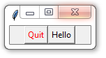

### Creating classes, subclasses, and class instances

This section provides a brief summary about working with classes in
Python. To create a class, simply use the keyword **class.** To create
an instance, reference it with trailing enclosing parentheses:

<table>
<tbody>
<tr class="odd">
<td>
#py_class_support.py

&gt;&gt;&gt; class Mammal():

pass

&gt;&gt;&gt; m = Mammal()
</td>
</tr>
</tbody>
</table>

Optionally, provide an **\_\_init\_\_**() method to execute upon
instantiation. This method provides an instance variable (each instance
gets its own "private copy"). The "self" argument stands in for each
instance's private namespace.

<table>
<tbody>
<tr class="odd">
<td>
&gt;&gt;&gt; class Mammal():

def __init__(self):

self.warmblooded = True

&gt;&gt;&gt; m = Mammal()
</td>
</tr>
</tbody>
</table>

To create a subclass of Mammal i.e., to inherit from the parent class
Mammal, simply provide the parent class as an argument to the new one.
You can go something like:

<table>
<tbody>
<tr class="odd">
<td>
&gt;&gt;&gt; class Dog(Mammal):

def __init__(self, name):

Mammal.__init__(self)

self.name = name

def speak(self):

print("The dog {} says: WOOF!".format(self.name))

&gt;&gt;&gt; dog = Dog("Fang")

&gt;&gt;&gt; dog.speak()

The dog Fang says: WOOF!

&gt;&gt;&gt; dog.warmblooded

True
</td>
</tr>
</tbody>
</table>

Here, we've provided a second argument to **\_\_init\_\_**() – this is a
(mandatory) positional argument that we can pass into the instance's
namespace. When we create a new instance of Dog, we provide a name.

Within **\_\_init\_\_**(), we've executed the parent class'
**\_\_init\_\_**() method. This ensures that the Dog class instances
will have the self.warmblooded attribute. We've also added a method
**speak**() which will be available to each instance.

Similarly, we can create a Cat class. The **\_\_init\_\_**() method adds
another instance variable and the speak() method is altered but
otherwise it's the same as Dog.

<table>
<tbody>
<tr class="odd">
<td>
&gt;&gt;&gt; class Cat(Mammal):

def __init__(self, name):

self.name = name

self.breath = "bad"

Mammal.__init__(self)

def speak(self):

print("The Cat {} says: Derp.".format(self.name))

&gt;&gt;&gt; cat = Cat("Snarky")

&gt;&gt;&gt; cat.speak()

The Cat Snarky says: Derp.

&gt;&gt;&gt; cat.breath

bad
</td>
</tr>
</tbody>
</table>

Unlike some languages, Python supports inheritance from multiple
classes. To invoke this feature, simply provide a comma separated
recitation of them as arguments in the new class' constructor. In the
next example, we'll make a cat/dog chimera. Here's a photo of "Kotpies",
a hybrid developed by Cornell, UC Davis and Massy University (New
Zealand), as reported in the April 1, 2009 edition of *Catster*
*Magazine*[6]:

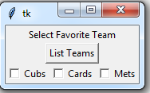

<table>
<tbody>
<tr class="odd">
<td>
&gt;&gt;&gt; class Dat(Dog, Cat):

"Dog/Cat combo - MRO favors left-most argument"

def __init__(self):

super().__init__("Dat")

print("\nDat: MRO is Dog then Cat")

self.speak()

&gt;&gt;&gt; dat = Dat()

Dat: MRO is Dog then Cat

The dog Dat says: WOOF!
</td>
</tr>
</tbody>
</table>

One thing to keep in mind is that when method names conflict (the same
name occurs in more than one of the parent classes), the Python
interpreter chooses the left-most one.

<table>
<tbody>
<tr class="odd">
<td>
&gt;&gt;&gt; class Dat(Cat, Dog):

"Cat/Dog combo - MRO favors left-most argument"

def __init__(self):

super().__init__("Dat")

print("\nDat: MRO is Cat then Dog ")

self.speak()

&gt;&gt;&gt; dat = Dat()

Dat: MRO is Cat then Dog

The Cat Dat says: Derp.
</td>
</tr>
</tbody>
</table>

As you've seen, it's easy enough to add new methods. It's also possible
to override inherited ones. Here, we're giving the Dat class its own
**speak**() method to give it its own voice:

<table>
<tbody>
<tr class="odd">
<td>
&gt;&gt;&gt; class Dat(Cat, Dog):

"Cat/Dog combo - MRO favors left-most argument"

def __init__(self):

super().__init__("Dat")

self.speak()

def speak(self):

print("I'm a Dat, and I say 'DAT'!!!")

&gt;&gt;&gt; dat = Dat()

I'm a Dat, and I say 'DAT'!!!
</td>
</tr>
</tbody>
</table>

### Summary

The proceeding chapter should provide you with a firm grasp of the bits
of Python that are central to working with **NumPy**, **SciPy**,
**pandas** and other tools of the data scientist. Naturally, there's
much more to the language, and your author would do nothing to
discourage your further exploration. I'll wish you all the best in your
journey, but for now we'll move on to more "data-sciencey" topics.

<table>
<tbody>
<tr class="odd">
<td>
Exercise:

Please write some Python code that will:

- Using <strong>list</strong> comprehension, produce a <strong>tuple</strong> of the first 10 positive, even integers that are evenly divisible by 9.

- Save the object in a pickle file, retrieve it, and save it again as a 5-line .csv file (2 elements per line) using the csv module.

- Write subclass of Dog called Pack that keeps track of newly-added Dogs. Here's some code to get you started and some sample output:

class Dog():

def __init__(self, name):

self.name = name

class Pack(Dog):

"your code here"

&gt;&gt;&gt; pack = pack()

&gt;&gt;&gt; for name in ('lassie', 'spicey', 'kelly'):

pack+Dog(name)

&gt;&gt;&gt; print("Yay! There are now {} dog(s):{}\n"\

Yay! There are now 3 dog(s): lassie, spicey, kelly
</td>
</tr>
</tbody>
</table>

 NumPy ndarrays
--------------

You have likely worked with some data objects such as **array.array**,
**fractions.Fraction**, and **decimal.Decimal**. These all wrap up core
Python functionality and add their own magic. Similarly **numpy** wraps
up the **scipy.ndarray** object, along with features of the **list**,
**dict** and other objects to create powerful and extremely accessible
analytical tools. This section demonstrates how to get started with
**ndarray** objects.

### Installation and Available Distributions

NumPy has many Python dependencies (SciPy, etc.), as well as requiring
many operating system-level libraries. A successful installation can
involve using pip / apt to compile dozens of different packages, with
the precise version numbers, all in the right order. As a result it can
be extremely tricky to install even for an experienced programmer.

This issue can be addressed by using intact "distributions" of Python. A
distribution is an assemblage Python and OS-level packages that's
configured and tested to the point that the pieces are guaranteed to
work together. Some of the better-known include Anaconda, Canopy from
Enthought, and Python(x,y). Your author has had great success with
Anaconda. Python's official docs maintains a **list** of these with all
the links[7].

### Arrays and ndarray Objects

A couple of technical notes are in order here. This text will
interchangeably refer to 'ndarrays' and 'arrays'. The real object is the
**numpy.ndarray**. By calling it directly, as we've seen so far, we can
access the low-level constructor. There's no object called 'numpy.array'
– instead **numpy.array**() is a function that serves as a higher-level
(and easier to use) constructor.

The **ndarray** object, as you might expect, is used to represent arrays
of an arbitrary number of dimensions. It's common to produce ndarrays
using built-in methods to instantiate them and populate them all at
once. If you've got a rough idea of the size and shape of the
**ndarray** you will eventually need, you can go ahead and create a
placeholder object. This way, the relatively expensive memory allocation
operation needs to happen only once. You can always prune unneeded rows
or columns later – this is a cheap operation.

Here's how to create a **list**-like, one-dimensional **ndarray**
containing all 1s:

<table>
<tbody>
<tr class="odd">
<td>
#py_numpy_support.py

&gt;&gt;&gt; import numpy as np

&gt;&gt;&gt; b = np.ones(3)

&gt;&gt;&gt; b

array([ 1., 1., 1.])
</td>
</tr>
</tbody>
</table>

You can see that the **ndarray** represents itself similarly to a
3-element **list**. This is no coincidence – they behave quite a bit
like a real **list** of lists would. As with a **list**, we can
reference individual elements using the index value. The **ndarray** is
aware of its shape, which is represented by a **tuple** with one element
for each dimension. Since we have a 1-D object, the shape is a
one-element **tuple**. The default variable type is a 64-bit floating
point number, though we could have specified something different.

<table>
<tbody>
<tr class="odd">
<td>
&gt;&gt;&gt; b = np.array([ 1., 1., 1.])

&gt;&gt;&gt; type(b[1])

&lt;class 'numpy.float64'&gt;

&gt;&gt;&gt; type(b)

&lt;class 'numpy.ndarray'&gt;

&gt;&gt;&gt; b.shape

(3,)
</td>
</tr>
</tbody>
</table>

If you don't want to use one of the default instantiation methods, you
can create a home-made array directly from a **list** of tuples. A
**tuple** of lists, **tuple** of tuples, and **list** of lists also
work. Here's how you might whistle up a 2-D array - as you can see, the
**ndarray** object represents itself as an 'array', presenting its
contents like a **list** of lists would.

<table>
<tbody>
<tr class="odd">
<td>
&gt;&gt;&gt; d = np.array([(0,1,2,3), (10,11,12,13),(20,21,22,23)])

&gt;&gt;&gt; d

array([[ 0, 1, 2, 3],

[10, 11, 12, 13],

[20, 21, 22, 23]])

&gt;&gt;&gt; d.shape

(3, 4)

&gt;&gt;&gt; d.ndim

2
</td>
</tr>
</tbody>
</table>

Slicing and Indexing
--------------------

The number of elements in the shape **tuple** lets us know that the
array has a "**rank**" of 2 – that's the number of dimensions, and the
same as the number of axes. Alternatively, we could ask about the
dimensions directly by querying the **ndim** property. The output
reveals that the first axis provides an **index** over 3 **elements;**
and the second provides an index over 4 elements.

We can address parts of the array by using slicing operations, just as
we did with the 1-D array. The only difference is that you can (but
don't need to) address each dimension ("**axis**") independently. Here's
how you can get a specific row and a specific element. By providing a
single argument, we address the first axis of the array (the "row").

<table>
<tbody>
<tr class="odd">
<td>
&gt;&gt;&gt; row = d[1]

&gt;&gt;&gt; row

array([10, 11, 12, 13])

&gt;&gt;&gt; element = d[1][1]

&gt;&gt;&gt; element

11

&gt;&gt;&gt; type(element)

&lt;class 'numpy.int64'&gt;
</td>
</tr>
</tbody>
</table>

Let's examine this exchange. We can see that the result is an object
with a single axis. If we provide a double index, we can extract a
single element. The single element is no longer an array, but is
whatever **dtype** numpy chose as a default (it'll take a guess based on
the type of objects passed in via the constructor).

We can get a little fancier, if we want, and extract an element (of
block of elements) with a more complex slice based on specifications
against both axes. The only difference is that we need to provide two
slices, separated by a comma. The second slice, naturally, operates on
the second axis - the "columns". Here are some examples:

<table>
<tbody>
<tr class="odd">
<td>
&gt;&gt;&gt; col = d[:,1]

&gt;&gt;&gt; col

array([ 1, 11, 21])

&gt;&gt;&gt; top_left_chunk = d[:2,0:3]

&gt;&gt;&gt; top_left_chunk

array([[ 0, 1, 2],

[10, 11, 12]])

&gt;&gt;&gt; bottom_corner = d[-1, -1]

&gt;&gt;&gt; bottom_corner

23

&gt;&gt;&gt; skip_cols = d[:,::2]

&gt;&gt;&gt; skip_cols

array([[ 0, 2],

[10, 12],

[20, 22]])
</td>
</tr>
</tbody>
</table>

There are a couple things to note with this exchange. First, the object
returned (unless it's a single element) is always an **ndarray**.
Second, the object returned as a column represents itself the same way
as the object returned as a row – potentially a bit confusing at first.

As with lists, these arrays also work and play well with **slice**
objects. These can enhance the transparency and maintainability of your
code because you can use them anywhere a slice specification is
appropriate. For instance you could replace the top\_left\_chunk
definition with the following and achieve the same result:

<table>
<tbody>
<tr class="odd">
<td>
&gt;&gt;&gt; row_slice = slice(0,2)

&gt;&gt;&gt; col_slice = slice(0,3)

&gt;&gt;&gt; top_left_chunk = d[row_slice, col_slice]

array([[ 0, 1, 2],

[10, 11, 12]])
</td>
</tr>
</tbody>
</table>

### Copies and Views

There's another similarity between lists and **ndarrays** – if you use
the "=" operator, you don't make a fresh copy of the array. You simply
give a second name to the same object. To make a real, "**deep copy**"
you can either use the **copy**() method:

<table>
<tbody>
<tr class="odd">
<td>
&gt;&gt;&gt; e = d

&gt;&gt;&gt; id(e) == id(d)

True

&gt;&gt;&gt; e = d.copy()

&gt;&gt;&gt; id(e) == id(d)

False
</td>
</tr>
</tbody>
</table>

This goes much further. Remember the "top\_left\_chunk" and "col" arrays
we just created? They aren't new objects, either – instead they are
still "joined at the hip" to the original array – technically they are
"**views**" of the original. An operation on any of them is reflected in
the original. Check this out:

<table>
<tbody>
<tr class="odd">
<td>
&gt;&gt;&gt; col

array([ 1, 11, 21])

&gt;&gt;&gt; col[1] = 777

&gt;&gt;&gt; col

array([ 1, 777, 21])

&gt;&gt;&gt; d

array([[ 0, 1, 2, 3],

[ 10, 777, 12, 13],

[ 20, 21, 22, 23]])
</td>
</tr>
</tbody>
</table>

Under the hood, the system has allocated a chunk of memory for the
original object. That same memory can be shared by one or more other
objects – that's the "view" idea. Because the memory is shared,
operations on any object that references that memory changes the state
of the memory for all other objects. It's something to watch out for,
particularly if you're going to need to expand or shrink the array later
on. By default **resize**(), discussed below, operations have built-in
checks for multiple references, but they can throw some non-intuitive
errors and can be overridden.

Scalar Operations
-----------------

The "+", "-", "\*", etc. operators are implemented by applying the
appropriate action on each element individually. So, for instance, we
could increase each element by 100 thusly:

<table>
<tbody>
<tr class="odd">
<td>
&gt;&gt;&gt; d+100

array([[100, 101, 102, 103],

[110, 111, 112, 113],

[120, 121, 122, 123]])

&gt;&gt;&gt; d

array([[ 0, 1, 2, 3],

[10, 11, 12, 13],

[20, 21, 22, 23]])
</td>
</tr>
</tbody>
</table>

As you can see, the operation worked like a charm. You'll also note that
the original array was unchanged by the operation – it's not an "in
place" operation like a **list**.**sort**(). To make the change "stick"
you have to assign the new object created by the operation back to the
original name. Something like this:

<table>
<tbody>
<tr class="odd">
<td>
&gt;&gt;&gt; d = d+100

&gt;&gt;&gt; d

array([[100, 101, 102, 103],

[110, 111, 112, 113],

[120, 121, 122, 123]])
</td>
</tr>
</tbody>
</table>

### Masking

The "\*" operator is implemented just as the "+" operator, doing
element-wise calculations. One great use for this is in creating a
"**boolean mask**" or filter. Instead of selecting elements based on
their index values e.g., d\[1\]\[1\] one can select on their value.
Suppose we want to select all the odd values from our array. We could go
something like this:

<table>
<tbody>
<tr class="odd">
<td>
&gt;&gt;&gt; mask = d % 2 #returns 0 if even

&gt;&gt;&gt; mask

array([[0, 1, 0, 1],

[0, 1, 0, 1],

[0, 1, 0, 1]])

&gt;&gt;&gt; d * mask #element-wise multiplication

array([[ 0, 101, 0, 103],

[ 0, 111, 0, 113],

[ 0, 121, 0, 123]])

&gt;&gt;&gt; # combining operations: d * (d % 2)
</td>
</tr>
</tbody>
</table>

Numpy also has several methods in the **numpy.ma** library to support
these operations. A common use case is to "weed out" values that would
otherwise goof up a calculation. Here's an example using the
**masked\_array**() method against an array containing a null **np.nan**
value:

<table>
<tbody>
<tr class="odd">
<td>
&gt;&gt;&gt; g = np.array([1, np.nan, 3])

&gt;&gt;&gt; g.mean()

nan

&gt;&gt;&gt; np.ma.masked_array(g, [False, True, False]).mean()

2.0
</td>
</tr>
</tbody>
</table>

Shape Shifting
--------------

NumPy supports methods to change the shape of an array. For instance if
you want to "vectorize" an array i.e., make a 1-D object from higher
dimension one, you can use the **ravel**() method. If an iterator is
more convenient, you can use **flat**:

<table>
<tbody>
<tr class="odd">
<td>
&gt;&gt;&gt; e = d.ravel()

&gt;&gt;&gt; e

array([100, 101, 102, 103, 110, 111, 112, 113, 120, 121, 122, 123])

&gt;&gt;&gt; iter_version = d.flat

&gt;&gt;&gt; iter_version

&lt;numpy.flatiter object at 0xac8830&gt;

&gt;&gt;&gt; next(iter_version)

100
</td>
</tr>
</tbody>
</table>

By inspection, you can see that **ravel**() creates the new 3-D object
by picking off the elements of the original array row-wise. The elements
of the first row are added, then the elements of the second row, and so
on. Alternatively, you can use **flatten**() – it does the same thing
but gives you the option to pick off elements column-wise, etc.

The opposite operation can be accomplished with the **reshape**()
method. The idea is that you can specify the shape of a new object by
providing a **tuple**. The only rule is that you need to account for
each element in the original – in other words if the operation were
Musical Chairs, everyone would get a seat when the song stops.
Otherwise, you'll get a **ValueError**. For instance we could change the
original object with shape (3, 4) to a new one with four rows by
specifying a new shape (4, 3) like so:

<table>
<tbody>
<tr class="odd">
<td>
&gt;&gt;&gt; new_rows = 4

&gt;&gt;&gt; new_cols = len(e) // new_rows

&gt;&gt;&gt; e.reshape(new_rows, new_cols)

[[100 101 102]

[103 110 111]

[112 113 120]

[121 122 123]]
</td>
</tr>
</tbody>
</table>

You'll note that we've determined the columns analytically – this way
we're sure not to get "accounting errors". You'll also note that we used
floor division to figure out the number of columns. This is one way to
force it to be an **int** type – something **NumPy** requires for shape
specifications.

It's possible to resize an array. For instance, we can use the
**numpy.resize**() method to reduce the array we just created to a shape
of (2,2). This will redistribute as many elements of the original that
are required into the new object. This elements are chosen row-wise –
taking the elements in the same order as provided with the **ravel**()
method.

<table>
<tbody>
<tr class="odd">
<td>
&gt;&gt;&gt; e = np.resize(e, (2,2))

&gt;&gt;&gt; e

[[100 101]

[102 103]]
</td>
</tr>
</tbody>
</table>

We can also expand the size of the array. If we use **numpy.resize**()
again to make it larger, the elements of the original array are
distributed throughout the new array getting "recycled" as necessary.

<table>
<tbody>
<tr class="odd">
<td>
&gt;&gt;&gt; e = np.resize(e, (4,4))

&gt;&gt;&gt; e

[[100 101 102 103]

[100 101 102 103]

[100 101 102 103]

[100 101 102 103]]
</td>
</tr>
</tbody>
</table>

If we use the array method **resize**() – not the numpy method - the
newly-created elements will default to zeros. This is an in place
operation so there's no need to assign the result to a new object (in
fact it returns **None**).

<table>
<tbody>
<tr class="odd">
<td>
&gt;&gt;&gt; k = np.array([(1,2,3)])

&gt;&gt;&gt; k

[[1 2 3]]

&gt;&gt;&gt; k.resize((3,3))

&gt;&gt;&gt; k

[[1 2 3]

[0 0 0]

[0 0 0]]
</td>
</tr>
</tbody>
</table>

There are a couple of limitations. If there's another object referencing
the array you're trying to resize – or if the array you're trying to
**resize** references another array, the system will return an error. If
you're <u>really</u> sure you know what you're doing, you can override
the default by setting the (optional) **refcheck** parameter. This code
begins with the array we just created:

<table>
<tbody>
<tr class="odd">
<td>
&gt;&gt;&gt; k.resize(1,1) # resize() operation works

&gt;&gt;&gt; k

array([[1]])

&gt;&gt;&gt; zebra = k # reference the array

&gt;&gt;&gt; k.resize(2,2)

builtins.ValueError: cannot resize an array that references &lt;snip&gt;

&gt;&gt;&gt; k.resize(2,2, refcheck = False) # call off the reference check

&gt;&gt;&gt; k # now all is happy

array([[1, 0],

[0, 0]])
</td>
</tr>
</tbody>
</table>

Descriptive Statistics
----------------------

NumPy array objects have some statistical functions built-in. Here are a
few:

<table>
<tbody>
<tr class="odd">
<td>
&gt;&gt;&gt; d = np.array([(6, 3, 8), (20,1,80), (4, 3, 34)])

&gt;&gt;&gt; d

array([[ 6, 3, 8],

[20, 1, 80],

[ 4, 3, 34]])

&gt;&gt;&gt; d.min()

1

&gt;&gt;&gt; d.max()

80

&gt;&gt;&gt; d.sum()

159

&gt;&gt;&gt; d.std()

24.225789747475496

&gt;&gt;&gt; d.mean()

17.666666666666668

&gt;&gt;&gt; d.diagonal()

array([ 6, 1, 34])

&gt;&gt;&gt; d.trace()

41
</td>
</tr>
</tbody>
</table>

Array Operations
----------------

NumPy is also capable of doing "real" array math. Except for the "\*"
operator, the arithmetic operators works as expected:

<table>
<tbody>
<tr class="odd">
<td>
&gt;&gt;&gt; a = np.array([ [1,2], [3,4]])

&gt;&gt;&gt; b = np.array([ [10,20], [30,40]])

&gt;&gt;&gt; a+b

array([[11, 22],

[33, 44]])

&gt;&gt;&gt; a-b

array([[ -9, -18],

[-27, -36]])

&gt;&gt;&gt; a*b

array([[ 10, 40],

[ 90, 160]])

&gt;&gt;&gt; np.sin(a)*abs(np.sin(b))

array([[ 0.45777798, 0.83013877],

[ 0.13943103, -0.5639035 ]])
</td>
</tr>
</tbody>
</table>

On the last line, you'll note that **NumPy** has baked-in support for
trig functions and retains access to all of Python's built-in functions.

To do array multiplication, use the **dot**() method like so:

<table>
<tbody>
<tr class="odd">
<td>
&gt;&gt;&gt; c = np.array((10,10))

&gt;&gt;&gt; a

array([[1, 2],

[3, 4]])

&gt;&gt;&gt; a.dot(c)

array([30, 70])

&gt;&gt;&gt; c.dot(a)

array([40, 60])
</td>
</tr>
</tbody>
</table>

To transpose an array, use the **T** operator . Note that **T**, like
other **NumPy** operators can be applied successively:

<table>
<tbody>
<tr class="odd">
<td>
&gt;&gt;&gt; a

array([[1, 2],

[3, 4]])

&gt;&gt;&gt; a.T

array([[1, 3],

[2, 4]])

&gt;&gt;&gt; a.T.T.T.T

array([[1, 2],

[3, 4]])
</td>
</tr>
</tbody>
</table>

Multiple Dimensions
-------------------

NumPy arrays can have any number of axes (dimensions). Operations that
can only be executed against one axis at a time will typically have a
default axis. For instance, when we used **ravel**() the arrays was
flattened row-wise "row-major". We could use **flatten**() and choose
either 0 or 1 for the dominant axis.

Another of these methods is **sort**(). We can pick which dimension to
use as the basis for sorting. For instance, if we use so the first axis
(0) as an argument, numpy will shuffle the elements around keeping them
in their original column – shifting the row they live in as needed. If
we use the second axis (1), the elements stay in the same row, but get
shifted to the correct column.

<table>
<tbody>
<tr class="odd">
<td>
&gt;&gt;&gt; d = np.array([(6, 3, 8), (20,1,80), (4, 3, 34)])

&gt;&gt;&gt; d

array([[ 6, 3, 8],

[20, 1, 80],

[ 4, 3, 34]])

&gt;&gt;&gt; d.sort(0) #keep the column, shuffle the row

&gt;&gt;&gt; d

array([[ 4, 1, 8],

[ 6, 3, 34],

[20, 3, 80]])

&gt;&gt;&gt; d.sort(1) #keep the row, shuffle the column

&gt;&gt;&gt; d

array([[ 1, 4, 8],

[ 3, 6, 34],

[ 3, 20, 80]])
</td>
</tr>
</tbody>
</table>

### Thinking In High Dimensions

Personally, I don't find it easy to think about high-dimension spaces.
Past 3-D, or maybe 3-D + time as another axis, I get fuzzy. In the hopes
it helps, I would offer the following. One way to think about high
dimensions is to extrapolate from what's easy.

|                                                                      |
|----------------------------------------------------------------------|
|  |

Row A extends a 1-D row of tiles into a 2-D grid then, in Star Trek
fashion, into a stack of grids represented by a 3-D chess game. These
could be represented as numpy arrays:

<table>
<tbody>
<tr class="odd">
<td>
&gt;&gt;&gt; a1 = np.ones( (3,), dtype = np.int)

&gt;&gt;&gt; a2 = np.ones( (8,8), dtype = np.int)

&gt;&gt;&gt; a3 = np.ones( (8,8,3), dtype = np.int)
</td>
</tr>
</tbody>
</table>

If you want to specify a specific square on this 3-D game, you'd need to
know the index value for each of the three axes – which layer, row, and
column.

<table>
<tbody>
<tr class="odd">
<td>
&gt;&gt;&gt; a1[2, 4, 8]

1
</td>
</tr>
</tbody>
</table>

So far, so good, right?

Now, say that you're manufacturing these. You need to ship them to
customers so you put them into a box (B1). You might be able to put 3
rows and 4 columns on the bottom of the box to form a layer, and be able
to put in 2 layers to fill the box. Now to locate a specific square on a
specific board you'll need to know: the index value for each of three
axes within the box; <u>and</u> the index value for each of the three
axes of the chess game. Six pieces of data in all.

The games are selling like gang-busters and you need to ship lots of
boxes to your customers. You now have to fill a room in your apartment
(B2) with them. This complicates the task of finding a specific square
on a specific game board further. You need three additional pieces of
information – the axes index values for each of the coordinates of the
box's location within the room. Nine pieces of data in all.

More commercial success means filling up your whole apartment (B3), then
buying out your neighbors (C1), maybe your whole complex (C2), and maybe
the whole town (C3).

By the time you add enough information to address a letter to the
building the specific chess game is located, you easily have 20+
dimensions[8].

Another way to think about high dimensions is in terms of a "feature
set" – how many things describe the object. Here we're using spatial
coordinates, but we could just as easily use physical characteristics.
For a coin we might consider denomination, date, condition, where
produced, nationality, shape, exterior ridges, etc. All could be
considered dimensions and represented as axes in an **ndarray** object.

### Coding In High Dimensions

All operations discussed here extend into high-dimension objects – some,
like slicing, are just a bit more complicated to think through and
implement. Here are a few examples that you can use for practice. The
first bit builds a stack of 2-D arrays. The top values are 3.xx, mid
values are 2.xx and bottom values are 1.xx – just to make it easy to
"eyeball" the results. There's no need to study the code below
extensively – its main purpose is to show how you can build a
dimensionally-complex array from smaller ones:

<table>
<tbody>
<tr class="odd">
<td>
&gt;&gt;&gt; top = np.empty( (3,3)); mid = np.empty( (3,3))

btm = np.empty( (3,3))

&gt;&gt;&gt; for arr, valbase in zip( (top, mid, btm), (3,2,1)):

for row in range(arr.shape[0]):

for col in range(arr.shape[1]):

arr[row, col] = np.random.random()+valbase

&gt;&gt;&gt; box = np.array( (top, mid, btm) )

&gt;&gt;&gt; box

[[[ 3.86088329 3.26100869 3.37532744]

[ 3.11982375 3.00006649 3.44628649]

[ 3.27614533 3.05426672 3.89945169]]

[[ 2.07715382 2.9382717 2.88235342]

[ 2.61226057 2.58914594 2.66596822]

[ 2.96506094 2.26238572 2.84557831]]

[[ 1.94729993 1.90361987 1.64395291]

[ 1.09286659 1.66835836 1.25443615]

[ 1.89227877 1.75429315 1.12943534]]]
</td>
</tr>
</tbody>
</table>

Here are a few slicing operations we can employ. It's a matter of
independently addressing the axes, each with their own specification.

<table>
<tbody>
<tr class="odd">
<td>
&gt;&gt;&gt; box[1] #middle layer

array([[ 2.07715382, 2.9382717 , 2.88235342],

[ 2.61226057, 2.58914594, 2.66596822],

[ 2.96506094, 2.26238572, 2.84557831]])

&gt;&gt;&gt; box[1, 1, :] #middle layer, middle row

array([ 2.61226057, 2.58914594, 2.66596822])

&gt;&gt;&gt; box[1, :, 1] #middle layer, middle col

array([ 2.9382717 , 2.58914594, 2.26238572])

&gt;&gt;&gt; box[1,1,1] #middle layer, middle row, middle element

2.5891459407967474
</td>
</tr>
</tbody>
</table>

You are encouraged to experiment on you own – get facile with 3-D
objects then put together a 4-D "stack" and see if you can extract the
elements you expect.

Array Creation Options
----------------------

Here are some other methods for creating an **ndarray** instance:

<table>
<tbody>
<tr class="odd">
<td>
&gt;&gt;&gt; #identity matrix, 3x3, 32-bit wide integer elements

&gt;&gt;&gt; c = np.eye(3, dtype = np.int32)

&gt;&gt;&gt; c

array([[1, 0, 0],

[0, 1, 0],

[0, 0, 1]], dtype = int32)

&gt;&gt;&gt; c.shape

(3, 3)
</td>
</tr>
</tbody>
</table>

Here, we've created an identity matrix (all 1s on the diagonal). The
first parameter we provided the **eye**() function is the number of
rows. By default, we get a square matrix, though we could have provided
a second positional parameter to specify the number of columns. By
default, the 1s will show up on the main diagonal as show above. A third
positional argument can override this behavior by shifting the
diagonal's index by the given amount. A positive number causes the
diagonal to "shift right" toward the upper quadrant; a negative causes
it to "shift left" toward the lower quadrant.

As noted earlier, it's relatively expensive to allocate memory for an
array. Yes, it's possible to extend it once created but when possible
you'll want to create it once and be done. Here's how to create an empty
array then **fill**() each element with a specific value:

<table>
<tbody>
<tr class="odd">
<td>
&gt;&gt;&gt; y = np.empty ( (2,2) ) #provide a tuple for the shape

&gt;&gt;&gt; y.fill(4)

&gt;&gt;&gt; y

array([[ 4., 4.],

[ 4., 4.]])
</td>
</tr>
</tbody>
</table>

There are some built-in methods to create arrays that work the same way:

<table>
<tbody>
<tr class="odd">
<td>
&gt;&gt;&gt; y = np.empty ( (2,2) ) #tuple

&gt;&gt;&gt; y.fill(4)

&gt;&gt;&gt; y

array([[ 4., 4.],

[ 4., 4.]])

&gt;&gt;&gt; y = np.ones( (1, 2)) #tuple

&gt;&gt;&gt; y

[[ 1. 1.]]

&gt;&gt;&gt; y = np.zeros ((1,2))

&gt;&gt;&gt; y

[[ 0. 0.]]

&gt;&gt;&gt; y = np.random.rand (1,2) #*not* a tuple

&gt;&gt;&gt; y

array([[ 0.99202039, 0.26230018]])
</td>
</tr>
</tbody>
</table>

Note that creation of an array with random elements taps the
**np.random** library[9] and that the arguments provide the shape.
Element values will be between zero and one.

It is also possible to build an array from Python objects and file
system objects. We've already looked at how to build them from container
object like **lists** and **tuples**. Here is how you can create an
array from a file (and, as a bonus, how you can save an array to a
file):

<table>
<tbody>
<tr class="odd">
<td>
&gt;&gt;&gt; dtype = np.dtype( 'int, int, int')

&gt;&gt;&gt; d = np.array([(6, 3, 8), (20,1,80), (4, 3, 34)], dtype = dtype)

&gt;&gt;&gt; fn = 'junk.npy'

&gt;&gt;&gt; d.tofile(fn)

&gt;&gt;&gt; new_d = np.fromfile(fn, dtype = dtype)

&gt;&gt;&gt; new_d

array([(6, 3, 8), (20, 1, 80), (4, 3, 34)],

dtype = [('f0', '&lt;i8'), ('f1', '&lt;i8'), ('f2', '&lt;i8')])
</td>
</tr>
</tbody>
</table>

Note that we specified the data type with a **np.dtype** object created
on the first line. More on data types later, but for now just know that
we have to clue NumPy in on what shape and element types we'll be
passing back and forth to the file system. If we don't, the default
behavior is to save the data in a flattened format that we'd have to
reshape once imported. The **tofile**() and **fromfile**() methods work
by passing either strings or bytes to and from the file system.

We could also save the array as a binary file (the default behavior is
to use Python-specific pickles). Building on the previous array
definition, and using the **save**() and **load**() methods:

<table>
<tbody>
<tr class="odd">
<td>
&gt;&gt;&gt; np.save(fn, d)

&gt;&gt;&gt; d = None #just to prove it works

&gt;&gt;&gt; d = np.load(fn)

&gt;&gt;&gt; d

array([(6, 3, 8), (20, 1, 80), (4, 3, 34)],

dtype=[('f0', '&lt;i8'), ('f1', '&lt;i8'), ('f2', '&lt;i8')])
</td>
</tr>
</tbody>
</table>

If a 1-D (vector) is all that's required, you can create an array
directly from it using the **fromiter**() method. Suppose we want an
array of all the first 10K integers. We could go:

<table>
<tbody>
<tr class="odd">
<td>
&gt;&gt;&gt; np.fromiter([i for i in range(10000)], dtype = np.int)

array([ 0, 1, 2, ..., 9997, 9998, 9999])
</td>
</tr>
</tbody>
</table>

This will work for any iterable object. If we wanted to give NumPy a
break by letting it know ahead of time how much memory to reserve, we
could go:

<table>
<tbody>
<tr class="odd">
<td>
&gt;&gt;&gt; count = 10000

&gt;&gt;&gt; np.fromiter([i for i in range(count)],

dtype = np.int,count=count))

array([ 0, 1, 2, ..., 9997, 9998, 9999])
</td>
</tr>
</tbody>
</table>

Data Types
----------

### Built-in Numeric Data Types 

NumPy provides a great selection of numeric data types ( **'dtypes'**)
that work with **ndarrays**. These include signed and unsigned integers
(**int** / **uint**), floating point (**float**) and complex
(**complex**) numbers. Integers can be specified in widths ranging from
8 to 64 bytes, floats from 16 to 64, and complex as either 64 or
128[10]. These are named **float14**, **uint8**, etc.

NumPy arrays can contain all sorts of different types of data. The only
rule is that an array can contain only one type – and this is so each
element is constrained to be the same size for computational efficiency.
The type can be any of the built-in **dtypes** e.g., **uint64** or
**complex32**.

### Custom Data Types

It's also possible to "roll your own" data structures – and they can be
heterogenous in terms of the object types they contain. For instance,
you can create a dtype consisting of a string, a complex number, a
float, and an integer so:

<table>
<tbody>
<tr class="odd">
<td>
&gt;&gt;&gt; dtype = '|S4, c8, float16, int32'

&gt;&gt;&gt; data = ("hello", complex(1,2), 4.3, 6)

&gt;&gt;&gt; g = np.array(data, dtype = dtype)

&gt;&gt;&gt; g

&lt;class 'numpy.ndarray'&gt;

(b'hell', (1+2j), 4.2999999999999998224, 6)
</td>
</tr>
</tbody>
</table>

Here, we created a new data type by using shorthand names for the
various object types. If you look carefully you'll see that the syntax
for the string object specification is a bit weird: "**\|S4**" – it
begins with a bar character and the "S" needs to be capitalized. Also,
you'll notice that the string 'hello' got truncated to 'hell' – that
because it was pruned to fit the specification. You'll note that this
happened silently.

You need to be careful in this regard. If the extra wide string you
store gets truncated it may not be a big deal. But if you try to store
too large a number, what gets stored can be really strange[11]. You may
want to see what happens on your machine, but when I try to store the
number 10,000,000,000 as a 32-byte integer, the number that actually
gets stored is 1,410,065,408. Silently. Yikes.

### **Object** Data Type

It's possible to get around this issue by getting a little vague about
the dtype specification by using **object** as the type. You might think
this violates the notion that all the elements in an **ndarray** have to
be the same size. But it doesn't because internally the **ndarray** is
storing a reference only, and the reference can point to just about
anything.

<table>
<tbody>
<tr class="odd">
<td>
&gt;&gt;&gt; h = np.array( [ ("hello", 23), ('goodby', 45) ], \

dtype = 'object, int32')

&gt;&gt;&gt; h

array([('hello', 23), ('goodby', 45)],

dtype = [('f0', 'O'), ('f1', '&lt;i4')])
</td>
</tr>
</tbody>
</table>

If you look carefully at this last example, you'll see that the array
can be specified fairly compactly. The data can be provided as a
**list** of tuples and the **dtype** can be specified all in a single
command. Also, the string representation of the dtype consists of a
**tuple** for each object – 'f0' and 'f1' are internal field name labels
and the 'O' and '&lt;i4' stand in for 'object' and the 4-byte integer.

Here's an important performance note: if you create an array of objects,
you'll likely give up some of **NumPy's** blazing-fast performance. Why?
Because you're creating list-like objects where the "stride length" –
the amount of memory required for each element in the array – is no
longer sufficient to extract the data. A second step is imposed – the
pointer to the object only gets us to the starting point of the
contents, and the amount of memory allocated to the object needs to be
discovered before the actual contents can be accessed.

### Precision

For all its charm, **NumPy** arrays, being dependent on the hardware's
floating point operations and its implementation of the underlying C
libraries, generally can't offer more than 64-bit precision. This being
said, it is possible to create a **ndarray** of **object** type
(elements serve as pointers only) and use objects like
**fractions**.**Fraction** and **decimal**.**Decimal**.

Getting NumPy-Specific Help
---------------------------

The **ndarray** object is an implementation of a \*lot\* of C language
code – it's not built up from smaller elements of the Python language.
The API (the programming interface to make it look Python) is just a
wrapper.

A practical effect of this is that you don't have nice, Python code to
explore and you can't simply "follow the code around" using an IDE to
figure out how it works. **NumPy** has some built-in features to help
out in this regard. The **doc** module has extensive write-ups on
various topics:

<table>
<tbody>
<tr class="odd">
<td>
from numpy import doc

for d in dir(doc):

print(d, end = ', ')

absolute_import, basics, broadcasting, byteswapping, constants, creation, division, glossary, indexing, internals, misc, os, print_function, structured_arrays, subclassing, ufuncs
</td>
</tr>
</tbody>
</table>

... you just need to call **help**() on any of them.

<table>
<tbody>
<tr class="odd">
<td>
&gt;&gt;&gt; help(doc.ufuncs)

&lt;long docstring&gt;
</td>
</tr>
</tbody>
</table>

There's also a **lookfor**() method that takes a string argument and
searches through the local **NumPy** docs for everything related to the
topic. Here's an example that returns about a million 'hits':

<table>
<tbody>
<tr class="odd">
<td>
&gt;&gt;&gt; np.lookfor('array')

&lt;snip&gt;

numpy.take

Take elements from an array along an axis.

numpy.tile

Construct an array by repeating A the number of times given by reps.

&lt;snip&gt;
</td>
</tr>
</tbody>
</table>

> If you're really interested in how the guts of it work, you'll have to
> read the C language source[12]. The official docs from scipy.org[13]
> provide great practical information. As usual, **help**() works well –
> but the docstrings can run several pages. The act of browsing the
> Python source[14] can be really helpful because the developers have
> sprinkled several useful, human-readable files into the mix with the
> full expectation that you'll refer to them.

Overview of Data Visualization / Presentation Tools
---------------------------------------------------

### Introduction to Matplotlib and Seaborne

Matplotlib is the visualization tool that's integrated into Numpy and
pandas. It provides several "out of the box" plotting tools along with
the ability to customize new charts and graphs through its API. Seaborne
wraps Matplotlib and provides a suite of high-level, aggregate
visualization tools. While this course is not focused on visualization,
the current chapter will provide you enough background to spin up basic
graphics and generally interact with the API – enough to be dangerous,
anyway ;-)

### Working With Matplotlib

While working with Matplotlib can considerably more tedious than
whistling up a chart with Excel or Open Office, the beauty is that it's
tightly integrated with the other tools you'll be using. Over time,
you'll build up an inventory of reusable objects/code to fit your needs
to a tee.

Fret not, however, because rudimentary graphics are ridiculously easy to
produce. Here's a simple example:

<table>
<tbody>
<tr class="odd">
<td>
#py_matplotlib_basics.ipynb

%matplotlib inline

import matplotlib.pyplot as plt

plt.plot([2,8,8,2,3,6,1])
</td>
</tr>
</tbody>
</table>

Here, we've provided pyplot an array-like object (it's fairly agnostic
about just what that is). We've given it an optional y-axis label then
displayed it with the **show**() method. It yields this result – note
that it threw in an x-axis label "for free":

|                                                                       |
|-----------------------------------------------------------------------|
| 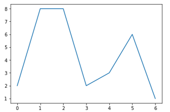 |

Want a bar chart? No problem, just give it array-like objects to
represent the x-axis and the data like this:

<table>
<tbody>
<tr class="odd">
<td>
data=[2,8,3,6,1]

xaxis=[1,2,3,4,5]

plt.bar(left=xaxis, height=data)

plt.show()
</td>
</tr>
</tbody>
</table>

... which produces a decent bar chart "right out of the box".

|                                                                         |
|-------------------------------------------------------------------------|
| 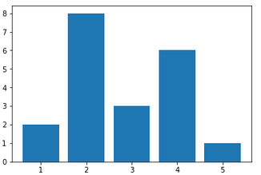 |

There are dozens of options that allow you granular control over every
visible element of the plot object, and how individual plots can be
arrayed over a containing "**canvas**" object. More on these later.

Pandas, covered in detail later, are tightly integrated with Matplotlib.
Its built-in **Series** and **DataFrame** objects wrap **pyplot** and
contain the same visualization methods.

<table>
<tbody>
<tr class="odd">
<td>
Exercise:

To celeberate completion of this class, you might have

a party for your geek friends. Let's say you stock up

with three 12-packs of great beer:

Beer 1: IPA

Beer 2: Lagar

Beer 3: Stour

Each 12-pack has three rows of bottles (call them 1, 2, and 3) and

four "columns" of bottles (call them 1, 2, 3) as well.

Represent them in a 3-D ndarray comprised of (100 * beer value) +

(10 * row value) + (1 * column value). The array would look like:

Layer 1 (IPA): Layer 2 (Lagar) Layer 3 (Stout)

111 112 113 114 211 212 213 214 311 312 313 314

121 122 123 123 221 222 223 224 321 322 323 324

131 132 133 134 231 232 233 234 331 332 333 334

See if you can strip out these chunks of the array:

- Layer 1 (as above)

- The "middle, bottom" bit of Layer 2:

222 223

232 233

- This "middle row" of Layer 3:

321 322 323 324

- The middle bottles:

122 123

222 233

322 323
</td>
</tr>
</tbody>
</table>

 Overview of Pandas
==================

Pandas (the term is derived from "panel" and "data”) is a data analysis
framework developed by Wes McKinney[15] in 2012 (he remains the
BDFL[16]). Built primarily on the NumPy **ndarray** object, it is
particularly strong in handling date and time series because it provides
high-level wrappers around Python's built-in **datetime** objects.
Visualization based on Matplotlib is also knit into the main pandas
objects. This chapter explores some of the more useful features of the
pandas library.

Working With Pandas in an IDE
-----------------------------

The pandas library is fairly complex. It provides a variety of data
structures and tools for manipulating sequences, two-dimensional tables,
and three dimensional data panels. Due to its complexity, and that of
the underlying **ndarray** objects, you may find an IDE valuable as you
explore new objects and learn how to manipulate them.

Over time, however, you may find that the GUI is more of a hindrance
than an asset. There is quite a bit of overhead involved – not only to
support the visual aspects, but in managing several threads/processes
and having to push all the information through the sockets managed by
the IDE software. As your data sets grow larger, performance will become
a real issue. Besides, you'll likely be running your code on remote
servers which won't be configured for GUIs.

Fortunately, Python has several tools for text-only debugging in the
standard library. You'll find a complete chapter on tools like **pdb**
(Python debug) in Appendix I.

For this course, we'll focus on examples written against the REPL or
Jupyter notebooks for clarity of exposition.

Enhancements from ndarray Objects
---------------------------------

The pandas library contains some really useful enhancements to NumPy
arrays. The principal advances are around indexing – pandas provides
extremely flexible means of providing **datetime** and **str** indices
on its objects while NumPy uses only integers.

One of the implications is that the index objects have a separate
existence from the objects they are associated with. It's possible, as
we'll see later, to "stretch" an index value. For example, if we have
weekly data originally using "weeks" as it's index we can reconstitute
the index as "days" then reassign it. Before conducting operations on
the array, its values will be aligned to the new index.

Another important enhancement is that pandas objects handle missing data
smoothly – much as SPSS or SAS does. This is important when dealing with
"stretched" indices, for instance, when the now-unoccupied index points
receive placeholder values. The nice thing is that the placeholders are
evaluated just as you would hope when used for calculations. If you ask
for the mean of a NumPy array with a single **numpy.NaN** value, the
mean is reported as numpy.NaN. With pandas, the value simply drops out
of the equation and the mean is reported as average of the remaining
values.

Pandas also supports easy ways to "bin" values into buckets of
user-definable ranges. This, in turn, allows creation of pivot tables
and operations on categorized data. They also provide native support for
database-like queries on data **Series** objects – no need to build an
actual database or resort to "roll your own" means of selecting and
organizing your information.

Finally, since pandas are built on NumPy / SciPy, methods from these
libraries can be applied to pandas data structures. Nothing has been
left behind.

Naturally, all of this comes at a performance cost relative to working
with "straight up" **ndarrays**. A homogenous **ndarray** is
computationally efficient and the tools used to manipulate it are thin
wrappers around compiled C libraries. Wickedly fast. Pandas objects are
a bit further away from the "bare metal" – in particular the requirement
to consistently realign arrays to their indices requires a
potentially-costly computational step every time the array is loaded.

Series Objects
--------------

The **Series** object might be regarded as a chimeric combination of a
**list**, a **dict**, and a database. It contains indexable elements,
which can be looked up with keys, and selected / sorted as one might do
with a database query.

### Creating a Series

Here's a simple way to create a **Series**:

<table>
<tbody>
<tr class="odd">
<td>
#py_pandas_series_1.py

&gt;&gt;&gt; import pandas as pd

&gt;&gt;&gt; data = [10, 20, 30, 40]

&gt;&gt;&gt; ser = pd.Series(data = data)

&gt;&gt;&gt; print(ser)

0 10

1 20

2 30

3 40

dtype: int64
</td>
</tr>
</tbody>
</table>

To provide data, all we need to do is pass along an iterable object and
**Series** takes over from there. As you can see, we get an index "for
free" and the default is the same as for a **list** object – consecutive
integers beginning with 0. **Series** even chose an appropriate data
type (**int64**). Had we provided a **list** of **float** types the
elements would be type **float64.**

### Addressing Elements

We can work with it much as we would a **list**. For instance,
**Series** objects support slicing. They also accept heterogeneous
members. Note that as we add elements, the data type automatically
adapts and now is **object**.

<table>
<tbody>
<tr class="odd">
<td>
&gt;&gt;&gt; ser[0] = 'some string'

&gt;&gt;&gt; ser[1] = (1,2,3)

&gt;&gt;&gt; ser

0 some string

1 (1, 2, 3)

2 30

3 40

dtype: object
</td>
</tr>
</tbody>
</table>

### Managing Elements

Adding and removing elements works pretty much like operating on a
**dict**. For instance, we can add a new element to a non-contiguous
index point. We can simultaneously remove and capture a value using the
**pop**() method. As is the case with a **dict**, the **get**() method
is a little more robust because it accepts a default value to be
returned in case the index doesn't exist (it's spared the trouble of
producing a **KeyError**).

<table>
<tbody>
<tr class="odd">
<td>
&gt;&gt;&gt; value_3 = ser.pop(3)

&gt;&gt;&gt; value_3

40

&gt;&gt;&gt; ser.get(666, 'nope')

'nope'

&gt;&gt;&gt; ser

0 some string

1 (1, 2, 3)

2 30

dtype: object
</td>
</tr>
</tbody>
</table>

If you ever want to have a look at the index or the values, you can use
methods by the same name to return **Series**-like objects. If you want
to convert either to a **list**, you can use the **tolist**() method:

<table>
<tbody>
<tr class="odd">
<td>
&gt;&gt;&gt; ser.values.__repr__()

array(['some string', (1, 2, 3), 30], dtype=object)

&gt;&gt;&gt; print(ser.index.tolist())

[0, 1, 2]
</td>
</tr>
</tbody>
</table>

### Searching

We can also conduct searches on both the members' values and the
**Series** index. To search for the presence of an <u>index value</u>,
simply use the Python keyword **in**. To search <u>values</u>, we use
the **isin()** method. The latter produces a "Boolean mask" – an object
the same shape as the target, populated with **True** or **False**
indicating presence or absence of the searched-for object in that
location:

<table>
<tbody>
<tr class="odd">
<td>
&gt;&gt;&gt; 2 in ser

True

&gt;&gt;&gt; 666 in ser

False

&gt;&gt;&gt; look_for = [ (1,2,3), 30, 50]

&gt;&gt;&gt; ser.isin(look_for)

0 False

1 True

2 True

dtype: bool
</td>
</tr>
</tbody>
</table>

Note that the search terms can be arbitrarily numerous. The only rule is
that they need to be provided as some **list**-like object – even if
it's only one element. Both of these work:

<table>
<tbody>
<tr class="odd">
<td>
&gt;&gt;&gt; ser.isin( [0] )

&gt;&gt;&gt; ser.isin( (1,) ) #a one-element tuple
</td>
</tr>
</tbody>
</table>

To replace all the values in a **Series** with a new values, you can use
the **replace**() method. For instance, if we had an instrument
measuring absolute temperature (Kelvin), we can be pretty sure that zero
is a bad reading. The instrument probably was off line. We can do an
inplace substitution of the bad reading with a NaN like so:

<table>
<tbody>
<tr class="odd">
<td>
&gt;&gt;&gt; from numpy import nan

&gt;&gt;&gt; ser = pd.Series([100, 110, 0, 115])

&gt;&gt;&gt; ser.replace(0, nan, inplace = True)

&gt;&gt;&gt; ser

0 100.0

1 110.0

2 NaN

3 115.0
</td>
</tr>
</tbody>
</table>

### Managing Indices

The **Series** object comes with a default index, as we've seen. It's
possible to upgrade it by providing a new one. The only rules are that
there has to be an index value for each element of the **Series**, and
the value has to be immutable (just like a **dict**).

<table>
<tbody>
<tr class="odd">
<td>
&gt;&gt;&gt; data = [10, 20, 30, 40]

&gt;&gt;&gt; ser = pd.Series(data = data)

&gt;&gt;&gt; ser.index

RangeIndex(start = 0, stop = 4, step = 1)

#upgrade

&gt;&gt;&gt;ser.index = ('dog', 'cat', 'bear', 'anteater')

&gt;&gt;&gt; ser.index

Index(['dog', 'cat', 'bear', 'anteater'], dtype = 'object')
</td>
</tr>
</tbody>
</table>

We can now use the upgraded index to pick off individual elements.
Alternatively, we can still get to them by using the index value if we
provide it using the **iloc()** ("index locator") method.

<table>
<tbody>
<tr class="odd">
<td>
&gt;&gt;&gt; ser['dog']

10

&gt;&gt;&gt; ser.iloc[2]

20
</td>
</tr>
</tbody>
</table>

We'll do much more with the **Series** object as we explore
**DataFrame**s in the next section.

<table>
<tbody>
<tr class="odd">
<td>
Exercise:

Carbonify, an Australian nonprofit, maintains climate change information on its website<a href="#fn1" class="footnote-ref" id="fnref1" role="doc-noteref">1</a>.

Included is atmospheric CO2 saturation levels from the Mauna

Loa Observatory in parts per million. Obeservations were takenin April of each year 1958-2017.

It's available to you as a <strong>list</strong> in the file

solution_dsci_chapter_02_data_file.py

Please use your new knowledge to:

- create a <strong>Series</strong> object from the <strong>list</strong> and apply an index to reflect the timeframe over which the data was collected;

- replace any obviously bad values with a <strong>np.NaN</strong> object;

- use the <strong>Series.mean</strong>() method and slicing operations to figure out the average CO2 saturations for the first 10 years and the last 10 years of data then print them out;

- create a histogram of the cleaned-up data.
</td>
</tr>
</tbody>
</table>
<section class="footnotes" role="doc-endnotes">

<ol>
<li id="fn1" role="doc-endnote">
http://www.carbonify.com<a href="#fnref1" class="footnote-back" role="doc-backlink">↩︎</a>
</li>
</ol>
</section>

Pandas in 2-D
-------------

**Series** object provide convenient containers for simple data like a
company's stock's price over time. More often than not, we'll be
interested in bundling several data streams, such as the stock prices of
all companies in an industry. Further, we'll likely be interested in
comparing contemporaneous prices and will be using using time as the
common 'unit of analysis'. Pandas provides an object that's very
well-suited to this task, the **DataFrame**.

This section provides an overview of the **DataFrame** and its basic
operations.

### The DataFrame

The **DataFrame** object contains two dimensions of data. It's
convenient to think of it as a spreadsheet or a database table. In fact,
it has many of the characteristics of both. It's really a stack of
**Series** objects (the ‘columns’). The stack can be indexed and
addressed just as the **Series** objects are. Additionally, the
**DataFrame** contains powerful methods for reading, writing, reshaping,
combining, and otherwise manipulating data. Let's explore using a
tangible example.

### Creating an Instance

One way to create a **DataFrame** is to provide an iterable object. In
the example below, we'll use a **dict** object – this allows us to pass
in index values for both "rows" and "columns".

<table>
<tbody>
<tr class="odd">
<td>
#py_pandas_dataframe_intro.py

&gt;&gt;&gt; data = {'c1' : pd.Series([11, 21, 31], index=['r1', 'r2', 'r3']),

'c2' : pd.Series([12, 22, 32], index=['r1', 'r2', 'r3']),

'c3' : pd.Series([13, 23, 33], index=['r1', 'r2', 'r3']),

}

&gt;&gt;&gt; df = pd.DataFrame(data)

&gt;&gt;&gt; df

df

c1 c2 c3

r1 11 12 13

r2 21 22 23

r3 31 32 33
</td>
</tr>
</tbody>
</table>

### Addressing Rows, Columns, and Elements

By inspection, we can see that each **Series** object entered as a
column in the 2-D table. If we want to extract a column, we can simply
use its index value. To obtain an individual element, we can "double
index" it, just as we can with an **ndarray**. There are a few ways to
accomplish these tasks:

<table>
<tbody>
<tr class="odd">
<td>
#get a column

&gt;&gt;&gt; df['c2'] #alternative: df.iloc[1]

r1 12

r2 22

r3 32

Name: c2, dtype: int64

#get a row

&gt;&gt;&gt; df.iloc[-1] #alternative: df.loc['r3']

c1 31

c2 32

c3 33

Name: r3, dtype: int64

#a single element

&gt;&gt;&gt; df['c2']['r2'] #alternatives: df.at['r2', 'c2']); df.iat[1, 1])

22
</td>
</tr>
</tbody>
</table>

### Scalar Operations

**Series** and **DataFrame** objects support the same scalar
(element-wise) operations as **ndarrays**. Here are a couple examples:

<table>
<tbody>
<tr class="odd">
<td>
&gt;&gt;&gt;df/10

c1 c2 c3

r1 1.1 1.2 1.3

r2 2.1 2.2 2.3

r3 3.1 3.2 3.3

&gt;&gt;&gt; df['c1']*100

r1 1100

r2 2100

r3 3100

Name: c1, dtype: int64
</td>
</tr>
</tbody>
</table>

It's easy enough to add a column and apply a scalar operation using the
**assign**() method. This code calculates a new column's values, assigns
a new column index, and returns a 'scratch copy' of the original – all
in one fell swoop. Note that the original is unchanged – we could simply
reassign the name 'df' to the copy if we wanted to make the change
permanent.

<table>
<tbody>
<tr class="odd">
<td>
&gt;&gt;&gt; df.assign(c4 = df['c2']/10)

c1 c2 c3 c4

r1 11 12 13 1.2

r2 21 22 23 2.2

r3 31 32 33 3.2

&gt;&gt;&gt; df

c1 c2 c3

r1 11 12 13

r2 21 22 23

r3 31 32 33
</td>
</tr>
</tbody>
</table>

### Insertions and Deletions

Observe that in the last example we didn't provide quotes around the
name of the new column – that happens automatically "under the hood". If
this isn't the desired behavior, you can insert a column "manually" with
the same syntax as adding a **dict** entry:

<table>
<tbody>
<tr class="odd">
<td>
&gt;&gt;&gt; df['c4'] = df['c2']

&gt;&gt;&gt; df

c1 c2 c3 c4

r1 11 12 13 12

r2 21 22 23 22

r3 31 32 33 32
</td>
</tr>
</tbody>
</table>

To get rid of the new column we can use the system-level **del**
command, just as with a **dict** object:

<table>
<tbody>
<tr class="odd">
<td>
&gt;&gt;&gt; del df['c4']

print(df)&gt;&gt;&gt; df

c1 c2 c3

r1 11 12 13

r2 21 22 23

r3 31 32 33
</td>
</tr>
</tbody>
</table>

We can also insert columns using the **insert**() method. The general
syntax is a bit different than that of **assign**():

df.insert ( &lt;insertion point (col number)&gt; , &lt;new index
name&gt; , &lt;new data&gt; )

<table>
<tbody>
<tr class="odd">
<td>
&gt;&gt;&gt; col_index = df.columns.get_loc('c1')

&gt;&gt;&gt; new_col = pd.Series(data = [666,777,888], index = ('r1', 'r2', 'r3'))

&gt;&gt;&gt; df.insert(loc = col_index, column = "new", value = new_col)

&gt;&gt;&gt;df

new c1 c2 c3

r1 666 11 12 13

r2 777 21 22 23

r3 888 31 32 33
</td>
</tr>
</tbody>
</table>

There are a few of things to note here.

-   The col\_index needs to be the integer value of the insertion point
    – this can be retrieved with the **get\_loc()** method of the
    **columns** object.

-   **insert**() is an in-place operation. We didn't need to go: "df =
    df.insert..." to make the changes permanent.

-   Since we provided row index values 'r1', 'r2', etc. earlier, we need
    to include them here, as well. If we don't, the element values will
    (silently) enter the **DataFrame** as **np.NaN**. Here's an example
    using a "bad" row index value:

<table>
<tbody>
<tr class="odd">
<td>
&gt;&gt;&gt; new_col = pd.Series(data = [666,777,888],

index = ('r1', 'r2', 'xxx'))

&gt;&gt;&gt; df.insert(loc = col_index, column = "new1", value = new_col)

&gt;&gt;&gt; df

new1 new c1 c2 c3

r1 666.0 666 11 12 13

r2 777.0 777 21 22 23

r3 NaN 888 31 32 33
</td>
</tr>
</tbody>
</table>

If you want to add a row, a simple way to is to simply add a
non-existing one using the **loc**() method. It has the effect of
expanding the array and adding the new data.

<table>
<tbody>
<tr class="odd">
<td>
&gt;&gt;&gt; df = pd.DataFrame(data)

&gt;&gt;&gt; row_data = (41,42,43)

&gt;&gt;&gt; df.loc['r4'] = row_data

&gt;&gt;&gt; df

c1 c2 c3

r1 11 12 13

r2 21 22 23

r3 31 32 33

r4 41 42 43
</td>
</tr>
</tbody>
</table>

Note that this isn't necessarily the most efficient way to expand an
array. Much better if you can know *a priori* how big it will eventually
be and can create a sufficiently-large empty one. Operations like this
need to create new object, find memory for it, move existing content,
then add the new data. All this can get expensive – especially for large
data sets.

To delete a row, you can tap the **index** attribute. This example drops
the last row:

<table>
<tbody>
<tr class="odd">
<td>
&gt;&gt;&gt; df = df.drop(df.index[-1])

&gt;&gt;&gt; df

c1 c2 c3

r1 11 12 13

r2 21 22 23

r3 31 32 33
</td>
</tr>
</tbody>
</table>

### Introspecting Indices

If you ever need to discover the rows and columns, you can do so with
the **index** and **columns** attributes. These will both produce an
**Index** object (useful if you want to recycle the **index** for use in
a new object – you can simply assign it to the new object's **index**
attribute). Note that you can use "cherry pick" the rows returned by
enumerating them. You can slice the columns for the same effect. If you
want a straight up list, you can use the **tolist**() method.

<table>
<tbody>
<tr class="odd">
<td>
&gt;&gt;&gt; rows = df.iloc[ [0,2] ].index.tolist()

&gt;&gt;&gt; rows

['r1', 'r3']

&gt;&gt;&gt; cols = df.columns.tolist()

&gt;&gt;&gt; cols

cols: ['c1', 'c2', 'c3']

&gt;&gt;&gt; df.columns[0:2].tolist()

&gt;&gt;&gt; cols

['c1', 'c2']
</td>
</tr>
</tbody>
</table>

OK. You've now got a pretty good repertoire of skills working with
**DataFrame** and **Series** objects. As you may have noticed these
objects have a lot in common in terms of how to address elements and
methods available to manipulate them. Please take a crack at the
following exercises and test these skills out.

<table>
<tbody>
<tr class="odd">
<td>
Exercise:

The Python machine learning library Scikit-Learn comes with several practice datasets. You can get to the Tenenhaus exercise and fitness database thusly:

&gt;&gt;&gt; import sklearn.datasets as ds

&gt;&gt;&gt; everything = ds.load_linnerud()

The result, called 'everything' here, is a "bunch class". That's a class where all the objects are available via a dict-like object.

&gt;&gt;&gt; everything.keys()

dict_keys(['target', 'data', 'DESCR', 'target_names', 'feature_names'])

This object is a nice package of the description of the data sets and column names (data/feature_names and target/target_names). The data is already in <strong>ndarray</strong> format.

&gt;&gt;&gt; type(everything['data'])

&lt;class 'numpy.ndarray'&gt;

Most (if not all) of the practice datasets in the sklearn.datasets package are bundled in this fashion.

Please work this data to:

- Create a DataFrame for each of the target and data objects

- Add the columns of the target <strong>DataFrame</strong> to the data <strong>DataFrame</strong>

- The data database accounts for the situps, chinups, and jumping jacks each respondent performed. Add a new column to serve as an "exercise index": 3*chinups + 2*situps + jumping jacks.

- The target database accounts for subjects' weight (lbs), waist (inches), and pulse (bpm). We'll want more civilized units for future analysis. Please convert the weight column to kg (2.2 lb = 1 kg) and waist column to cm (1 in = 2.54 cm).
</td>
</tr>
</tbody>
</table>

Pandas in 3-D
-------------

**Pandas** supports creating 3-D structures by stacking **DataFrame**
objects – much as **DataFrame**s are essentially stacked **Series**
objects. Individual **DataFrames** can be accessed by a third index
variable. One way to conceptualize these 3-D objects is from their
original intent – to serve as containers for panel data. You might have
presidential approval survey data that displays answers (columns) by
respondent (rows) that is collected each month so the "**Panel**" of
respondents is tracked over time as the political winds blow. Time
serves as the additional dimension.

### Panel Objects

The **Panel** object historically served this purpose, but is officially
deprecated and will eventually be dropped in favor of the **xarray**
package[17]. I'll show you a little about the **Panel** because you may
run into it, then how to use an **xarray** representation to accomplish
the same things.

Here's a simple means of creating a **Panel** from a **dict** of
**DataSeries** objects:

<table>
<tbody>
<tr class="odd">
<td>
#py_pandas_panel.py

"""3-d pandas objects"""

&gt;&gt;&gt; import pandas as pd

&gt;&gt;&gt; data = {'c1' : pd.Series([11, 21, 31], index = ['r1', 'r2', 'r3']),

'c2' : pd.Series([12, 22, 32], index = ['r1', 'r2', 'r3']),

'c3' : pd.Series([13, 23, 33], index = ['r1', 'r2', 'r3']),

}

&gt;&gt;&gt; df1 = pd.DataFrame(data)

&gt;&gt;&gt; df2 = df1+100

&gt;&gt;&gt; #make a dict of Series objects

&gt;&gt;&gt; p_dict = {"Frame1": df1, "Frame2": df2}

&gt;&gt;&gt; pan = pd.Panel(p_dict)

&gt;&gt;&gt; pan

&lt;class 'pandas.core.panel.Panel'&gt;

Dimensions: 2 (items) x 3 (major_axis) x 3 (minor_axis)

Items axis: Frame1 to Frame2

Major_axis axis: r1 to r3

Minor_axis axis: c1 to c3
</td>
</tr>
</tbody>
</table>

By inspection, you can determine that the **Panel** tracks three axes.
The "Items" axis serves to index the **DataFrames**. The "Major\_axis"
and "Minor\_axis" index the individual **DataFrame** rows and columns,
respectively.

These work pretty much like **DataFrames**. The indices are **Index**
objects:

<table>
<tbody>
<tr class="odd">
<td>
&gt;&gt;&gt; pan.items

Index(['Frame1', 'Frame2'], dtype = 'object')

&gt;&gt;&gt; pan.major_axis

Index(['r1', 'r2', 'r3'], dtype = 'object')
</td>
</tr>
</tbody>
</table>

... and a **slice** against the default "Items" axis yields a new
**Series** object.

<table>
<tbody>
<tr class="odd">
<td>
&gt;&gt;&gt; pan['Frame2']

c1 c2 c3

r1 111 112 113

r2 121 122 123

r3 131 132 133
</td>
</tr>
</tbody>
</table>

If we want to look at our data longitudinally, we can just pick one
either the Major or Minor axis. Here's how to accomplish the job:

<table>
<tbody>
<tr class="odd">
<td>
&gt;&gt;&gt; pan.minor_xs(pan.minor_axis[1])

Frame1 Frame2

r1 12 112

r2 22 122

r3 32 132

&gt;&gt;&gt; pan.major_xs(pan.major_axis[1])

Frame1 Frame2

c1 21 121

c2 22 122

c3 23 123
</td>
</tr>
</tbody>
</table>

### Xarray Objects

The **xarray** library[18] will replace the **Panel** object, but that
shouldn't present a problem because they have built-in methods to
convert from one paradigm to the other; and because the **xarray**
objects have pretty much the same functionality.

The two main objects in the **xarray** library are the **DataArray**
(roughly equivalent to the pandas **Series**) and **DataSet** (close to
the pandas **DataFrame** object). The major difference is that the
**xarray** objects enforce the requirement that the **dtypes** of the
contained data be the same while pandas provide a little more leeway in
this regard.

This bit of code translates a **Series** into the "xarray style" of the
**DataArray**:

<table>
<tbody>
<tr class="odd">
<td>
#convert to xarray

# a single Series

&gt;&gt;&gt; xarr_Series = xr.DataArray(df1['c1'])

&gt;&gt;&gt; xarr_Series

&lt;xarray.DataArray 'c1' (dim_0: 3)&gt;

array([11, 21, 31])

Coordinates:

* dim_0 (dim_0) object 'r1' 'r2' 'r3'
</td>
</tr>
</tbody>
</table>

... you'll notice that the nomenclature is a little different, but all
the data and metadata are retained. Here's how to convert a
**DataFrame** into a **Dataset**:

<table>
<tbody>
<tr class="odd">
<td>
# convert a DataFrame

&gt;&gt;&gt; xarr_DataFrame = xr.Dataset(df1)

&gt;&gt;&gt; xarr_DataFrame

&lt;xarray.Dataset&gt;

Dimensions: (dim_0: 3)

Coordinates:

* dim_0 (dim_0) object 'r1' 'r2' 'r3'

Data variables:

c1 (dim_0) int64 11 21 31

c2 (dim_0) int64 12 22 32

c3 (dim_0) int64 13 23 33
</td>
</tr>
</tbody>
</table>

… and here's how you can convert an intact **Panel** into the **xarray**
"flavor", a **DataSet**. To reverse the operation, you can use
**xarr\_Panel.to\_pandas**():

<table>
<tbody>
<tr class="odd">
<td>
# convert an intact Panel

&gt;&gt;&gt; xarr_Panel = xr.Dataset(pan)

&gt;&gt;&gt; xarr_Panel

&lt;xarray.Dataset&gt;

Dimensions: (dim_0: 3, dim_1: 3)

Coordinates:

* dim_0 (dim_0) object 'r1' 'r2' 'r3'

* dim_1 (dim_1) object 'c1' 'c2' 'c3'

Data variables:

Frame1 (dim_0, dim_1) int64 11 12 13 21 22 23 31 32 33

Frame2 (dim_0, dim_1) int64 111 112 113 121 122 123 131 132 133
</td>
</tr>
</tbody>
</table>

 Data Acquisition
================

Numpy (and pandas) support tons of easy ways to create data structures
directly or upon importing data from files, web pages, etc. They also
support some powerful ways to examine, clean, and manipulate data once
acquired. We'll discuss these here.

The main methods are found in the ../pandas/io library and reading for
text-like files is found in the module **parsers.py**. The latter is
worth a quick look if you want to understand what's going on "under the
hood" – important if you want to know about what the various arguments
work, what the defaults are, how inferences about things like file types
are managed, how duplicate columns are handled, etc. This chapter will
discuss some of the more common data acquisition tools and introduce you
to the rest.

### CSV Files

CSV[19] is a common format for passing data files around because it's
light-weight and (nearly) machine/application independent. Pandas'
method to handle these, **read\_csv()** extends the standard **csv**
library by adding some additional parsing options and translators to
create intact **DataFrame** and other objects.

Let's get started by providing a small \*.csv file and printing its
contents:

<table>
<tbody>
<tr class="odd">
<td>
#py_pandas_data_acquisition

fn = 'test_data.csv'

with open(fn, 'w+') as f:

f.writelines( ["c1, c2, c3\n","11, 12, 13\n", "21, 22, 23\n"])

f.seek(0)

for line in f.readlines():

print(line[:-2])

#produces this output

c1, c2, c3

11, 12, 13

21, 22, 23
</td>
</tr>
</tbody>
</table>

Now, we can sic the **read\_csv**() method on it thusly:

<table>
<tbody>
<tr class="odd">
<td>
&gt;&gt;&gt; import pandas as pd

&gt;&gt;&gt; import numpy as np

&gt;&gt;&gt; df = pd.read_csv(fn)

&gt;&gt;&gt; df

c1 c2 c3

0 11 12 13

1 21 22 23

&gt;&gt;&gt; type(df)

&lt;class 'pandas.core.frame.DataFrame'&gt;

&gt;&gt;&gt; df.shape

(2, 3)

&gt;&gt;&gt; df.dtypes

c1 int64

c2 int64

c3 int64
</td>
</tr>
</tbody>
</table>

You can see that this method has done a lot of heavy lifting. It handled
the file open, close, and read operations. The first line was inferred
to contain the column index values. The elements were correctly inferred
to be integers. And it created a 2 row by 3 column **DataFrame** object
with the appropriate indices and variable types without being asked. Not
bad for one line of code!

Naturally, we can override any of this default behavior. For instance,
if we want to bring the data in as 16-byte floating point numbers, we
could add the appropriate keyword argument:

<table>
<tbody>
<tr class="odd">
<td>
&gt;&gt;&gt; df = pd.read_csv(fn, dtype = np.float16)

&gt;&gt;&gt; df.dtypes

c1 float16

c2 float16

c3 float16

dtype: object
</td>
</tr>
</tbody>
</table>

The keyword overrides are extensive and (mostly) self-explanatory.
Here's a list of them. The actual default values for things like **sep**
(a comma) and the documentation for the rest of these can be found in
the **TextParser**() method of **parsers.py**

| sep = sep                 | delimiter = None         | header = 'infer'                |
|---------------------------|--------------------------|---------------------------------|
| names = None              | index\_col = None        | usecols = None                  |
| squeeze = False           | prefix = None            | mangle\_dupe\_cols = True       |
| dtype = None              | engine = None            | converters = None               |
| true\_values = None       | false\_values = None     | skipinitialspace = False        |
| skiprows = None           | nrows = None             | na\_values = None               |
| keep\_default\_na = True  | na\_filter = True        | verbose = False                 |
| skip\_blank\_lines = True | parse\_dates = False     | infer\_datetime\_format = False |
| keep\_date\_col = False   | date\_parser = None      | dayfirst = False                |
| iterator = False          | chunksize = None         | compression = 'infer'           |
| thousands = None          | decimal = b'.'           | lineterminator = None           |
| quotechar = '"'           | quoting = 0              | escapechar = None               |
| comment = None            | encoding = None          | dialect = None                  |
| tupleize\_cols = False    | error\_bad\_lines = True | warn\_bad\_lines = True         |
| skipfooter = 0            | skip\_footer = 0         | doublequote = True              |
| delim\_whitespace = False | as\_recarray = False     | compact\_ints = False           |
| use\_unsigned = False     | low\_memory = True       | buffer\_lines = None            |
| memory\_map = False       | float\_precision = None  |                                 |

Some of the non-intuitive, but potentially useful, of these include:

**date\_parser** - you can include a function to handle this if your
format is weird;

**squeeze** – forces a **Series** instead of a **DataFrame** if there's
only one column;

**infer\_datetime\_format** – applies the first **datetime** string
found to parse all others;

**header** = None – overrides automatic grabbing first row as column
headers;

**usecols** – takes a **list** of the columns you want to pull into your
new object.

The **read\_csv**() method can be used on many types of files – even
compressed ones. It groks the compression method using the file name. So
it's smart enough to know to run **gzip.GzipFile** against \*.gzip
files, **bz2** against \*.bz2 files, etc.

### Spreadsheets

Use the **pd.read\_excel**() method to read spreadsheet-like files. This
also works on URLs (local file:\\\\... or those served up over the
Internet "http:\\\\..."). There are lots of options that you can specify
with keyword arguments just like **read\_csv**(). You can call
**help**() to get a full listing. We'll discuss some of these here.

**sheetname** - The default is 0, which grabs the first (zero-indexed)
"tab" and returns a **DataFrame** object. Set it to some other integer
to grab a different one. Specify **None** to return a **dict** with each
"tab" in its own **DataFrame**. Alternatively, you can provide a name
like "Sheet1". To get several "tabs" as a **dict** of **DataFrames**,
specify a **list** of the ones you want. \[2, 5, "mySheet"\] will work
just fine.

**header** – The default is 0 meaning that the first row is the column
header. You can override this to use a different row. Specify **None**
if your data has no header row. Similarly, **index\_col** is used to
specify the column to be used as row labels.

**parse\_cols** – you can pick what columns to pull into your
**DataFrame**. The default, **None**, grabs all the columns. You can
specify a **list** of the column numbers (zero indexed) or a string. The
string can contain individual columns or ranges – "A, F, G:H" will work.
A couple of examples:

<table>
<tbody>
<tr class="odd">
<td>
df = pd.read_excel(filename, parse_cols = "A:M")

df = pd.read_excel(filename, parse_cols = [1,3,5])
</td>
</tr>
</tbody>
</table>

### Databases

Pandas has several methods for reading database table contents, and even
executing SQL queries, then transforming the "take" into a **DataFrame**
object.

The **read\_sql\_table**() method takes a table name and a connection
object. The latter will be a live connection to a specific database,
already authenticated with the user name, password, etc. as required.
The connection object needs to be SQLAlchemy – the **sqlite** connector
will not work.

The **read\_sql\_query**() method is a little more flexible. You provide
a SQL string containing your SELECT statement and a connection object.
This method has maximum power when using a **SQLAlchemy** connector, but
will work with a **sqlite** connector as well.

**read\_sql**() works pretty much like the other two methods – in fact
it serves as a wrapper around both, selecting the appropriate one based
on the connector type. The main difference is that if you use a
**DBAPI2** connector object, it will ONLY read **sqlite** tables. If you
use a **SQLAlchemy** connection, any other database is supported.

All these methods allow you to choose which columns to haul into your
**DataFrame** object with the **columns** keyword (which works the same
as the spreadsheet and csv methods). Additionally, they have a
**parse\_dates** option where you can provide a **list** or **dict** of
columns to be parsed into **datetime** objects – this is valuable if the
dates appear as strings in the target database. Finally, they have a
**chunksize** option for use with really big databases. This creates an
iterator that will pull in so many rows at a time so you don't bring
your system to its knees by trying to take the whole database into
memory at once.

There is also an experimental method to execute commands against Google
BigQuery[20] r**ead\_bgq()**. This requires authentication into Google
using OAuth 2.0 using the appropriate key.

### HTML Tables

You can, optionally, create pandas objects straight from a web site
using **read\_html**(). You feed it a URL-like string for an HTTP, FTP,
or file URL page (not "secure" versions like HTTPS) and it will return a
**list** of **DataFrame** objects, one for each table encountered. This,
too, has lots of keyword options. See the docs and/or read
..pandas/io/html/py for the gritty details.

A few of the more useful keywords:

> **match** – a regex used to figure out which tables to parse. The
> default is ".+" (grab everything), but that's probably not what you
> want to do.
>
> **flavor** – this is the parsing engine to use. The default is
> **lxml**. If that fails it uses **html5lib** (Beautiful Soup) as a
> "secondary default".
>
> **attrs** – this is a **dict** to help identify the table you want to
> use. The keys are valid HTML table attributes e.g., "id"

Be aware that parsing web pages is a dicey business. While a parsing
engine will do its level best, it can be thwarted by poorly-written HTML
(missing tags, etc.), inconsistent use of id tags, strange encodings,
etc. "Trust, but verify".

### Serialized Objects

Pandas can produce **DataFrame** objects from a variety of serialized
formats. Available methods include:

**read\_json**() – reads JSON files

**read\_msgpack**() – reads msgpack (sort of a "JSON lite" format) files

**read\_pickle**() – reads the Python-specific pickle format

**read\_hdf**() – reads HDF-5 files (efficient storage of homogenous
data arrays)

### Other Formats

Pandas supports creation of **DataFrames** from a few other formats.
These methods are similar to the others discussed so I'll just mention
them here.

r**ead\_strata**() - for Strata (similar to SAS/SPSS) files

**read\_sas**() – reads XPORTed SAS files or those formatted as SAS7BDAT

**read\_table**() – use this for general delimited file, similar to
read\_csv()

**read\_fwf**() – use this for fixed-width formatted files.

As you can see, you have tons of built-in ways to acquire data for your
analysis. You'll likely not ever need to "roll your own" data gathering
tools if you can master the relevant libraries. Have fun!

Dealing with Missing Data And Outliers
--------------------------------------

In the real world, data sets are often messy. Some of the "mess" is due
to missing data – a weather instrument may be out of order, a respondent
skipped a question, etc. Sometimes it's due to data that's all over the
map – due either to real randomness or things like an electrical spike
in the weather instrument or a respondent misunderstanding the question.
Whatever the cause, it's often necessary to tidy up a data set before
analyzing it – and in the process better understand its "texture and
color".

This section will show you some of the ways you can preprocess a raw
dataset using native Python tools. In the process, I'll show you some
embedded ways to whistle up pandas objects and populate them with data
with straight Python code.

Here's a tip: when exploring new methods or objects in pandas, you may
want to start with synthetic and/or well-understood data. We've seen
examples of using syntetetic data with playing with the **DataFrame**
object – this helps you make sure the operations are working as you
intend before using them to explore data sets you don't (yet)
understand.

### Adding A Platform – the Jupyter Notebook

For the balance of this course we'll shift back and forth between using
the REPL/IDE and a Jupyter (iPython) Notebook. The tools we've been
using are great for real time object introspection, links to the docs,
etc. However, they're not the greatest at visualizing data.

More on the Notebooks later, but for now just know that they are XML
wrappers around Python code. The code executes on a server. You pass
code to the server via a code window and see the results via an output
window. One big advantage is that you can capture graphical output
in-line, integrated with your code and any other output.

It's not "either-or". A reasonable workflow is to develop code using an
IDE (or even a text editor) then paste it into the Notebook a bit at a
time. We'll take this approach moving forward.

To get a Notebook going, all you need to do is go to a local command
window, navigate to the directory your code lives in, then type[21]
(sans the ‘$’):

|                    |
|--------------------|
| $ jupyter notebook |

You'll see output that looks something like:

<table>
<tbody>
<tr class="odd">
<td>
[I 14:40:15.855 NotebookApp] Writing notebook server cookie secret to /run/user/1000/jupyter/notebook_cookie_secret

[I 14:40:16.567 NotebookApp] Serving notebooks from local directory: /home/pat/workspace/learninglab/data_sci

[I 14:40:16.567 NotebookApp] The Jupyter Notebook is running at: http://localhost:8888/?token=ed3ef66fecfbf605f116bbd2e56a19c29bf36ab278518841
</td>
</tr>
</tbody>
</table>

... which shows you that you've initialized a server at port 8888 and
tells you where the notebook files will be saved. You can then access
the system using any browser by requesting the URL:

|                       |
|-----------------------|
| http://localhost:8888 |

###  Missing Data

Missing data is a fact of life in the real world. It's flagged in
various ways. For instance you might find "NA", "n/a", etc. in text
data. Sometimes it will be encoded in agreed-upon values e.g., missing
weather data from the NWS often appears as -999. Missing column values
from a spreadsheet might appear as NULL. Here are a few ways to handle
it in Python[22].

Consider the following code:

<table>
<tbody>
<tr class="odd">
<td>
#py_missing_data.ipynb

%matplotlib inline

import numpy as np

import pandas as pd

import matplotlib.pyplot as plt

#produce a Series

total_observed = 100

s = pd.Series(np.random.choice([10, 20, 30, 40, -9], total_observed))

#make a quick and dirty histogram

h = s.hist()

#print some diagnostics

print('count: {} missing: {}'.format(s.count(),

total_observed-s.count()))
</td>
</tr>
</tbody>
</table>

Here, we've created a **Series** object using the **np.random.choice**()
method (this wraps the standard Python random library). This will take
the values provided in an iterable and produce a **Series** with
**total\_observed** elements, each chosen randomly from iterable's
elements. The -9 stands in for an encoded missing value.

|                                                                      |
|----------------------------------------------------------------------|
| 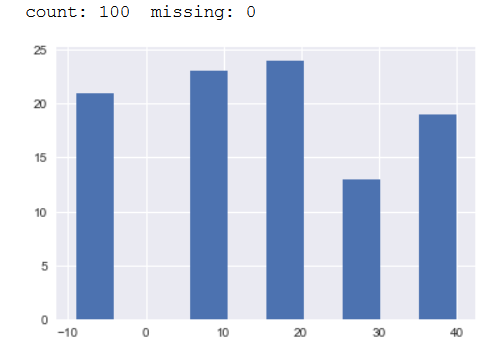 |

To get rid of the missing values we can tap the **replace**() method of
the **Series** object. It works just like the **str** method. Here, we
take advantage that pandas (via NumPy) has a special placeholder for
missing data, **np.nan**[23]. This placeholder is cool because it
magically drops out of calculations like means, standard deviations, and
counts. The optional keyword **inplace** = **True** means a new object
will not be created as a result of the operation and that **None** will
be returned. Check this out:

<table>
<tbody>
<tr class="odd">
<td>
#inplace operation

s.replace(-9, np.nan, inplace = True)

h = s.hist()

print('count: {} missing: {}'.format(s.count(),

total_observed-s.count()))

#in a notebook we don't need print() – it works like the REPL

# ... but it doesn't hurt

print(s)
</td>
</tr>
</tbody>
</table>

When it's run, the missing values are replaced by the **np.nan** object,
rendered as "NaN". Note that the **count**() method reflects the length
of the **Series** sans the missing data. The retained placeholders are
reflected in the reported "Length".

<table>
<tbody>
<tr class="odd">
<td>
count: 79 missing: 21

&lt;snip&gt;

22 20.0

23 NaN

24 NaN

25 40.0

&lt;snip&gt;

Length: 100, dtype: float64

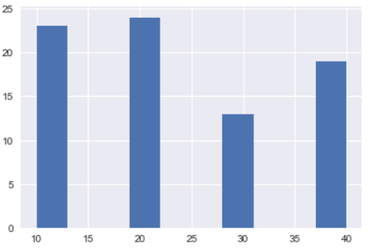
</td>
</tr>
</tbody>
</table>

If you want to scrub the NaN values completely, you can use the
**dropna**() method. This, too, has an optional **inplace** keyword
option. If you choose not to use it, you'll need to use the assignment
operator '=' to make the changes "stick".

<table>
<tbody>
<tr class="odd">
<td>
s = s.dropna() #no inplace = True

print(s)
</td>
</tr>
</tbody>
</table>

Note that the output reflects that the index values associated with the
missing data have disappeared (the original data is associated with the
original indices). The length of the **Series** reflects the removal of
the NaNs.

<table>
<tbody>
<tr class="odd">
<td>
22 20.0

25 40.0

Length: 79, dtype: float64
</td>
</tr>
</tbody>
</table>

If you simply want to extract null values, you can use use the
**np**.**isnull**() method; and if you want the valid values, you can
use the **np**.**notnull**() method.

### Replacing Missing Values

Sometimes you want to replace missing values with reasonable estimates
of what the data probably is. For instance, if you are looking at hourly
temperatures and have gaps, you have a pretty good idea that the missing
values are going to be between the good observations. Pandas has some
ways to handle this situation. To illustrate, let's generate a clean
**Series** with some NaN values sprinkled in:

<table>
<tbody>
<tr class="odd">
<td>
s = pd.Series.from_array([100, np.nan, np.nan, np.nan, 200])

print(s)
</td>
</tr>
</tbody>
</table>

This will give us something like:

<table>
<tbody>
<tr class="odd">
<td>
0 100.0

1 NaN

2 NaN

3 NaN

4 200.0

dtype: float64
</td>
</tr>
</tbody>
</table>

If we want, we can give the null values a specific new value using
**np.fillna**(). We'll make a deep copy of the original and try it out:

<table>
<tbody>
<tr class="odd">
<td>
t = s.copy()

t = t.fillna("FAKE NEWS! SAD.")

print(t)
</td>
</tr>
</tbody>
</table>

This will yield something like:

<table>
<tbody>
<tr class="odd">
<td>
0 100

1 FAKE NEWS! SAD.

2 FAKE NEWS! SAD.

3 FAKE NEWS! SAD.

4 200
</td>
</tr>
</tbody>
</table>

We can get a little fancier and pick one of the bracketing good values
to serve as the new value. The **ffill**() method takes the previous
valid data point and projects it "forward".

<table>
<tbody>
<tr class="odd">
<td>
#replace NaN last good value

t = s.copy()

t = t.fillna(method = 'ffill')

print(t)
</td>
</tr>
</tbody>
</table>

... and produces this output:

<table>
<tbody>
<tr class="odd">
<td>
0 100.0

1 100.0

2 100.0

3 100.0

4 200.0
</td>
</tr>
</tbody>
</table>

The opposite method, **bfill**() takes the <u>next</u> good value as the
replacement. For this example, we'll also use the **limit** keyword
argument – this limits the number of consecutive missing values to be
replaced (works for **ffill**() as well). You might want to set this to
a reasonable number such that really big gaps are apparent when you run
quality checks, and that estimated values don't span such large gaps
that they become bogus.

<table>
<tbody>
<tr class="odd">
<td>
#replace NaN w/ next good value

t = s.copy()

t = t.fillna(method = 'bfill', limit = 2)

print(t)
</td>
</tr>
</tbody>
</table>

This code produces the following results:

<table>
<tbody>
<tr class="odd">
<td>
0 100.0

1 NaN

2 200.0

3 200.0

4 200.0
</td>
</tr>
</tbody>
</table>

Often times, you'll want to get a bit fancier and calculate interpolated
values. Again pandas comes to the rescue with the cleverly-named
**interpolate**() method. Here is its basic usage...

<table>
<tbody>
<tr class="odd">
<td>
#replace NaN w/ interpolated

t = s.copy()

t = t.interpolate()

print(t)
</td>
</tr>
</tbody>
</table>

...which yields the following:

<table>
<tbody>
<tr class="odd">
<td>
0 100.0

1 125.0

2 150.0

3 175.0

4 200.0
</td>
</tr>
</tbody>
</table>

The **interpolate**() method has lots of options. As with **ffill**()
and **bfill**() we can tell it whether to project new values forward or
backwards, and set a limit as to the number of consecutive null values
to be replaced. It also supports different "flavors" of interpolation
(as you can see from the results, the default is linear) – and that's
where the direction of the projection can become material.

<table>
<tbody>
<tr class="odd">
<td>
#replace NaN w/ interpolated

t = pd.Series.from_array([100, 120, np.nan, np.nan, np.nan, 200])

t = t.interpolate(method = 'quadratic',

direction = 'backward')

print(t)
</td>
</tr>
</tbody>
</table>

You'll note that we had to give the **Series** another good value to
support the quadratic extrapolation method. Here are the results:

<table>
<tbody>
<tr class="odd">
<td>
0 100.0

1 120.0

2 140.0

3 160.0

4 180.0

5 200.0
</td>
</tr>
</tbody>
</table>

The interpolation options include **cubic**, **polynomial**, **nearest**
(picks the most proximate good value), etc. If you want to explore all
of the options, you may want check out the docs[24].

### Outliers

Sometimes your data will contain elements that simply cannot be valid.
Let's say your relative humidity monitoring equipment suddenly says
"200" – a physically impossible metric. You would want to throw that
data point out before doing any analysis. Or let's say you're measuring
outdoor temperatures on a winter day and get sporadic readings in the
120 degree (F) range. This is pretty suspect and probably indicates an
instrumentation error.

Or let's say you're measuring things like rainfall and baseball
statistics and learn that in 2016 Houston got 50" of rain in a week
eight months after the Cubs won the World Series. This can't be correct.
Ummm. The point is that you should scrub outliers carefully and with
plenty of reflective thought. Anyway, here are a couple of ways to
handle them.

#### Known-Value Outliers

In the case that a class of observations is truly impossible, the
process is easy – we have lots of good options. Let's say we had
relative humidity measures (that's the amount of water vapor contained
in the air relative to the maximum amount the air can possibly hold at
any given temperature). We would want to get rid of any observation less
than 0 or greater than 100.

One way to do that is to use the **mask**() method. Essentially, you can
create a data structure the same size and shape as the original with
each element containing valid data or an **np.nan** object.

<table>
<tbody>
<tr class="odd">
<td>
#use mask() to create a new data structure

rh = pd.Series.from_array([3, 50, -4, 99, 201])

masked = rh.mask( (rh&lt;0) | (rh &gt;100) )

print(masked)
</td>
</tr>
</tbody>
</table>

To use **mask**(), just provide the <u>invalid</u> condition(s).

<table>
<tbody>
<tr class="odd">
<td>
0 3.0

1 50.0

2 NaN

3 99.0

4 NaN
</td>
</tr>
</tbody>
</table>

If you want a new structure with the bad values kicked out, you can use
a slice operation like so, providing the <u>valid</u> condition(s):

<table>
<tbody>
<tr class="odd">
<td>
#grab a slice of 'the good stuff'

fixed = rh[ (rh&gt; = 0) &amp; (rh &lt; = 100)]

print(fixed)
</td>
</tr>
</tbody>
</table>

... to get something like[25]:

<table>
<tbody>
<tr class="odd">
<td>
0 3

1 50

3 99
</td>
</tr>
</tbody>
</table>

#### Distributional Outliers

Sometimes, you'll have a situation where you don't understand the data
that well and you want to kick out values that are way out of whack with
the rest of them. You can do that statistically with a technique called
"z-distribution normalization" or more simply "standardization".

Assuming your data (or at least what it purports to reflect in the real
world) has a normal distribution there are lots of statistical tricks
you can use to wrangle it. The normal distribution is really well
understood to the point where there are all kinds of inferences you can
make around it, and all kinds of methodologies based on its properties.

In order to make use of many of the tools and techniques available, you
need to make your (probably messy) real world data look like the
idealized form. That involves some linear rescaling – this doesn't
remove any information content from your data but makes it much more
tractable.

Essentially you want to rescale your data so that it has a mean of zero
and standard deviation of one (that's called a "standard normal"
distribution). In a perfect world it'll look something like this:

<table>
<tbody>
<tr class="odd">
<td>
frequency

observed value (in terms of how many

standard deviations from mean)
</td>
</tr>
</tbody>
</table>

The <u>mean</u> is the average of the observations – add them up and
divide by the count. That's going to be right in the middle of the curve
if you plot your observations.

The <u>standard deviation</u> is a little more complicated. It's a
measure of the "spread" of the data. A high standard deviation means a
wide distribution. A low standard means a more "peaked" one.

It's based on something called the <u>variance</u> (actually, the
standard deviation is just its square root). To get the variance[26],
you find the difference between each observation and the mean. Then
square each difference (this makes sure that each contribution is a
positive number that reflects how far off-center the observation is).
Then figure out the mean (average) of all the squared differences. In
math terms:

<table>
<tbody>
<tr class="odd">
<td>
Variance = [ SUM (observed - mean ) ^2 ] / number of observations

Standard deviation = SQRT (Variance)
</td>
</tr>
</tbody>
</table>

Back to rescaling ... you want to transform your observations so that it
looks as close to the ideal version as possible. To accomplish that you
make up a scaling factor based on the mean and standard deviation of the
entire data set then apply it to each element.

This involves subtracting the mean (that centers the distribution) and
dividing by the standard deviation (this controls the "spread").

Here's a simple example, starting with a weird distribution called the
Gumbel distribution[27]:

<table>
<tbody>
<tr class="odd">
<td>
#screen data statistically

data = np.random.gumbel(size = 1000) #for 'fat tailed' distributions

t = pd.Series(data)

t.hist(bins=100)
</td>
</tr>
</tbody>
</table>

... which yields the following frequency / distribution plot:

|                                                                            |
|----------------------------------------------------------------------------|
| 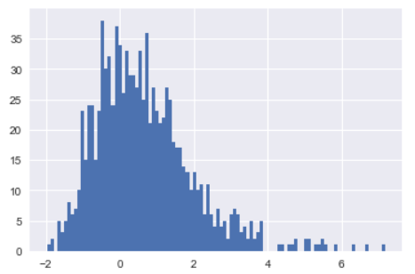 |

The observed values range from around -2 to around 8. To transform it to
a standard normal distribution[28] we can use code like this:

<table>
<tbody>
<tr class="odd">
<td>
#standardize the data

mean = t.mean()

stdev = t.std()

norm = (t-mean)/stdev

norm.hist(bins = 100)
</td>
</tr>
</tbody>
</table>

... which yields this distribution. You can see that its "center of
mass" is right over the zero mark on the x-axis and that the right tail
has been pulled in a bit.

|                                                                         |
|-------------------------------------------------------------------------|
| 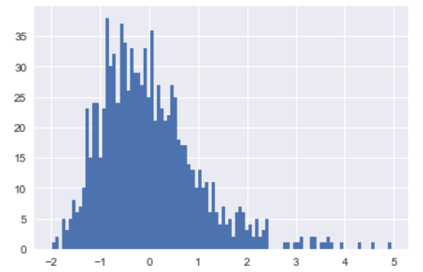 |

One nice thing about this transformed distribution is that we can use
the x-axis to determine cutoff points (in terms of the standard
deviation) that enclose particular fractions of the distribution. If we
look at the idealized distribution above, we can see that the 99% of all
observations are within 3 standard deviations of the mean; 95% are
within 2 standard deviations; and two-thirds are within one standard
deviation.

This makes it easy to use a rule-based approach to throwing out
potentially-aberrant observations. So, for instance, we might want to
get rid of everything that's more than 2 standard deviations from the
mean – getting rid of 5% of the data in an ideal world .

Here's one way to approach the problem:

<table>
<tbody>
<tr class="odd">
<td>
#make a new array with the good values

test = pd.Series([1,2,3,4,5])

bmask = test[test&gt;3]

print('good values (bmask)\n', bmask)

print()

print('good values index\n', bmask.index)

print()

fixed = test[bmask.index]

print('new series (fixed version)\n', fixed)sk.index] #we can 'borrow' the index and apply to test

print(fixed)
</td>
</tr>
</tbody>
</table>

. This bit of code creates a fresh **Series** object based on "good
values" found in the original. The new **Series** preserves the index
values of the original ones. We can "borrow" the new index and apply it
against the original with a slice operation. The result is a third
object that reflects the "good index values". Here's the output:

<table>
<tbody>
<tr class="odd">
<td>
good values (bmask)

3 4

4 5

good values index

Int64Index([3, 4], dtype='int64')

new series (fixed version)

3 4

4 5
</td>
</tr>
</tbody>
</table>

This is a bit silly because the solution is obvious, but it's just the
sort of thing you want to do with a more complex analysis when the data
is not so visible and/or you don't know just how the tools work.

So now that we have an algorithm, let's put it to work on the more
complex data. We're wanting to jettison everything that's more than 2
standard deviations from the mean ( **\|** normalized values **\|** &gt;
2). We'll use the index values of the "good" data points on the
normalized version to clean up the original data.

<table>
<tbody>
<tr class="odd">
<td>
#create a mask against the standardized data

bmask = norm[norm&lt;2]

new_norm = norm[bmask.index]

new_norm.hist(bins = 100)
</td>
</tr>
</tbody>
</table>

As you can see, the normalized values got "chopped off" on the right
side and the largest value is now around 2.

|                                                                          |
|--------------------------------------------------------------------------|
| 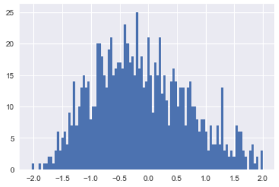 |

We can apply the same index against the original values. The visual
effect is less dramatic, but we've chopped off the highest values so
instead of the x-axis going to around 7 it now stops at about 3.

<table>
<tbody>
<tr class="odd">
<td>
#now apply it against the original

fixed = t[bmask.index]

fixed.hist(bins = 100)
</td>
</tr>
</tbody>
</table>

|                                                                       |
|-----------------------------------------------------------------------|
| 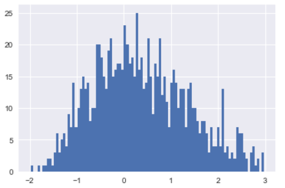 |

These are just a couple fairly straightforward data cleaning methods.
Naturally, things can get more complicated. For instance, if you're
interested in filtering signals (noise reduction, etc.) you might check
out the **signal** library[29]. If you're interested in image processing
(cancelling out "green screen" effects, etc.) you might investigate
**pillow/PIL**[30], the **ndimage** library[31], or
**scikit-image**[32]. Unfortunately, these are beyond the scope of the
present class.

Slicing, Dicing and Re-indexing
-------------------------------

As you've seen already, NumPy and pandas objects work a lot like
**list** objects. They carry indices along with them and can be
addressed via slicing operations. They also work a lot like **dict**
objects where values/components can be addressed by named key values.
You've also seen that these objects have separate index and value
components and that the index can be "borrowed" from one object and
applied to another. This section will take a further look at how all
this works and how you can apply it to your advantage. For simplicity of
exposition we'll focus on the **Series** object, but the concepts are
easily applied to other objects like the **DataFrame** and **Panel** –
and most to NumPy **ndarrays** upon which these are built.

### Index Objects

Unlike a **list** object, pandas index objects are largely under the
control of the user. This is evident as we apply the **Series** object's
constructor:

<table>
<tbody>
<tr class="odd">
<td>
&gt;&gt;&gt; index = ["duck0", "duck5", "duck10"]

&gt;&gt;&gt; data = (0, 5, 10)

&gt;&gt;&gt; s = pd.Series(data = data, index = index)

&gt;&gt;&gt; print(s)

duck0 0

duck5 5

duck10 10
</td>
</tr>
</tbody>
</table>

We can play around with this, accessing elements in a variety of ways as
we get our ducks in a row : -)

<table>
<tbody>
<tr class="odd">
<td>
&gt;&gt;&gt; s["duck0":"duck5"]

duck0 0

duck5 5

&gt;&gt;&gt; s.loc["duck0"]

0

&gt;&gt;&gt; s.iloc[1]

5
</td>
</tr>
</tbody>
</table>

The indices and values are essentially stored separately, and can be
addressed accordingly. Note from the output below that the **Index** is
a different object than the array:

<table>
<tbody>
<tr class="odd">
<td>
&gt;&gt;&gt; s.values

array([ 0, 5, 10])

&gt;&gt;&gt; s.index

<strong>Index</strong>(['duck0', 'duck5', 'duck10'], dtype = 'object')
</td>
</tr>
</tbody>
</table>

We can, if we want create a new **Index** object from its constructor
and apply it to our array. Here's an example:

<table>
<tbody>
<tr class="odd">
<td>
&gt;&gt;&gt; newix

Index(['qucker1', 'quacker2', 'quacker3'], dtype = 'object')

&gt;&gt;&gt; s.index = newix

&gt;&gt;&gt; s

qucker1 0

quacker2 5

quacker3 10

dtype: int64
</td>
</tr>
</tbody>
</table>

### Re-Indexing

The fact that the index and values are separate is really powerful
because it allows rearranging data along new indices as they are
provided. Consider this example:

<table>
<tbody>
<tr class="odd">
<td>
&gt;&gt;&gt; newix = ["duck0", "duck1", "duck2", "duck5", "duck10"]

&gt;&gt;&gt; s.reindex(newix)

s.reindex(newix)

duck0 0.0

duck1 NaN

duck2 NaN

duck5 5.0

duck10 10.0
</td>
</tr>
</tbody>
</table>

By inspection, you can observe that the existing values associated with
the original indices for "duck0, duck5, and duck10" all persisted.
Placeholders were created for the newly-added index points. We didn't
even have to create a separate **Index** object – pandas was smart
enough to know we needed one (it'll actually work with anything that
looks like it will fit – a **tuple**, **array**, etc.)

If we want, we can ask to fill in the placeholders as the index is
expanded using the methods **bfill**(), **ffill**(), and **nearest**().
It's also possible to sort a **Series** using by **sort\_index**() and
**sort\_values**(). Be careful, thought, as the results may not be what
you expect:

<table>
<tbody>
<tr class="odd">
<td>
&gt;&gt;&gt; s.ffill()

duck0 0.0

duck1 0.0

duck2 0.0

duck5 5.0

duck10 10.0
</td>
<td>
&gt;&gt;&gt; s.sort_index()

duck0 0.0

duck1 NaN

duck10 10.0

duck2 NaN

duck5 5.0
</td>
<td>
&gt;&gt;&gt; s.sort_values()

duck0 0.0

duck5 5.0

duck10 10.0

duck1 NaN

duck2 NaN
</td>
</tr>
</tbody>
</table>

Data Description / Analysis Tools
---------------------------------

Pandas has a pretty good set of data introspection tools baked right
into the objects. We'll go over these in more detail as we analyze real
data, but here's an overview.

Working still with the Gumbel distribution, we'll make a two-column
**DataFrame** object by providing a **dict** to the constructor:

<table>
<tbody>
<tr class="odd">
<td>
#py_numpy_descriptives.py

&gt;&gt;&gt; import numpy as np

&gt;&gt;&gt; import pandas as pd

&gt;&gt;&gt; data = np.random.gumbel(size = 1000)

&gt;&gt;&gt; df = pd.DataFrame({'a':data, 'b':data*2})
</td>
</tr>
</tbody>
</table>

It's possible to use the **DataFrame**'s built-in **describe**() method
to get some basic statistics (these will also work on the **Series**
object):

<table>
<tbody>
<tr class="odd">
<td>
&gt;&gt;&gt; d = df.describe()

&gt;&gt;&gt; d

a b

count 1000.000000 1000.000000

mean 0.553424 1.106848

std 1.326876 2.653752

min -1.943750 -3.887501

25% -0.362556 -0.725112

50% 0.289234 0.578468

75% 1.206974 2.413948

max 11.871133 23.742267
</td>
</tr>
</tbody>
</table>

The **describe**() method works like most of the others. It actually
returns a new **ndarray** object that we can selectively query. For
instance, if we just wanted the mean from the first column we could go:

<table>
<tbody>
<tr class="odd">
<td>
&gt;&gt;&gt; d['a']['mean']

0.56050127339136135
</td>
</tr>
</tbody>
</table>

We can, alternatively, directly query this information using methods
like **mean**(), **min**(), **std**(), **kurtosis**(), and **max**().
Here are a few examples. Note that you have a choice of syntax when
accessing them.

<table>
<tbody>
<tr class="odd">
<td>
&gt;&gt;&gt; df.mean()['a']

0.56050127339136147

&gt;&gt;&gt; df.max()

a 8.131923

b 8.131923

dtype: float64

&gt;&gt;&gt; d['a'].kurtosis()

7.9989540881999783
</td>
</tr>
</tbody>
</table>

If you want to get a bit fancier, you can tap into scipy’s **stats**
library. The **stats** library is a vast collection of distributions,
statistical tests, and other fun stuff to do with data arrays. Here's
how to use some of the methods:

<table>
<tbody>
<tr class="odd">
<td>
&gt;&gt;&gt; from scipy import stats

&gt;&gt;&gt; dstats = stats.describe(df)

dstats

DescribeResult(nobs = 1000,

minmax = ( array([-2.26940325, -4.5388065 ]),

array([ 6.94329272, 13.88658544])),

mean = array([ 0.50914785, 1.01829569]),

variance = array([ 1.42528858, 5.70115432]),

skewness = array([ 0.90966795, 0.90966795]),

kurtosis = array([ 1.67634417, 1.67634417]))
</td>
</tr>
</tbody>
</table>

As you can see, **describe**() has produced a superset of the
**DataFrame** version and in pretty much the same format. We lose the
column labels i.e., can't reference by name like \['a'\], but can pick
off individual items:

<table>
<tbody>
<tr class="odd">
<td>
&gt;&gt;&gt;dstats.minmax[1][0]

6.9432927181148854

&gt;&gt;&gt; dstats.mean[0]

0.50914784672113866
</td>
</tr>
</tbody>
</table>

We can whistle up some tests quickly. Here's a test for normality run
against the first column of data:

<table>
<tbody>
<tr class="odd">
<td>
&gt;&gt;&gt; sn = stats.normaltest(df['a']))

&gt;&gt;&gt; sn

NormaltestResult(statistic=226.96289845495562,

pvalue=5.1955652346602584e-50)
</td>
</tr>
</tbody>
</table>

We can go ahead and pick off the components. The 'statistic' is the
combined z-score for tests of skewness and kurtosis. That's very roughly
the number of standard deviations away from what we'd expect if the
distribution was perfectly normal – a small number is better than a
larger one.

<table>
<tbody>
<tr class="odd">
<td>
&gt;&gt;&gt; sn.statistic

226.96289845495562
</td>
</tr>
</tbody>
</table>

The **'pvalue'** is what we're really after. The **pvalue** provides an
estimate of how much confidence we can have about rejecting the null
hypothesis (that the distribution is normal). In this case the null
hypothesis is that the distribution is normal and smaller the p-value,
the more certain we are that the distribution doesn't fit the normal
distribution. At p=.05, we'd be 95% certain that we can reject...

<table>
<tbody>
<tr class="odd">
<td>
&gt;&gt;&gt; sn.pvalue

5.1955652346602584e-50
</td>
</tr>
</tbody>
</table>

... and with a value this low there's about zero percent chance that
we've made a bad call. Another way to get at the same question is to ask
whether, based on the skewness of our data, whether it probably came
from a normally-distributed population.

<table>
<tbody>
<tr class="odd">
<td>
&gt;&gt;&gt; sn = stats.normaltest(df['a'])

&gt;&gt;&gt; sn.statistic

226.96289845495562

sn.pvalue

5.1955652346602584e-50
</td>
</tr>
</tbody>
</table>

Some of the other tests available include **binom\_test** (tests if
binomally distributed) and **ttest\_ind** (tests two samples to figure
out whether they probably came from the same population by comparing
their means).

Here is how to use **ttest\_ind**(). It takes two array-like objects and
is pretty flexible in just what they are – **ndarrays**, **Series**, and
even humble **list** objects all work equally well.

<table>
<tbody>
<tr class="odd">
<td>
&gt;&gt;&gt; stats.ttest_ind(df['a'], df['b'])

Ttest_indResult(statistic=-6.7713653833129266,

pvalue=1.6717218297409181e-11)
</td>
</tr>
</tbody>
</table>

One can just "eyeball" this result to see that that the two columns of
our **DataFrame** are not from the same population.

These are a few of the tools available. To learn about the rest or to
dig more deeply into the ones shown here, simply apply the **help**()
utility. This command will get you the gory details on how to compare
the means of two related samples. It'll show you how to manage treatment
of missing values, how to interpret the p-values, etc.

<table>
<tbody>
<tr class="odd">
<td>
&gt;&gt;&gt; help(stats.ttest_rel)

&lt;snip&gt;
</td>
</tr>
</tbody>
</table>

<table>
<tbody>
<tr class="odd">
<td>
Exercise:

rotowire.com<a href="#fn1" class="footnote-ref" id="fnref1" role="doc-noteref">1</a> publishes an excellent compendium of baseball statistics. Some of these are available in your course materials file directory as "baseball_stats.xls". Please practice some of your chops against this file.

- use the pandas <strong>read_excel</strong>() method to read columns "A" to "M" only.

- one of the columns, "bb_pct" shows the percentage of at-bats that resulted in walks. Create a histogram so you can "eyeball" it.

- find the mean and standard deviation then determine if this is probably normally distributed.

- prune the outliers (maybe get rid of zero values and those above 20%).

- create a standardized version of the pruned distribution then trim it so it contains only the data that's within one standard deviation of the mean. Use its <strong>index</strong> to create a pruned version of the original.

How does the mean and standard deviation of the this version compare to the original? Is it more or less likely to be normally-distributed?

Extra credit:

Create a bunch of new <strong>Series</strong>, based on subsets of the pruned version, with varying numbers of observations and determine whether each is likely to be normally-distributed (you need at least 20 for <strong>normaltest</strong>() to work, and should get at least 100 at the high end). You can use slice notation or perhaps the <strong>sample</strong>() method of the <strong>Series</strong> object here. Gather the results into a new <strong>Series</strong> and create a histogram.

What do you observe about the p-value as the number of observations grows?
</td>
</tr>
</tbody>
</table>
<section class="footnotes" role="doc-endnotes">

<ol>
<li id="fn1" role="doc-endnote">
http://www.rotowire.com/baseball/player_ex_stats.htm<a href="#fnref1" class="footnote-back" role="doc-backlink">↩︎</a>
</li>
</ol>
</section>

Data Visualization
==================

A picture is worth a thousand words, right? This is especially the case
with data projects. There's nothing like a clean graphic to give you the
"smell", look, and feel of the target of your analysis.

This chapter shows you how to use some more of the baked-in
visualization features of pandas. You'll recall that pandas objects wrap
**matplotlib**, Python's native plotting library. This provides a quick
and dirty way see what your data looks like and to communicate your
analytical findings. Mastery at visualization is a discipline unto
itself, of course, and there are many tools available as your
requirements become more complex. We'll just cover the basics here.

Jupyter (iPython) Notebooks
---------------------------

Jupyter notebooks provide an XML container capable of rendering code and
output in a variety of languages including Python and R in a web browser
that's in communication with a server. You can write code in one or more
text windows then ask the server to execute it and return the results –
including graphics if you want them – back to your browser window.
Additionally, you can include "static" text provided as HTML or another
markup language e.g., Markdown or LaTeX, in separate text windows.

Jupyter comes with major Python distributions like Anaconda and "just
works" right out of the box. It provides the ability to present
integrated Python code, high quality typeset graphics (to include
mathematical symbols), and visualizations from tools like matplotlib and
Seaborn all in a pseudo-interactive environment.

By "pseudo-interactive", I mean that you can iteratively edit code,
execute it, and see the results with fairly fast turn-around cycles.
That being said, the Python code is no longer "live" because it's
getting executed on a server – you no longer have access to the REPL or
the real-time object introspection capabilities provided by an IDE. The
latter fact can make it a more challenging for a new user feeling her
way around unfamiliar objects. Part of this disadvantage is moot when
working with objects like NumPy arrays that are "close to the metal",
wrapping compiled C modules because the underlying code is opaque,
anyway.

The good news is that you don't really have to choose one or the other.
A common workflow involves writing code in some sort of editor to get it
working and tested - then transfer it over to a notebook for
presentation or to refine analysis based on "interactive" exploration of
visualized data.

Getting a notebook working locally is really easy. From a command line,
simply go:

|                    |
|--------------------|
| $ jupyter notebook |

This will fire up a server on port 8888 and (on most systems) open a
browser already pointed to localhost:8888.

|                                                                        |
|------------------------------------------------------------------------|
|  |

You'll the have the upload a notebook (\*.ipynb) file from the file
system or launch a new one. In either case the notebook will be stored
in the server root of the Jupyter server (it is a web app, after all) –
which will be the directory from which the server was launched. If you
launch a new notebook, you'll see a window something like this:

|                                                                          |
|--------------------------------------------------------------------------|
| 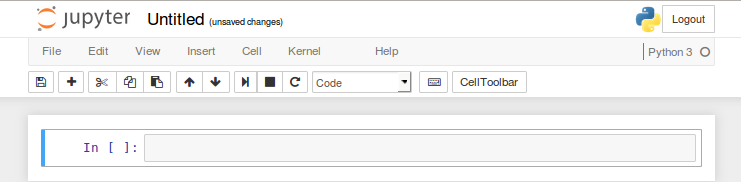 |

This provides a code window into which you can type or cut/paste code at
the bottom and a GUI with several operational options at the top. The
code window can have Python code or text (choose with the drop-down that
currently says "Code"). You can make new code windows using the "Insert"
menu item. Execute one or more code blocks using options from the "Cell"
menu item. Here's a simple "Hello World" example:

|                                                                            |
|----------------------------------------------------------------------------|
| 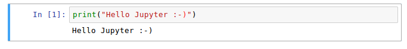 |

To display graphics in-line, use the **%matplotlib** inline directive
like this:

|                                                                        |
|------------------------------------------------------------------------|
| 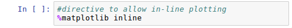 |

To replicate the last example, we could then copy/paste the code
(omitting the **show**() – that happens automatically in a notebook).

<table>
<tbody>
<tr class="odd">
<td>
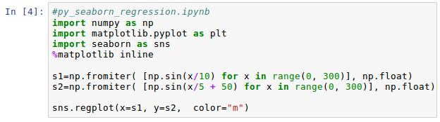

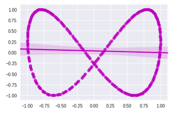
</td>
</tr>
</tbody>
</table>

We'll be using both Python both in the interactive mode and with
notebooks, striving to utilize each where it's strongest.

Matplotlib with Pandas methods
------------------------------

Pandas provide convenient wrappers for the Matplotlib functionality,
making "quick and dirty" plots easy to implement, as we've already seen.
Here are a few off the shelf examples in a Jupyter notebook:

|                                                                        |
|------------------------------------------------------------------------|
| 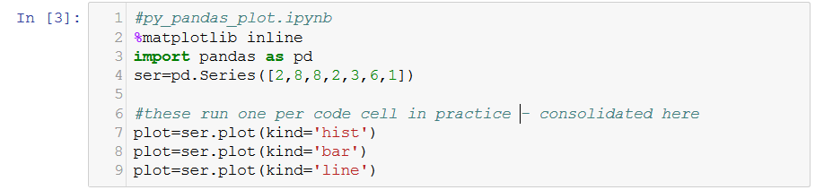 |

In a notebook, you would call each of the **plot**() directives one at a
time, each in its own code block. For exposition they are consolidated
here. Working in an IDE or at the command line, you would have to call
the **plot.figure.show**() method to get them to actually display. Here
are the the three results, consolidated after production:

|                                                                          |
|--------------------------------------------------------------------------|
| 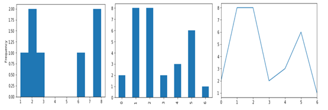 |

Plotting works the same way with a **DataFrame** object. Here's are a
couple of quick example using random data...

|                                                                        |
|------------------------------------------------------------------------|
| 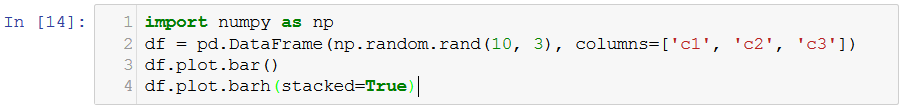 |

... again with the images combined post-production.

|                                                                          |
|--------------------------------------------------------------------------|
| 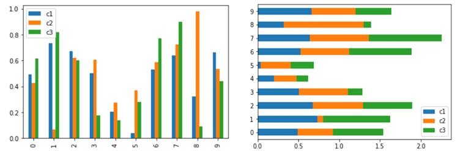 |

Several other graph types are available. These include **plot.box**() to
visualize distributions, **plot.area**(), **plot.pie**(),
**plot.scatter**(), and **hexbin** to visualize density via color-coded
hexagons. You can read all about these in the official docs[33].

Working With Basic Matplotlib Charts
------------------------------------

The **plot**() of a pandas **Series** object is a method of the
**Series** object, technically, though it's really the
**matplotlib.pyplot.plot**() method under the hood. To create the same
line chart working directly with Matplotlib, we could use the following
code:

<table>
<tbody>
<tr class="odd">
<td>
import matplotlib.pyplot as plt

plt.plot([2,8,8,2,3,6,1])
</td>
</tr>
</tbody>
</table>

The syntax is a bit different – the pandas wrapper provides a little
extra convenience with keyword arguments like "kind=". However, this
would also produce a line chart with the pandas objects. Other methods
include **plt.bar**() and **plt.hist**().

Working with Compound and Customized Chart Types
------------------------------------------------

Making easy charts is ... well ... easy. To get more granular control
you need to understand a little about the objects in play. You don't
need to memorize this, but it's a good idea to get a 10,000 foot
overview before plunging in[34].

One way to think about Matplotlib is a bunch of nested containers – sort
of like Russian dolls. At the top level there's a **FigureCanvas**
that's populated with contents by the **Renderer**. The interactions are
orchestrated by the **Artists**, which lays out the specifications for
the shapes, lines, and text that appear on a plot object.

The Artists know about the objects we want to create – things like
**AxisImage** and **Line2D** graphics – and the appropriate container
objects like **Figure, Subplot,** **Axes** used to hold them.

Plotting objects are grouped into a container object called a
**figure**. Generally speaking, you can work with the **figure** to set
the window title and display the whole product. Each figure can have one
or more independent **Subplot** objects ( "charts" in the vernacular).
**Subplot** objects know about things like axes titles, chart titles,
axis formatting, and what sort of chart (line, bar, etc.) to produce.
Each subplot can display one or more data series, each contained in its
own **Axes** object. That's where the data itself lives.

This code demonstrates how to create a chart "the hard way" – by
handling different container objects. You won't typically go about it in
this fashion, but the script takes you on a quick tour of the structure.
Here are some imports and a data series to plot:

<table>
<tbody>
<tr class="odd">
<td>
#py_matplotlib_1.py

&gt;&gt;&gt; import numpy as np

&gt;&gt;&gt; import matplotlib.pyplot as plt

&gt;&gt;&gt; from matplotlib import rcParams #settable properties

&gt;&gt;&gt; s1 = np.fromiter( [np.sin(x/10) for x in range(0, 300)], np.float)
</td>
</tr>
</tbody>
</table>

We can start by creating a **figure** object. There can be several
figure objects in your script, but only can be active at a time –
references to **pyplot** objects, therefore, don't need to specify which
**figure** is in play. To switch, just specify a different **figure**
number. The **figure** automatically comes with a **canvas** container
into which it will render. We can, optionally, set a reference to it.

<table>
<tbody>
<tr class="odd">
<td>
#create a master figure container (comes with a free canvas object)

&gt;&gt;&gt; figure = plt.figure(1) #container object

&gt;&gt;&gt; fignum = figure.number #figure index # - one active at a time

&gt;&gt;&gt; canvas = figure.canvas #the canvas the figure renders into
</td>
</tr>
</tbody>
</table>

To a blank **plot** object, we can add an **axes** object. That's the
container that will hold the data. It can be specified directly with a
**tuple** containing size and location settings – all relative to the
size of the **figure's** internal size and shape:

<table>
<tbody>
<tr class="odd">
<td>
&gt;&gt;&gt; left, bottom, width, height = .2, .2,.6, .6

&gt;&gt;&gt; axes = figure.add_axes( (left, bottom, width, height) )
</td>
</tr>
</tbody>
</table>

In order to actually plot the data, we need to add an appropriate
object. Optionally, we can set parameters like line color, markings,
labels, etc. There are a half dozen different ways to set these up with
different \*args and \*\*kwargs patterns.

<table>
<tbody>
<tr class="odd">
<td>
&gt;&gt;&gt; #add data (adds an entry to axes.lines list for free)

&gt;&gt;&gt; axes.plot(s1, 'blue', label = 'axes.plot label')
</td>
</tr>
</tbody>
</table>

In this example, we've specified references to several of the available
objects. We can use these to tweak the parameters. Here are a few
examples. The legends, labels, etc. will display as the associated
directive:

<table>
<tbody>
<tr class="odd">
<td>
#canvas

&gt;&gt;&gt; canvas.set_window_title("canvas.set_window_title")

#axes

&gt;&gt;&gt; axes.xaxis.set_label_text('axes.xaxis.set_label_text')

&gt;&gt;&gt; axes.set_ylabel('axes.set_ylabel')

&gt;&gt;&gt; axes.set_title('axes.set_title')

&gt;&gt;&gt; axes.set(label = "axes.set(label = )")

&gt;&gt;&gt; axes.legend() #turns display on

#line properties

&gt;&gt;&gt; line = axes.lines[0]

&gt;&gt;&gt; line.set_marker('.')

&gt;&gt;&gt; line.set_markerfacecolor('green')

&gt;&gt;&gt; line.set_markeredgecolor('green')

&gt;&gt;&gt; line.set_label("line.set_label")
</td>
</tr>
</tbody>
</table>

Since there are literally hundreds of settings on dozens of different
possible objects, there's no sense in trying to remember them all. Here
are a few ways to get help (output is omitted because it would extend to
several dozens of pages).

<table>
<tbody>
<tr class="odd">
<td>
&gt;&gt;&gt; plt.setp(line) #line properties)

&lt;snip&gt;

&gt;&gt;&gt; figure.properties() #figure properties

&lt;snip&gt;

&gt;&gt;&gt; rcParams #dict of Artist properties

&lt;snip&gt;
</td>
</tr>
</tbody>
</table>

The last command is an exhaustive recitation of all the **Artist**
object's possible settings and current values. Recall that the
**Artist** handles all the lines, shapes, axis labels, etc. – most of
what you'll be interested in specifying.

Here's what the plot we just created looks like. Note that even though
we didn't set up the tick mark labels directly, Matplotlib came up with
some pretty reasonable defaults:

|                                                                          |
|--------------------------------------------------------------------------|
| 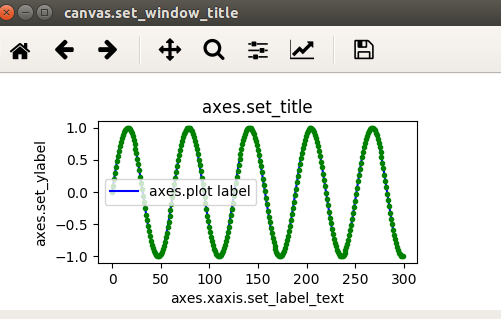 |

As noted above, some the the graphics presented here were combined in a
post-production step. Sadly for your author, this involved lots of
tedious cutting and pasting. There's an easier way, though it involves
diving a bit deeper into the plotting objects.

Here's an easy way to create a compound graphic using the
**pyplot.subplots**() method. It returns a 2-element **tuple**
containing a Matplotlib **figure.Figure** object and an array of
Matplotlib **axes** objects (technically **AxesSubplot** objects). The
**Figure** object is the master container for all the charts and each
**axes** object contains the information for an individual chart.

|                                                                        |
|------------------------------------------------------------------------|
| 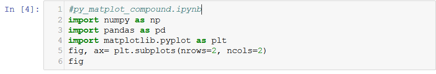 |

Here is the Figure object – for now a blank "catcher's mitt":

|                                                                            |
|----------------------------------------------------------------------------|
| 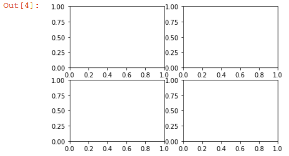 |

|                                                                        |
|------------------------------------------------------------------------|
| 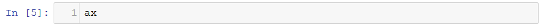 |

<table>
<tbody>
<tr class="odd">
<td>
ax

array([[&lt;matplotlib.axes._subplots.AxesSubplot object at &lt;snip&gt; &gt;,

&lt;matplotlib.axes._subplots.AxesSubplot object at &lt;snip&gt;&gt;],

[&lt;matplotlib.axes._subplots.AxesSubplot object at &lt;snip&gt;&gt;,

&lt;matplotlib.axes._subplots.AxesSubplot object at &lt;snip&gt;&gt;]],

dtype = object)
</td>
</tr>
</tbody>
</table>

And, as you can see each array element has a row's worth of **axes**
objects. We can address these individually as we add the specifics for
each chart.

|                                                                    |
|--------------------------------------------------------------------|
| 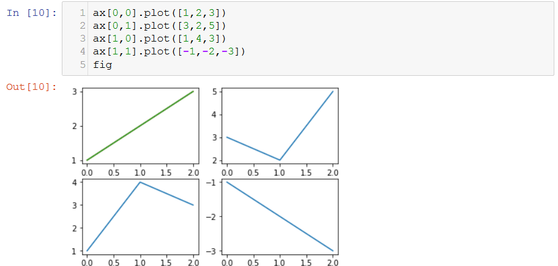 |

You can address the various properties of each of these subplot objects
individually. In the example below, we assigned names to the subplots
for enhanced transparency. To the lower, right one, we upgraded it to
include a scatter plot, customized axis tick marks, and an x-axis label.

|                                                                        |
|------------------------------------------------------------------------|
| 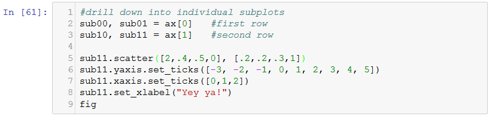 |

|                                                                            |
|----------------------------------------------------------------------------|
| 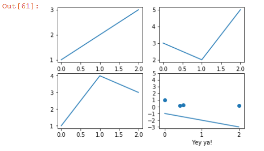 |

You've got really granular control if you want to drill down into the
constituent elements of these charts. To get a quick look at what these
elements are, use **get\_children**(). To figure out what you can tweak
on each of these take a look at **plt.rcParams**

|                                                                        |
|------------------------------------------------------------------------|
| 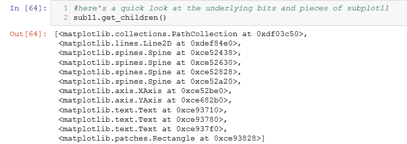 |

These plots so far are sort of boring, I know. So let's look at some
ways to customize them a bit more and add a modicum of coolness. For
this we'll start another notebook with some familiar imports.

|                                                                        |
|------------------------------------------------------------------------|
| 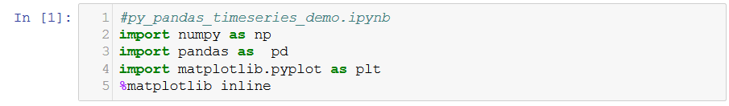 |

Customizing these plots requires using some specific symbols / names.
We'll provide English-language names for them to enhance transparency
later.

|                                                                        |
|------------------------------------------------------------------------|
| 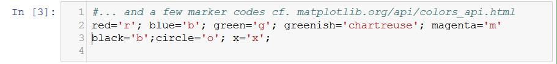 |

Here, we'll create some permutations of a sin wave to give us something
to plot – they're ginned up with **list** comprehensions:

|                                                                        |
|------------------------------------------------------------------------|
| 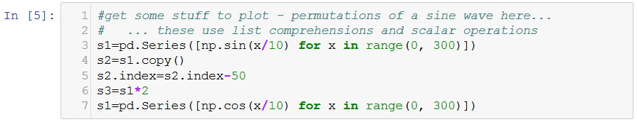 |

This code creates a figure object then plots a no-frills version of a
sin wave:

|                                                                        |
|------------------------------------------------------------------------|
| 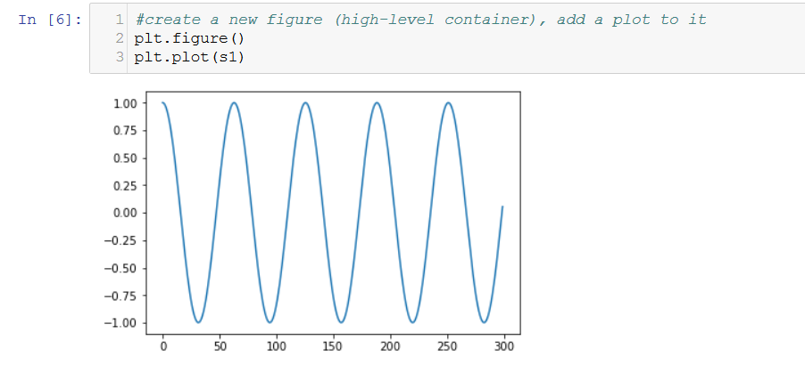 |

If we want, we can change the line color and add data point markers. We
can "dog pile" these, adding multiple markers to each of several
**Series** rendered in the same **axes** object:

|                                                                        |
|------------------------------------------------------------------------|
| 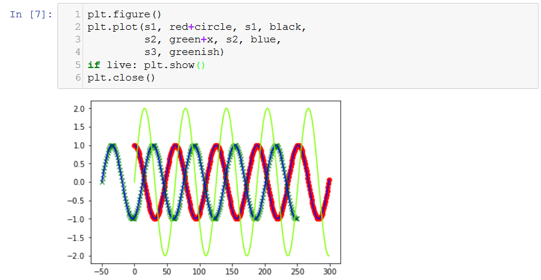 |

One common use case for putting multiple plots on the same graph is to
show a data set and some distribution that you think might fit it. For
instance, you might want to plot a histogram of some data and the normal
distribution that has the same mean and standard deviation. You can use
this as a recipe, should the need arise:

| 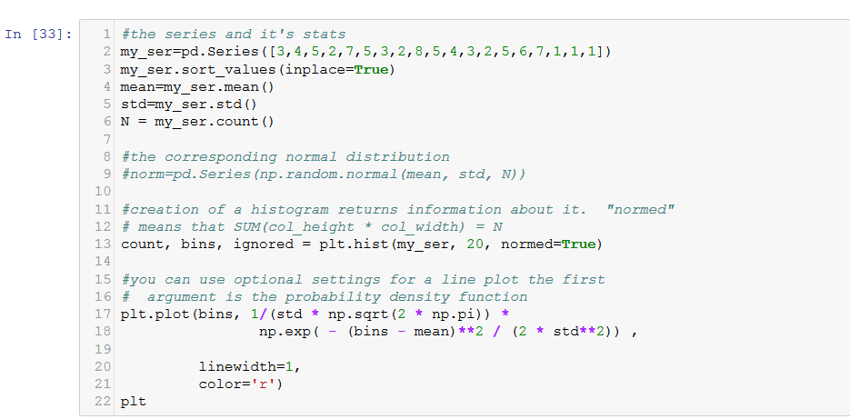     |
|----------------------------------------------------------------------------|
| 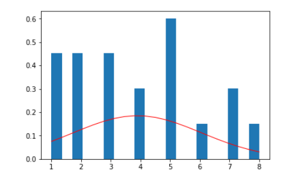 |

An alternative way to get several individual charts (**axes** objects)
into the same master Figure container is to use the **subplot**()
command. The arguments are rows (in the container), columns (in the
container), and which plot number we're populating.

The charts are numbered row-wise – \#1 goes in \[row 0\]\[column 0\],
\#2 in \[row 0\]\[column 1\], \#3 in \[row 1\]\[column 0\], and so on
until the grid is full.

|                                                                            |
|----------------------------------------------------------------------------|
| 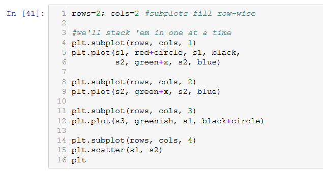 |

|                                                                         |
|-------------------------------------------------------------------------|
| 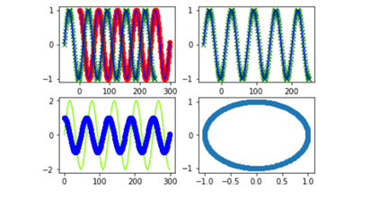 |

So far, we've plotted data f9rom the **Series** object. It's also
possible to plot right from a **DataFrame** – it, too, wraps Matplotlib.
For instance, if we want to plot several series of random numbers, we
could do so with this very short script. Note that it is nice enough to
include a legend without even being asked:

|                                                                        |
|------------------------------------------------------------------------|
| 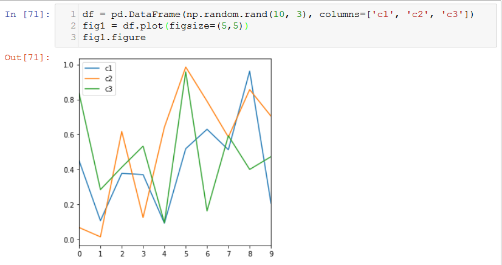 |

Visualization Tools for Exploratory Data Analysis
-------------------------------------------------

When looking at a new data set, sometimes it's useful to do at least
some first-order numerical exploration. We'll get into more complicated
ones later, but here are a couple simple tools / techniques to get you
going.

**Seaborn**[35] is essentially a high-level interface to Matplotlib.
Like Matplotlib, it works and plays well with the Python scientific
libraries like SciPy and NumPy. With Seaborne, it's easy to produce
really pretty graphics and some statistical analysis with minimal code.
For instance, it has ready access to built-in color theme palettes and
the ability to render complex "mash-ups" of different chart objects. The
downside is that to achieve granular control you still need to
understand, and work directly with Matplotlib, objects.

Even better, it has built-in analytical capability.

Here's a quick example of Seaborn's power. Let's assume we have two data
series. It's possible to conduct a linear regression analysis, plot both
**Series**, plot a linear regression line, and a 1-sigma (one standard
deviation) confidence boundary – all in a few lines of code.

|                                                                            |
|----------------------------------------------------------------------------|
| 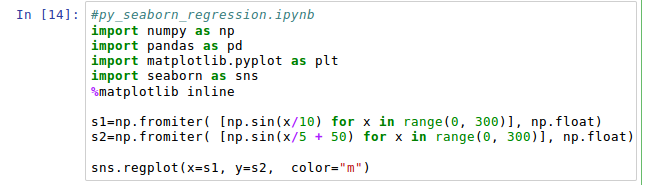 |

Linear regression is a technique used to find the "best fit" line
through a cloud of data. The idea is to minimize the distance between
the line estimated and data it's estimated against.

This isn't exactly the optimal application for regression, but the plot
is pretty cool – the "figure 8" is a scatter plot of the two data
series. The horizontal line represents the line that describes the best
linear relationship between the dependent variable (s1) and the
independent variable (s2). The light band shows the error band – minimal
at 0 and widening as the values approach the extremes. Pretty good for a
single line of code, don't you think?

|                                                                          |
|--------------------------------------------------------------------------|
| 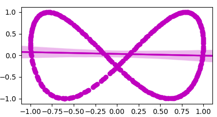 |

Here's a more conventional example, illustrating some of the many
options. The "ci" parameter is the confidence interval.

|                                                                            |
|----------------------------------------------------------------------------|
| 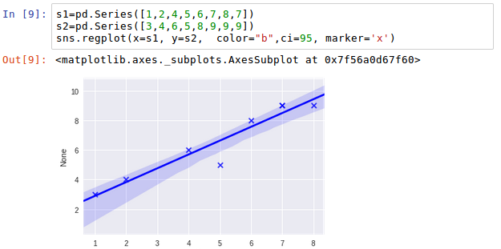 |

If you want a quick snapshot of the relationship between two **Series**,
you can use Seaborn's **jointplot**() method. You get the distribution
of each variable, a "heat map" of the joint probabilities, and the
Pearson's R – a measure of the correlation between the elements of two
data series, along with its p-value. Here's an example:

<table>
<tbody>
<tr class="odd">
<td>
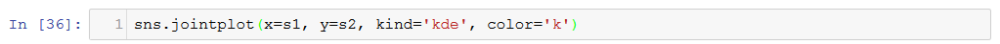

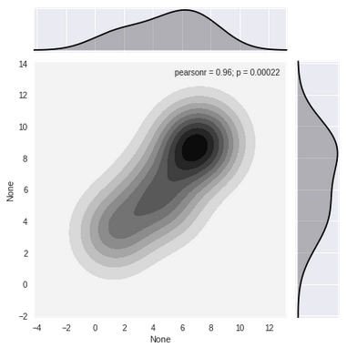
</td>
</tr>
</tbody>
</table>

There are also some univariate (one variable at a time) methods
available within Seaborn. One is the **distplot**() method. It will show
a histogram of the data then will attempt to fit a distribution to it.
By default it will use a Kernal Density Estimation[36] (KDE) for the
fit. This is a nonparametric method (doesn't use a formula for the base
shape) to figure what shape the population of all possible values
probably looks like. This may be a choice for small sample sizes as we
have here, or data you have no idea about. Right out of the box, here's
what you can do:

<table>
<tbody>
<tr class="odd">
<td>
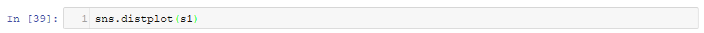

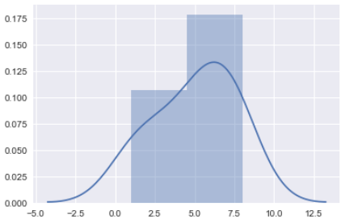
</td>
</tr>
</tbody>
</table>

It's easy enough to get it to try to fit another distribution – all you
have to do is give it the alternative distribution. If you want to
report the characteristics of that distribution, you can take advantage
that all of the tools we're discussing here – SciPy, NumPy, pandas, and
Seaborn are built on the same stack of constituent elements. Here, we
can delve into the **scipy.stats** library to get both the distribution
to use and fit metrics.

|                                                                        |
|------------------------------------------------------------------------|
| 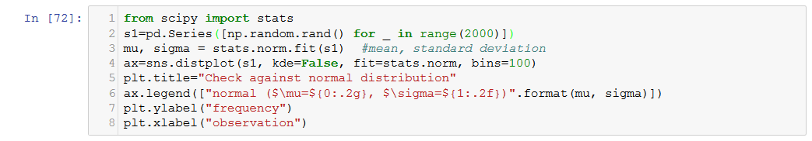 |

|                                                                            |
|----------------------------------------------------------------------------|
| 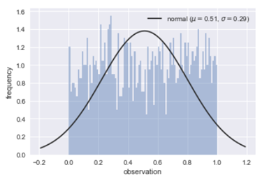 |

As you can we used the **stats.norm.fit**() method to do the heavy
lifting. Alternatively, we might have used **stats.chi2.fit**().
Chi-squared is another distribution – it's close to the normal
distribution in shape and better suited to small sample sizes.

The funny looking text for the legend works with Jupyter notebooks –
they know how to translate various kinds of text format strings like
this ...

|                                         |
|-----------------------------------------|
| 'normal ($\\\\mu=$5, $\\\\sigma=$2.35)' |

... into nicely-formatted text. This particular example uses **LaTeX**,
a general-purpose mathematical equation rendering language supported in
Jupiter's Markdown[37] implementation.

Another way to get a quick hit on your data is to use a "box-and-whisker
plot" (sometimes called simply "box plot"). It shows the min/max values,
median, and quartile boundaries. It's another "one liner" in
implementation:

<table>
<tbody>
<tr class="odd">
<td>
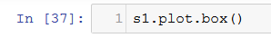

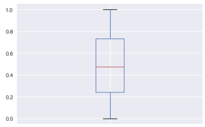
</td>
<td>
maximum

3rd quartile

median (*not* mean)

1st quartile

minimum
</td>
</tr>
</tbody>
</table>

Other Visualization Tools
-------------------------

Some of the other tools in the Python visualization ecosystem include:

-   **Bokesh**[38] - compares, more than contrasts with Seaborn.

-   **Pygal**[39] - produces high-quality, vectorized graphics.

-   **Plotly**[40] – online library that works with Python API.

-   **ggplot**[41] – simplified plotting tool based on ggplot2 (for R);
    works and plays well with pandas.

This is just a "tip of the hat" to these other tools, but your own
exploration is encouraged. The remainder of this course will focus on
Matplotlib and Seaborn.

<table>
<tbody>
<tr class="odd">
<td>
Exercise:

Please create a four-quadrant plot using data from "baseball_stats.xls" with this layout:

- NW: a histogram of the batting average (the "avg" column).

- NE: an overlay of the batting average and the associated normal distribution curve (using the batting average's mean and standard deviation). Feel free to build on the recipe in the text.

- SW: a scatter plot comparing the ratio of walks ("bb" column) to at_bats ("at_bat" column) on one axis and hits to at_bats (the "avg" column).

- SE: a scatter plot comparing the ratio of strikeouts ("k" column) to at_bats ("at_bat" column) on one axis and hits to at_bats (the "avg" column).

The tick marks on both of the scatter plots should be the same on the x-axis and y-axis. That's so that observations falling on a diagonal line through the origen would indicate that there's no difference in propensity to (walk/strike out) and the propensity to get a hit. You can manage the tick marks with the <strong>set_ticks</strong>() method.

All the subplots should have appropriate titles (hint: consider using the <strong>set_title</strong>() method).
</td>
</tr>
</tbody>
</table>

 Datetime Objects
================

Many streams of data come to us as time series of some sort or another.
Pandas is particularly well-adapted to wrangling these and has a lot of
tools to take care of digesting various data types, filling in missing
data, figuring out things like holidays, fiscal quarters, and weekends –
all built in.

Much of the magic comes from the tools to manufacture and manipulate
**Series** indices. We will explore some of these operations in this
chapter.

Basic Time Series Operations
----------------------------

You'll recall that **Series** index elements can be any hashable
object[42]. Most **datetime**-like objects fit this bill and are
typically used to index data structures containing time series. Pandas
has a special object, a **DatetimeIndex**, for this purpose.

An easy way to create a **DatetimeIndex** is to apply the
**date\_range()** method. One nice thing about **date\_range()** is that
it can handle anything that remotely looks like a date and reliably do
the right thing. These all produce dates from Jan 1, 2017 - Jan 5, 2017:

<table>
<tbody>
<tr class="odd">
<td>
#py_time_series_basic.py

&gt;&gt;&gt; import datetime

&gt;&gt;&gt; import pandas as pd

&gt;&gt;&gt; index = pd.date_range(start = '1/1/2017', periods = 5, freq = 'd')

&gt;&gt;&gt; index = pd.date_range(start = 'Jan 1 2017', periods=5, freq = 'd')

&gt;&gt;&gt; index = pd.date_range(start = datetime.datetime(2017,1,1), \

periods = 5, freq = 'd')

&gt;&gt;&gt; index = pd.date_range(start = '1 Jan 2017', end = '5 Jan 2017')

&gt;&gt;&gt; index

DatetimeIndex(['2017-01-01', '2017-01-02', '2017-01-03', '2017-01-04',

'2017-01-05'],

dtype = 'datetime64[ns]', freq = 'D')
</td>
</tr>
</tbody>
</table>

As you can see, there are many options for specifying the index. The
optional '**freq'** keyword argument can be specified as: 'A' (annual),
'M' (monthly), 'D' (daily), 'H' (hourly), 'M' (each minute), 'S" (each
second), and 'MS' (each millisecond). There are several flavors of 'A'
available e.g., 'A-MAR' (every year on March 1).

It's possible to create a **Series** object with a date index and data
in one fell swoop. It's also possible to swap or modify the index after
the **Series** already exists. Here's an alternative way to create a
**Series**:

<table>
<tbody>
<tr class="odd">
<td>
&gt;&gt;&gt; data = [10, 20, 30, 40]

&gt;&gt;&gt; index = pd.date_range(start = '1 Jan 2017', end = '4 Jan 2017')

&gt;&gt;&gt; ser = pd.Series(data = data, index = index)

&gt;&gt;&gt; ser

2017-01-01 10

2017-01-02 20

2017-01-03 30

2017-01-04 40

Freq: D, dtype: int64
</td>
</tr>
</tbody>
</table>

Introspecting Time Series
-------------------------

Once we have a time series, we can treat it like any other **Series**
object, but with a couple of twists. Here, we'll work with some
political polling data from Real Clear Politics[43]. The first few lines
of "clean\_polling\_data.csv" containing it look like this:

<table>
<tbody>
<tr class="odd">
<td>
date,poll,size,stype,approve,disapprove,spread

2017-04-24 00:00:00,Rasmussen Reports,1500,LV,47,53,-6

2017-04-23 00:00:00,Gallup,1500,A,40,54,-14

2017-04-20 00:00:00,ABC News/Wash Post,1004,A,42,53,-11
</td>
</tr>
</tbody>
</table>

The first line contains a comma-separated header (no spaces) which will
be picked up and added automatically as column index values when we
execute **read\_csv**() to import it.

This bit of code loads up the CSV file – assuming it's in the same
directory as the script / notebook then requests metadata on the
resulting **DataFrame** object. Note that we can specify column(s) to be
cast into **datetime** objects upon import.

|                                                                     |
|---------------------------------------------------------------------|
| 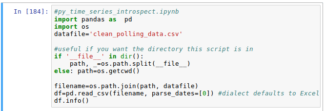 |

<table>
<tbody>
<tr class="odd">
<td>
&lt;class 'pandas.core.frame.DataFrame'&gt;

RangeIndex: 88 entries, 0 to 87

Data columns (total 7 columns):

date 88 non-null datetime64[ns]

poll 88 non-null object

size 88 non-null int64

stype 88 non-null object

approve 88 non-null int64

disapprove 88 non-null int64

spread 88 non-null int64

dtypes: datetime64[ns](1), int64(4), object(2)

memory usage: 4.9+ KB
</td>
</tr>
</tbody>
</table>

We can have a quick look at the first few rows using the **head**()
method. We'll do this after configuring how the text will display with
**pandas.set\_option**(). We'll also use the 'date' column as the index
since this is a time series.

| 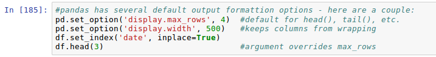 |
|--------------------------------------------------------------------------|
|    |

Our data is now in a **DataFrame** object. To grab a **Series**, all we
need to do is select a column (recall that a **DataFrame** is just a
stack of **Series** objects). Most of the methods, like **head**() will
still work.

|                                                                            |
|----------------------------------------------------------------------------|
|  |

It's easy to find out all the polling organizations in our data set.
This bit of code uses **unique**() to find one of each then sorts them
alphabetically:

|                                                                            |
|----------------------------------------------------------------------------|
|  |

Let's go ahead and create a new **Series**, this time based on the
polling "spread". That's the difference between "approve" and
"disapprove" ratings for the president.

|                                                                    |
|--------------------------------------------------------------------|
|  |

If we want, we can create an **ndarray** based only on the values using
the cleverly-named **values**() method:

|                                                                            |
|----------------------------------------------------------------------------|
|  |

We want to be a little careful here. Our **Series** object is not a
free-standing object. It's hot-linked to the original **DataFrame** – a
"view" instead of a deep copy. This is really important because any
change we make to the **Series** object is also reflected in the
original. Here, we'll change the first value of the **Series** to
something strange – 9999 then look at the **DataFrame**:

|                                                                            |
|----------------------------------------------------------------------------|
|  |

If we want to create an independent object, one way to go about it would
be to make a **copy** of the original, then pick off its **values**. The
following code does just that then "borrows" the index from the
original. Now we can change the values of the **Series** without
impacting the **DataFrame** object. No worries about the index, either –
it's also decoupled from the original.

|                                                                      |
|----------------------------------------------------------------------|
|  |

... and as you can see, the **Series** has reflected the change we just
made:

|                                                                            |
|----------------------------------------------------------------------------|
|  |

Pandas provides lots of additional options for exploring our new Series.
We can use **describe**() for the basic statistics of the data column:

|                                                                          |
|--------------------------------------------------------------------------|
|  |

Separately we can explore the index with methods like **index.max**()
and **index.min**()

|                                                                         |
|-------------------------------------------------------------------------|
|  |

It's easy to find the smallest (or largest) few elements with
**nsmallest**() and **nlargest**() like so:

|                                                                            |
|----------------------------------------------------------------------------|
|  |

Other introspection tools available allow you to figure out how many
unique values there are, whether there's any missing data, whether it's
monotonic, etc. Here are a few of them:

|                                                                            |
|----------------------------------------------------------------------------|
|  |

Tools for Holidays, Business Days, Etc.
---------------------------------------

Sometimes when working with time-dependent data, we're interested in not
just the data, but how their timing relates to the outside world. If
we're in the candy business, we might be really interested in what day
Easter falls on. In case you're interested, it's the first Sunday after
the first Monday after the Spring equinox. If we do business accounting,
we might care when fiscal quarters begin and end, or what the last
business day of a month (accounting for holidays, of course) will be.

This is far too much to want to keep in your head. Fortunately the
Pandas **Series** objects know a lot about dates generally.

There are dozens of built-in tools like permutations of "quarters" like
**QuarterEnd**() and **QuarterBegin**(). Other methods keep track of the
beginning and end of months and business months such as
**thisBMonthEnd**(). Still others have granularity to the level of
business hours. Depending of the version of pandas you're using, these
are housed in the **pandas.core.datetools** (older) or in the
**pandas.tseries**[44] (newer) libraries. We'll import these here:

|                                                                        |
|------------------------------------------------------------------------|
|  |

First, let's cover a few basics. Pandas has a built-in object called a
**DatetimeIndex**. It's used, as you might imagine from its name, as one
way to index a **Series** object. It's sort of a souped-up **datetime**
object – it's time zone aware, can be used to calculate
**timedelta**-like objects, etc. It can be coupled with a **DateOffset**
object that allows calculations to be made based on built-in or
customized time spans.

Of course, Pandas has a **datetime** object – we've already used it as
the index for the elections dataset. It's called simply
**pandas.datetime** and works just like the standard version. We can use
one to set a start point for a **DatetimeIndex** generated with the
**date\_range**() method:

|                                                                          |
|--------------------------------------------------------------------------|
|  |

Here, we've started with New Year's Day and have spun up three-element
**DatetimeIndex** objects – separated by a day, a month, and (roughly,
due to rounding) a year. We could alternatively provide a beginning, an
end, and a frequency and it would work well.

The next example uses **bdate\_range**() to gin up business dates – no
holidays or weekends. It works just like **date\_range**() otherwise.
Here, we're asking for the last day of each quarter in 2019.

<table>
<tbody>
<tr class="odd">
<td>

DatetimeIndex(['2019-03-29', '2019-06-28', '2019-09-30', '2019-12-31'] &lt;snip&gt;
</td>
</tr>
</tbody>
</table>

These objects are pretty clever and can be interrogated easily:

|                                                                         |
|-------------------------------------------------------------------------|
|  |

When we provided a "**freq=**" keyword argument, we've invoked
under-the-hood methods that apply a **DateOffset** object to the
original **datetime** object. These essentially perform time-specific
math, sparing you the gory details of just what that entails.

Here's an easy way to advance a year:

|                                                                      |
|----------------------------------------------------------------------|
|  |

A little easier might be to use the vast library of built in offset
objects from the **pandas.tseries.offsets** library (imported above as
"off"). That's where the baked-in logic to find business quarters, etc.
lives. A few examples:

|                                                                            |
|----------------------------------------------------------------------------|
|  |

Here, we used the **apply**() method to iteratively push to the next
quarter. Alternative methods include **rollforward**() and
**rollback**().

There is a large stash of holidays in the **pandas.tseries.holidays**
library. They can be used to create a **DatetimeSeries** like this:

|                                                                        |
|------------------------------------------------------------------------|
|  |

The holidays library contains movable days like **USThanksgiving** and
**USLaborDay**, "navigational" tools like after\_nearest\_**workday**(),
a **USFederalHolidayCalendar** and tools for building your own
customized calendars. You are welcome to explore.

Comparing and Combining Data From Different Series
--------------------------------------------------

Now what if we wanted to compare the results of a couple different polls
to compare trends? As we've already seen, the polls are released on
different schedules. To make a good comparison, we really want to align
the different polls to a common timeline – in other words, we probably
want to fill in the 'gaps' in our data base so all possible calendar
days are represented and each pollster's results are represented in
their particular 'slot'.

We'll start fresh with the Presidential Approval database, which we
imported with the **read\_csv**() method to produce the **DataFrame**
object "df". These examples use a comparison of Quinnipiac
(KWIHN'-uh-pee-ak) and Gallup polls to show some how to wrangle
disparate data series.

Let's start by picking off only these two polls, putting each into its
own **DataFrame** object. To isolate these from the original, we'll
apply the **copy**() method. To ensure monotonically increasing dates
(earliest first) we'll also do a **sort**() operation. Here are the
first few rows of each.

|                                                                            |
|----------------------------------------------------------------------------|
|  |

A couple of things probably jump out. The earliest date is the
25h of January for qpoll, but the 24th for the
rpoll. In fact, none of the dates match up. If we wanted to print out a
nice graph showing the results over time, it could be confusing. What we
really want to do is provide a common time scale (or more generally a
"unit of analysis") for both. You may get a **SettingsWithCopyWarning**
which you can safely ignore[45].

The new index will need to be "wide" enough to get all the polls – so
we'll want to find the earliest date and latest date from both. For
display purposes, we might pad both out to grab a few days on either
side. We can probe each index for the **min**() and **max**() values of
its **index** then use a **DateOffset** to bridge between the earliest
and latest dates. Armed with results, we can create a **DatetimeIndex**
object and use the **reindex**() method to create synchronized indices.
Here is how we might implement this strategy:

|                                                                            |
|----------------------------------------------------------------------------|
|  |

So let's check out the damages – here we're comparing a few days' worth
of data from each. You can see that the dates are now aligned, that all
the intermediate days are represented, and that known data are nicely
"slotted in" to the right locations.

|                                                                          |
|--------------------------------------------------------------------------|
|  |

As you can see, as the data got 'spread out' and the gaps have been
filled in with 'NaN'. You'll recall that **np.NaN** is an object, sort
of like **None**, that serves as a placeholder. It doesn't factor into
calculated values such as mean or standard deviation, so it's
well-behaved from a computational perspective.

Using a routine included in your class files ("py\_plotting\_utils.py")
we can render the two polling sequences with the data we've processed to
date. You are encouraged to study, pillage, ransack, plagiarize, improve
upon anything here to make your own plotting routine.

|  |
|----------------------------------------------------------------------------|
|  |

Time Shifting and Time "Window" Operations
------------------------------------------

Sometimes, you will want to "phase shift" your data – shifting each data
point to a new index value. For instance, these polling data are indexed
by the poll release date. But, as a practical matter, they represent
opinions from some point in the past. A survey might be in the field for
several days in order to get enough data points and demographic coverage
to be statistically interesting. The polling data reported necessarily
lags public opinion by a few days.

This is pretty easy to represent in pandas by using the **shift**()
method of the **DataFrame** object and adding a new column to the
original. Here's how that might be accomplished:

|        |
|----------------------------------------------------------------------------|
|  |

Data collected from the real world is sometimes "noisy" – observations
you record about some phenomenon are always different than the real
state of the phenomenon. This is particularly the case in the social
sciences because of the inherent inconsistencies in human thought. For
instance, with polling data respondents might have relatively unchanging
core beliefs, but the reported belief on any day can be conditioned on
the latest headline, a lively discussion over a chilled ale, the latest
tweet, or even just the respondent's current mood. In such cases, a
moving average might be a more reasonable (and certainly more stable)
assessment of the core beliefs.

Pandas supports moving "windows" quite handily with the **DataFrame**
**rolling**() method. In this example, we're applying a three-week
moving average and stipulating that a minimum of two observations are
required. (It will report **'NaN'** when there are not enough
observations). Here's how you can pull it off:

|  |
|----------------------------------------------------------------------------|
|      |

You'll note some gaps in the lightly shaded area – that's when there
isn't enough data to do the calculation. The **pyplot** object is clever
enough not to add the **NaN** values to the chart.

OK. This is a ton of detail. Time for a quick coding break so you can
put you newly-discovered knowledge to work.

<table>
<tbody>
<tr class="odd">
<td>
Exercise:

I'm a big fan of Halloween and Easter – mostly because I love Ghirardelli dark chocolate and it's *way* cheap just after these holidays. I try not to keep the stuff around the house, but like to stock up a bit, opportunisticaly.

Can you help me figure out the schedule? Here's how:

- figure out from some arbitrary year (2020, say) the dates of the next 10 occurrences of Easter. The <strong>pandas.tseries.holiday</strong> collection might help out here.

- from the same year, figure out the dates of same number of occurances of Halloween. It's on October 31 each year. You'll want to use a <strong>DateOffset</strong> object for this. Merely using <strong>date_range</strong>() setting freq="A" won't quite do what you want, but you're encouraged to try.

- suppose I shop for chocolate for three days around Easter. The next day after, there's a 25% discount, the second day a 50% discount, and by the third day, it's 75% off. The price goes down, but the selection narrows, so I buy 3 pieces each day.

Can you make a <strong>Series</strong> object that has the shopping date as the index and money spent as the value for each day of my Easter-related shopping? You can then query the <strong>Series</strong> for the total cost for all this candy.

Hint: if you want to apply a <strong>DateOffset</strong> and you have built the original series using the <strong>date_range</strong>() method, be aware that the dates will be in the form of <strong>Timestamp</strong> objects. You can use their <strong>date</strong>() method to convert them to something that can work with a <strong>DateOffset</strong>.

- finally, for each year, figure out how many days between Halloween and Easter (it varies because Easter is a floating holiday).
</td>
</tr>
</tbody>
</table>

Pandas Database Ops
===================

Comparison of SQL operations and pandas methods
-----------------------------------------------

When we worked with the Real Clear Politics polling data, we were able
to select only certain polls from the original **DataFrame** by using
its **query**() method. You may recall that we were able to make new
**DataFrames** for the Quinnipiac and Rasmussen polls with these
directives:

|                                                                      |
|----------------------------------------------------------------------|
|  |

These simple queries represent the basic SELECT directive. We can make
them more complicated by expanding the "WHERE clause" bit of it. For
instance, we can select rows based on multiple criteria like this:

|                                                                         |
|-------------------------------------------------------------------------|
|  |

We can provide an "ORDER BY" clause by using **sort\_values**() method
on the DataFrame returned by the **query**() directive. The "**by=**"
can be a single column identifier. Multiple identifiers can be provided
as or a **list** containing several column identifiers. Here, the
elements of the **list** are the primary and secondary sort keys.

|                                                                     |
|---------------------------------------------------------------------|
|  |

Similarly, one can apply a "GROUP BY" clause by using the **groupby**()
method. Here's an example showing the average polling results by
organization:

|                                                                         |
|-------------------------------------------------------------------------|
|  |

The grouping columns can be a single value, as shown here, or a **list**
when multiply-layered breakdowns are required. Some sort of aggregating
operation needs to be applied when using **groupby**() to return real
data (otherwise a **DatsFrameGroupBy** object gets returned). The
options are numerous and include **min**(), **max**(), **abs**(),
**prod**(), and more[46].

You can always get the COUNT by using the **count**() method. To get the
count in any of the bins created with **groupby**(), you can pick an
arbitrary column from the **DataFrameGroupBy** object and run the count
method on it. Here's how:

|                                                                        |
|------------------------------------------------------------------------|
|  |

Creating pivot tables and cross-tabulations
-------------------------------------------

Pivot tables are a handy way of handling complex data aggregation tasks
simply. Sure, you can do deeply-nested **query**() and **groupby**()
commands to drill down through large data sets, but it's easy to lose
transparency when building the requisite code structures. This section
will take you through some of the basic operations. Here, we'll use a
database of earthquakes maintained by the U.S. Geological Service[47].

As usual, we'll begin by importing some data. In the **read\_csv**()
method, we'll use the optional **parse\_dates=** keyword argument to let
pandas know which column(s) contain dates that we'd like it to grok as
**datetime** objects.

|                                                                         |
|-------------------------------------------------------------------------|
|  |

The file contains a ton of information – much of it we don't need here.
We'll use some of pandas built-in methods to clean it up. We can use the
**drop**() method of the **DataFrame** object to enumerate which columns
we want to get rid of – note we're providing a **list** of the victims
as the argument.

|  |
|--------------------------------------------------------------------------|
|  |

Next, we'll apply a couple of "accessors" – these are bridging objects
between pandas objects and other Python methods. The **str** accessor
provides most of the string methods and the **dt** accessor provides
many of the **datetime** methods.

<table>
<tbody>
<tr class="odd">
<td>

</td>
</tr>
</tbody>
</table>

Creating a pivot table is pretty easy. All that's required is a
**DataFrame** and one or more indices to define the groupings. Here,
we're providing three index names in the form of a **list** object.

|                                                                            |
|----------------------------------------------------------------------------|
|  |

The order of the indices determines the order of the groupings applied.
To list them by month, we can simply put 'mon' as the first data column
in the **index** **list**.

|                                                                            |
|----------------------------------------------------------------------------|
|  |

You've got granular control over what information gets displayed and to
what level of aggregation. Let's say you want to "roll up" the data and
figure out how many earthquakes happened, and their average magnitude,
by place name. You could do something like:

|                                                                       |
|-----------------------------------------------------------------------|
|  |

The pivot tables themselves are **DataFrame** objects – so you can use
the **query**() command on them. This example produces a list of all the
magnitude 4 and above quakes in Oregon and California with the dataset's
timeframe.

|                                                                        |
|------------------------------------------------------------------------|
|  |

Crosstabs are a snap with pandas. To illustrate, let's begin by creating
some classifications ("bins") for the magnitude and depth of the
earthquakes. One way to do that is to use pandas' **cut**() method. To
accomplish this, we want to provide some cutoff points and some labels
(alternatively, we could use numerical equivalents). The labels will be
assigned in between the gaps – in the example below, anything in the
range 0-4 will be "weak", between 4-6 'moderate', etc. Note the bins do
not have to be the same size.

|                                                                          |
|--------------------------------------------------------------------------|
|  |

If the classification logic needs to be more complicated, it's possible
to build a classifier routine and process a column of data through it –
much like you can build a function to do a customized **sort**() on a
**list** object. To use it, call pandas' **apply**() method with the
appropriate parameters like so:

|      |
|-----------------------------------------------------------------------------|
|  |

Now we can have a look at our newly-classified data as a cross-tab. This
example provides the requisite rows and columns arguments and the
optional "margins = True" to produce row and column totals.

|                                                                             |
|-----------------------------------------------------------------------------|
|  |

If you want to get a little fancier, you can do nested breakdowns by
providing a **list** instead of a single value for one or both of the
rows and columns. This example breaks things down by months:

|                                                                           |
|---------------------------------------------------------------------------|
|  |

Aggregating data across different tables
----------------------------------------

It's common to have data scattered across different container objects –
sometimes by design (keeping data atomic), and sometimes simply due to
the fact that they are gathered from different sources at different
times. In either case, you'll likely have the need to pull it together
to support your analysis. There are a few ways to do that with
**DataFrame** objects. We'll start with the "naive" approach.

In the simplest case, we start with two **DataFrames**, and we want to
combine them by putting the first on the left and the second on the
right of a fresh **DataFrame**; or put the first on top and the second
beneath it. In either of these cases, you can use the **concat**()
method and fiddle with the "**axis=**" keyword argument to get the
arrangement right. To illustrate, we'll use some minimal objects – we'll
call them "ff" and "gf":

|                                                                          |
|--------------------------------------------------------------------------|
|  |

To stitch them together horizontally we can use **concat**(), setting
axis = 1:

|                                                                             |
|-----------------------------------------------------------------------------|
|  |

You'll note a couple of things. The **concat**() operation combined
these data blindly – pretty much. The row and column names are a
superset of those found in the originals. Where the names did not line
up, a **np.NaN** object was substituted. Where there is overlap, you
might run into issues. For instance, asking for 'c2' yields an ambiguous
result:

|                                                                           |
|---------------------------------------------------------------------------|
|  |

One easy way to correct this is to provide new column names to associate
the new object's column names with the origin. Here's one way to do it:

|                                                                     |
|---------------------------------------------------------------------|
|  |

Stitching things together vertically involves the same **concat**()
operation, this time setting "**axis = 0**" like so:

|                                                                          |
|--------------------------------------------------------------------------|
|  |

Again, because of the "blind" nature of the operation, this sets up
another ambiguous situation because of redundant row indices. That can
be handled easily with the **reset\_index**() method. But you want to be
really sure that you can do that without destroying important
information embedded in the existing index of the either object:

|                                                                           |
|---------------------------------------------------------------------------|
|  |

A more "intelligent" way to combine two data objects is to use
database-like joins using the **merge**() method. Joins come in
different flavors. An "inner join" reports only the rows that the two
objects have in common. An "outer join" reports a superset of all the
rows in both objects, filling in **np.NaNs** when required. The outer
join has a couple permutations. A "left outer join" reports all the rows
in the left object, filling in data found in the right-hand object where
the right-hand object has the right rows. The "right outer join" is the
opposite – it reports all the rows in the right object along with data
from the left-hand object where possible.

This sounds like gobbledy-gook, I'm sure, so here are some examples.
We'll start with two simple **DataFrames** with some overlapping rows.
The columns overlap – sort of – the columns containing the common
information have different names, but we can handle that.

Let's play around with some made-up polling data for illustrative
purposes. Here are some approval/disapproval ratings:

|                                                                           |
|---------------------------------------------------------------------------|
|  |

And here are some qualitative evaluations on the polls and polling
organizations themselves:

|                                                                             |
|-----------------------------------------------------------------------------|
|  |

Here are what they look like:

<table>
<tbody>
<tr class="odd">
<td>
#poll_df

</td>
<td>
#eval_df

</td>
</tr>
</tbody>
</table>

To create an inner join (the one that reports only the rows that match
up) we just tell it what **DataFrames** to use and which columns to use
as "matchers":

|                                                                             |
|-----------------------------------------------------------------------------|
|  |

You can see that the "InfoWars" column dropped out. The new object has
all the columns from both input **DataFrames**. Thus, we've created an
object that is a superset of everything we know that's common to both
data objects.

Now let's try the one where we snag everything from the left object and
fill in what we can from the right-hand one (the "left outer" join). The
only substantive difference is that we included a "**how = 'left'**"
keyword argument:

|                                                                         |
|-------------------------------------------------------------------------|
|  |

You can see that it politely filled in "NaN" (the **np.NaN** object) on
the right when it got confused. The other flavors of join work the same
way – you just have to include the correct "**how =** " directive.
Here's the right outer join:

|                                                                         |
|-------------------------------------------------------------------------|
|  |

Here, all the information from the right table is included, and whatever
it could find in the left table. The outer join is the pretty much the
same as a horizontal **merge**() from above – it's a "kitchen sink"
operation that throws everything from both input objects into the same
new **DataFrame**.

|                                                                         |
|-------------------------------------------------------------------------|
|  |

Creating complex queries with intermediate data frame objects
-------------------------------------------------------------

Like SQL statements, pandas’ equivalent operations can be sequentially
applied to intermediate operations, but the syntax is much more
transparent IMHO. Instead of having to come with a bunch transient
objects with disambiguating scratch names, you can perform serial
operations on a morphing object. You're spared syntax like:

|                                                          |
|----------------------------------------------------------|
| SELECT a.name FROM (SELECT name FROM agentinformation) a |

You've already seen operations where we've fed the results of one
**DataFrame** operation into another **DataFrame** method (that's one of
the advantages of using the same fully-functional object type at each
step).

As a final illustration of pandas' powers, have a look at this small bit
of code. It uses the original polling data "df" and performs a right
join on the evaluation **DataFrame** (the one with "Fake News!", etc.).
Then it queries the results of the join for approval rates above 40.
Then it aggregates the results by the polling organization and
calculates the mean approval rating by organization. Then it does a
two-stage sort with the spread as the primary key and the size (number
of respondents) as the secondary key:

|                                                                           |
|---------------------------------------------------------------------------|
|  |

Not bad, eh? All in what could be a single line of code. And most
importantly (IMHO) in a really transparent, easy-to-explain fashion.

That's it for the basics of how to wrangle pandas objects. Next, we'll
move on to a more "real world" application and discover how to combine
some of these powers with the magic embodied in other parts of Python's
data science stack.

But first, a bit of practice:

<table>
<tbody>
<tr class="odd">
<td>
Exercise:

Let's do a little more exploration of the earthquake data – you can build on py_pandas_pivot_tables.ipynb, if you would like. You might go ahead and drop columns 1 (latitude), 2 (longitude), 10 (name of reporting network, and 19 (type of report).

Some people believe that recent seismic activity in the historically-mellow region around Oklahoma City is likely caused by the popularity of hydrostatic fracturing<a href="#fn1" class="footnote-ref" id="fnref1" role="doc-noteref">1</a> ("fracking").

Earthquakes in California, on the other hand, are generally caused by plate tectonics (large chunks of the Earth's crust slipping past each other)<a href="#fn2" class="footnote-ref" id="fnref2" role="doc-noteref">2</a>.

Given the different causality, one might expect these quakes would have different characteristics. But do they?

Another interesting question might be is there any temporal relationshop – maybe due to a common cause like gravitational / tidal influences of the moon – or a quake in one place causing a quake in the other place?

Please have a look at the magnitude ("mag") and depth ("depth") of quakes in these two regions and see what you can find out.

Here's how you might go about it:

- create separate objects to represent Oklahoma and California quakes

- use <strong>describe</strong>() and see if anything jumps out as different

- create some plots to visualize differences in earthquake depths and magnitudes

- create and plot time series to "eyeball" the temporal relationship (if any). You'll need to reindex both. A couple tricks:

o since there are NaN values, plotting a line won't work unless you tell it to plot a marker. It's an extra argument to <strong>plt.plot</strong>() – something like:

plt.plot(x_plot, ok_plot ,'o-')

o if you're doing a bar chart with time on the x-axis, you have to give it numeric values for the datetime objects in the <strong>DataFrame</strong> index. You can use <strong>matplotlib.dates.date2num</strong>() to do the conversion, like this:

import matplotlib.dates as dates

x_as_datetime = ser.index

x_as_floats = dates.date2num(x_as_datetime)

x_plot = x_as_floats

…assuming you're plotting ser and using x_plot for the x-axis values, something like:

plt.bar(x_plot, serok_plot, color = 'b', width = .01)

===============

Feel free to copy, past, modify, steal, pilliage, plageurize, and otherwise make use of the materials we've covered so far. No need to reinvent too many wheels.

You can use the file "starter_kit_dsci_chapter_06_database_ops.ipynb" if you want – it contains logic to import and clean up the data, most of which we've already covered. The only exception is near the bottom:

#round to nearest minute and de-dup

df['time'] = df['time'].dt.round('min')

df = df.drop_duplicates('time')

#make time the index

df.set_index('time', inplace = True)

… this "rounds" the time stamps to the nearest minute, making the data much more tractable.

Rounding shouldn't affect the analysis since the fastest seismic waves travel through the crust is about 13 km/sec<a href="#fn3" class="footnote-ref" id="fnref3" role="doc-noteref">3</a> (780 km/min) and the distance between Oklahoma City and LA is about 2930 km.

However, this produces potential duplicates, though, which screw up the reindexing – we need to get rid of them with the <strong>drop_duplicates</strong>() method.
</td>
</tr>
</tbody>
</table>
<section class="footnotes" role="doc-endnotes">

<ol>
<li id="fn1" role="doc-endnote">
cf: https://www.forbes.com/sites/jamesconca/2016/09/07/the-connection-between-earthquakes-and-fracking/#13e0e3ff6d68<a href="#fnref1" class="footnote-back" role="doc-backlink">↩︎</a>
</li>
<li id="fn2" role="doc-endnote">
cf. http://news.nationalgeographic.com/news/2014/03/140310-earthquakes-usgs-california-faults-science/<a href="#fnref2" class="footnote-back" role="doc-backlink">↩︎</a>
</li>
<li id="fn3" role="doc-endnote">
https://en.wikipedia.org/wiki/Seismic_wave<a href="#fnref3" class="footnote-back" role="doc-backlink">↩︎</a>
</li>
</ol>
</section>

Pandas + Machine Learning Tools
===============================

This purpose of this chapter is to introduce you to the scikit-learn
library's linear discriminant analysis (LDA) modeling tool. The library
also includes a quadratic version which can find more granular
solutions, and which operates the same way.

What is LDA?
------------

LDA is a form of Bayesian classification. It attempts to determine which
general class each newly-encountered case belongs in based on prior
knowledge about other members of the class and the observed
characteristics of the new case. Wikipedia has a lucid discussion on the
topic[48], and there’s a brief treatment in Appendix B.

The LDA method works to create linear combinations of the features in as
many dimensions as specified. In this sense it's a data reduction
method. The linear combinations are optimized to create as much
among-classes separation as possible while minimizing the within-class
variance

Getting to Know the Data
------------------------

For this section we'll use Ronald Fisher's classic iris database of 150
observations of sepal and petal length / width in three types of irises.

Fisher is widely considered to be the father of modern statistics –
inventing, among many other things, LDA. The first couple lines of
'iris.data.csv', found in your class files folder look like this:

<table>
<tbody>
<tr class="odd">
<td>
slength,swidth, plength, pwidth, iclass

5.1,3.5,1.4,0.2,Iris-setosa
</td>
</tr>
</tbody>
</table>

We can use the pandas **read\_csv**() method to acquire the data. For
convenience, we'll assign the dependent variables and independent
variable object names.

<table>
<tbody>
<tr class="odd">
<td>
#py_pandas_lda.py

&gt;&gt;&gt; file_name = 'iris.data.csv'

&gt;&gt;&gt; df = pd.read_csv(file_name)

&gt;&gt;&gt; iv_names = ['slength', 'swidth', 'plength', 'pwidth']

&gt;&gt;&gt; dv_name = 'iclass
</td>
</tr>
</tbody>
</table>

A new data set can be regarded as an exciting adventure – traveling to a
new country, going on a first date, learning a new language. To make the
most of the experience, you want to roll in the data – you want to
regard it as a golden retriever regards a pile of fully-mature, dead
fish. Not just a body-wash but a breath mint, too!

This section will show you a few ways you can proceed with the
adventure. The **describe**() method is a good place to start:

<table>
<tbody>
<tr class="odd">
<td>
&gt;&gt;&gt; df.describe()

slength swidth plength pwidth

count 150.000000 150.000000 150.000000 150.000000

mean 5.843333 3.054000 3.758667 1.198667

std 0.828066 0.433594 1.764420 0.763161

min 4.300000 2.000000 1.000000 0.100000

25% 5.100000 2.800000 1.600000 0.300000

50% 5.800000 3.000000 4.350000 1.300000

75% 6.400000 3.300000 5.100000 1.800000

max 7.900000 4.400000 6.900000 2.500000
</td>
</tr>
</tbody>
</table>

The method works on many types of objects. Here, we create a categorical
description of the data to automatically "bin" the categories.

<table>
<tbody>
<tr class="odd">
<td>
&gt;&gt;&gt; auto_cats = <strong>pd.Categorical.from_array</strong>(df['iclass'])

&gt;&gt;&gt; type(auto_cats)

&lt;class 'pandas.core.categorical.Categorical'&gt;

&gt;&gt;&gt; auto_cats.describe()

counts freqs

categories

Iris-setosa 50 0.333333

Iris-versicolor 50 0.333333

Iris-virginica 50 0.333333
</td>
</tr>
</tbody>
</table>

We can also have a look at pair-wise plots of attributes. This example
looks at the relationship between sepal lengths and widths for the
different iris classes. Note that there is a built-in **plot**() method
to the resulting **Series** objects – it's a wrapper around Matplotlib's
**pyplot**() method.

<table>
<tbody>
<tr class="odd">
<td>
&gt;&gt;&gt; ax = df[df.iclass == 'Iris-versicolor'].\

... plot.scatter(x = 'slength', y = 'swidth',

... color = 'yellow', label = 'versicolor')

&gt;&gt;&gt;

&gt;&gt;&gt; df[df.iclass == 'Iris-setosa'].\

... plot.scatter(x = 'slength', y = 'swidth',

... color = 'red', label = 'setosa',

... ax = ax)

&lt;matplotlib.axes._subplots.AxesSubplot object at 0x7f35c801c5c0&gt;

&gt;&gt;&gt;

&gt;&gt;&gt; df[df.iclass =='Iris-virginica'].\

... plot.scatter(x = 'slength', y = 'swidth',

... color = 'blue', label = 'virginica',

... ax = ax)

&lt;matplotlib.axes._subplots.AxesSubplot object at 0x7f35c801c5c0&gt;

&gt;&gt;&gt;

&gt;&gt;&gt; ax.set_title("scatter")

&lt;matplotlib.text.Text object at 0x7f35c8030be0&gt;

&gt;&gt;&gt; ax.figure.show()
</td>
</tr>
</tbody>
</table>

If you find scatter plots like this useful (I certainly do), there's
also a wrapper method in the pandas tools.plotting library,
**scatter\_matrix**(). It systematically does pair-wise combinations of
everything you can think of and displays all the scatter plots in one
object. It's a simple 'one-liner'. By default the diagonals are
histograms, but there are other options available:

<table>
<tbody>
<tr class="odd">
<td>
&gt;&gt;&gt; pd.tools.plotting.scatter_matrix(df)

&gt;&gt;&gt; plt.show()
</td>
</tr>
</tbody>
</table>

This gets the same information using Seaborn, another visualization
library, tapping its **pairplot**() method. The default diagonal
elements are line graphs of the distributions of the different iris
types

<table>
<tbody>
<tr class="odd">
<td>
&gt;&gt;&gt; sns.set()

&gt;&gt;&gt; sns.pairplot(df[['slength', 'swidth', 'plength', 'pwidth', 'iclass']],

hue = "iclass",

diag_kind = "kde")

&gt;&gt;&gt; sns.plt.show()
</td>
</tr>
</tbody>
</table>

This just scratches the surface of what you can do quickly and easily to
get your arms around a new data set. Exploration is encouraged!

Exploring Data Integrity
------------------------

The next thing we'll want to do is check to see if the assumptions
around the data for this method are met. Theoretically, the data should
be distributed multivariate normal and each class should have the same
variance.

We'll do a partial check here and test if each class is univariate
normal. We'll accomplish this by applying "D'Agostino's K-squared test".
This sizes up the shape of the distribution based on adding up the
square of the z-score of a test for skewness and the square of the
z-score of a test for kurtosis. In other words, if the distribution is
leaned too far 'left or right', or if the tails are too thick or thin,
this metric gets dinged. Because the both skew and kurtosis metrics are
squared, the penalty grows quickly as either gets out-of-spec.

This test is implemented as part of the scipy.stats library as a method
called **normaltest**(). This method produces a **tuple** of (statistic,
p) – we'll evaluate the p-value to determine whether the test passed. As
a rule of thumb, we're looking for p &gt; .05 (a 95% likelihood that the
distribution is normal, in this case).

The logic simply loops over each of the independent variables,
calculates the figure of merit, evaluates the p-value against the target
and reports the results:

<table>
<tbody>
<tr class="odd">
<td>
import scipy

&gt;&gt;&gt; p_target = .05

&gt;&gt;&gt; for iv in iv_names:

... data = df[iv]

... statistic, p = scipy.stats.normaltest(data)

... if p&lt;p_target:

... result = 'FAILED. SAD!'

... else: result = 'passed'

... print("\tfeature: {:&lt;10} {:&lt;20} p = {:&lt;10}".\

... format(iv, result, round(p,2)))

...

feature: slength passed p=0.06

feature: swidth passed p=0.17

feature: plength FAILED. SAD! p=0.0

feature: pwidth FAILED. SAD! p=0.0
</td>
</tr>
</tbody>
</table>

As you can see, we're batting .500 on our 'features' (another name for
independent variables). But our data set is pretty large (n=150) so it
might not be horrible.

Let's get a visual. We can do so easily by tapping into another
component of the scipy.stats library, **probplot**(). This method is
clever enough to produce a visual comparison between the actual and
ideal cumulative density functions for each of our features. This code
invokes **probplot**() for each and displays them in a single chart
object. As you'll see, most of the code is bookkeeping for placing the
individual graphs – it's otherwise pretty straightforward.

<table>
<tbody>
<tr class="odd">
<td>
&gt;&gt;&gt; cols = 3

&gt;&gt;&gt; rows = math.ceil(len(iv_names)/cols)

&gt;&gt;&gt;

&gt;&gt;&gt; #create a plot object

... plt.figure()

&lt;matplotlib.figure.Figure object at 0x7f35eb5bd940&gt;

&gt;&gt;&gt;

&gt;&gt;&gt; #loop over our data vectors and create Q-Q charts for each

... row = 1; col = 1; subplot = 1

&gt;&gt;&gt; for iv in iv_names:

... data = df[iv] #grab the data

... plt.subplot(rows, cols, subplot) #create the subplot

... scipy.stats.probplot(data, plot=plt) #stuff it w/ data

... plt.title(iv) #give it a nice title

... #reset indices

... col+=1

... if col&gt;cols:

... col=1

... row+=1

... subplot+=1
</td>
</tr>
</tbody>
</table>

Here are the results. As we already know, 'slength' and 'swidth' (the
sepal dimensions) and nicely behaved – the petals not so much.

But for now, we'll let it ride because they're not \*that\* aberrant and
– who knows? We might get credible results anyway. We'll just keep the
normalcy stats in mind in case it's material later.

The next step will be to work on our data set a bit. We're generally in
really good shape – the only thing needed is to change the class labels
like 'Iris-setosa' to category numbers like 1..3. As you've probably
guessed, pandas has that covered, too.

This code applies the pandas pd.Categorical.**from**\_**array**() method
to the 'iclass' column, creating a new **Series** object in the process.
Then it adds the new **Series** to the original **DataFrame** using the
same syntax one would use to add an element to a **dict**.

<table>
<tbody>
<tr class="odd">
<td>
&gt;&gt;&gt; iclass_ix = pd.Categorical.from_array(df[iv_name]).codes

&gt;&gt;&gt; df['iclass_ix'] = iclass_ix
</td>
</tr>
</tbody>
</table>

Applying the LDA Model
----------------------

Having checked out our data, we now need to run the analysis routine. We
import the correct modeling component into our namespace and create an
instance of it, then run it in two steps in the code below.

<table>
<tbody>
<tr class="odd">
<td>
&gt;&gt;&gt; from sklearn.discriminant_analysis import \

LinearDiscriminantAnalysis as LDA

&gt;&gt;&gt; lda = LDA(n_components = 2)

&gt;&gt;&gt; raw_data = df[dv_names].values

&gt;&gt;&gt; lda_result = lda.fit(raw_data, iclass_ix)

&gt;&gt;&gt; lda_result = lda_result.transform(raw_data)
</td>
</tr>
</tbody>
</table>

This approach can be a little weird if you're used to SAS or SPSS
syntax. We don't just execute a PROC. Instead we need a new instance of
an object (actually a complex class). Then we have to execute the right
methods. And remember to pass along the correct arguments. What could
possibly go wrong ;-)

Also, you'll note that everything happens to and within that object. So
if we want to get results, we'll have to talk to the object again:

<table>
<tbody>
<tr class="odd">
<td>
&gt;&gt;&gt; mean_success_rate = lda.score(raw_data, iclass_ix)

&gt;&gt;&gt; mean success_rate

0.98

#these are projections to what we can call "x, y"

&gt;&gt;&gt; df['dim1'] = lda_result[:, 0]

&gt;&gt;&gt; df['dim2'] = lda_result[:, 1]s
</td>
</tr>
</tbody>
</table>

Here, we've asked it to tell us its 'hit rate' on correct classification
with the **score**() method. We're batting .980 – not too bad.

We've also asked it for vectors of (x, y) projections for the reduced
data so we can plot it. Here's some code that will accomplish the
visualization job:

<table>
<tbody>
<tr class="odd">
<td>
&gt;&gt;&gt; plt.figure()

#these are color pallattes known to seaborn (lots of other options)

&gt;&gt;&gt; color1 = "Greens"; color2 = "Purples"; color3 = "Blues"

&gt;&gt;&gt; ax = sns.kdeplot(setosa.dim1, setosa.dim1, cmap = color1,

shade = True, shade_lowest = False)

&gt;&gt;&gt; ax = sns.kdeplot(versicolor.dim1, versicolor.dim2, cmap = color2,

shade = True, shade_lowest = False)

&gt;&gt;&gt; ax = sns.kdeplot(virginica.dim1, virginica.dim2, cmap = color3,

shade = True, shade_lowest = False)

#create some labels; this picks off the darkest color of each palatte

&gt;&gt;&gt; color1 = sns.color_palette(color1)[-1]

&gt;&gt;&gt; color2 = sns.color_palette(color2)[-1]

&gt;&gt;&gt; color3 = sns.color_palette(color3)[-1]

#this places text (x, y, text, color, font size)

&gt;&gt;&gt; ax.text(5, 4, "Iris setosa", color = color1, size = 20)

&gt;&gt;&gt; ax.text(0, 0, "Iris versicolor", color = color2, size = 20)

&gt;&gt;&gt; ax.text(-10, 4, "Iris virginica", color = color3, size = 20)

#second arg is a dict that can contain lots of font specs

&gt;&gt;&gt; ax.set_title('Linear Discriminant Analysis', {'fontsize':20})

&gt;&gt;&gt; iv_names = ['slength', 'swidth', 'plength', 'pwidth']

&gt;&gt;&gt; dv_name = 'iclass'
</td>
</tr>
</tbody>
</table>

...and the results appear below.

So it looks like we nailed the classification problem. But, really,
we're cheating.

Yep. We've created an "accurate" model that works well for this data
set, but have no expectation it will work on any other. Very likely,
we've created a model that's so well- tuned for our 150 irises that it
won't do well on a different set of newly-encountered flowers. And
that's not the end-game we're after, is it?

We really want to split our data set, train the model on part of the
data, then test it out on the remainder. You can split your data using
any technique you want (take every other row, say). The Scikit-Learn
library has a built-in method in its cross\_validation library,
**train\_test\_split**(), to make this easy. Just give it a fraction as
an argument, and that will be the fraction of cases placed in the test
set; give it an integer, and that many cases will be in the test set:

<table>
<tbody>
<tr class="odd">
<td>
#moved to sklearn.model_selection in v. 0.18

&gt;&gt;&gt; from sklearn.cross_validation import train_test_split

&gt;&gt;&gt; #could do this manually, but it's built-in. ".5" makes a 50/50 split

&gt;&gt;&gt; train, test = train_test_split(df, test_size = .5)
</td>
</tr>
</tbody>
</table>

Next, we'll create the two objects to hold our chunks of data. Here,
we've also created two separate indices – not necessary, but it may keep
the code a bit more transparent:

<table>
<tbody>
<tr class="odd">
<td>
&gt;&gt;&gt; train_data = train[['slength', 'swidth', 'plength', 'pwidth']].values

&gt;&gt;&gt; train_class_ix = train['iclass_ix']

&gt;&gt;&gt; test_data = test[['slength', 'swidth', 'plength', 'pwidth']].values

&gt;&gt;&gt; test_class_ix = test['iclass_ix']

#use fit() to produce component vectors

&gt;&gt;&gt; train_result = lda.fit(train_data, train_class_ix)

&gt;&gt;&gt; tlda_result = train_result.transform(train_data)

#so, how did we do? This time using test data against trained model

&gt;&gt;&gt; train_success_rate = train_result.score(train_data,\

train_class_ix)

&gt;&gt;&gt; printme("Training success rate:", round(train_success_rate, 2))

&gt;&gt;&gt; test_success_rate = train_result.score(test_data, test_class_ix)

&gt;&gt;&gt; print("Test success rate ('naive' data):",\

round(test_success_rate, 2))

Test success rate ('naive' data):

1.0
</td>
</tr>
</tbody>
</table>

OK. So we've got a really well-behaved model based on the test data
alone. The "money shot", however, is to use the trained model (called
'train\_result') against the date we've withheld (called 'test\_data').

<table>
<tbody>
<tr class="odd">
<td>
&gt;&gt;&gt; #This time using test data against trained model

&gt;&gt;&gt; test_success_rate = train_result.score(test_data, test_class_ix)

&gt;&gt;&gt; print("Test success rate ('naive' data):", round(test_success_rate, 2))

Test success rate ('naive' data):

0.96
</td>
</tr>
</tbody>
</table>

Still pretty respectable. There's a strong case for declaring success
here ... that is if we're really just classifying irises, and not
controlling a nuclear reactor or running an air traffic control system.

Do You Want a Doggie Bag?
-------------------------

If you like model, maybe because it's successful or because it took
hours to train, you may want to preserve it. Perhaps you'll want to use
it for other data sets, share it with colleagues, or maybe give it to
your spouse for an anniversary gift. Uh, never mind. While nobody has
died because of a misclassified lily, this is another matter completely.

Whatever your intentions, you can save your model by serializing it –
that's turning it into a byte stream that can be stored as a file system
object, streamed over a network socket, etc. There are a couple of ways
to accomplish that – converting it to JSON is one and 'pickling' is
another. The native Python serialization module, **pickle**, works only
for Python objects – but it works pretty well. If you have an object
that needs to be usable as on another platform – a data table maybe –
the Python **json** library is your better choice. In Python, they use
exactly the same method names and signatures.

Here's how you can persist your model using **pickle**[49]. Simply open
a binary file for writing ('**wb**' mode argument to **open**()) then
use the **pickle**.**dump**() method. The two arguments are the object
to be serialized and the file handle object:

<table>
<tbody>
<tr class="odd">
<td>
&gt;&gt;&gt; import pickle

&gt;&gt;&gt; fn = 'my_lda_model.pkl'

&gt;&gt;&gt; model = train_result

&gt;&gt;&gt; with open(fn, 'wb') as f:

&gt;&gt;&gt; pickle.dump(model,f)
</td>
</tr>
</tbody>
</table>

To recover it later perform the opposite operation, **load**()

<table>
<tbody>
<tr class="odd">
<td>
&gt;&gt;&gt; with open(fn, 'rb') as f:

&gt;&gt;&gt; model = pickle.load(f)
</td>
</tr>
</tbody>
</table>

That's really all there is to saving and retrieving an intact, trained
model!

Quick Recap of the Analysis
---------------------------

To recap, here are the steps we took to analyze Fisher's iris data. Yes,
there are several steps involved but most of them involve an analytical
and contemplative assessment of the data and gut-checking the
reasonableness of the input and output. Powerful tools to accomplish
this lay at your feet. Here's what we did:

> \- imported the data using the **pd.read\_csv**() method;
>
> \- ran descriptive statistics using the **df.describe**() method;
>
> \- plotted the data with tools like **matplotlib.pyplot**(),
> **pd.tools.plotting.scatter\_matrix**() and **searborn.pairplot**()
>
> \- created a categorical variable for the dependent variable (iris
> type) using p**d.Categorical**() method;
>
> \- tested distributional assumptions around the independent variables
> using tools like **scipy.stats.normaltest**() and
> **scipy.stats.probplot**();
>
> \- generated data sets, one for training and the other for testing
> with the **train\_test\_split**() tool from the
> **sklearn.cross\_validation** library;
>
> \- created a LDA model against the training data set using the
> **LinearDiscriminantAnalysis**(), tool from the
> sklearn.discriminant\_analysis library, along with its **fit**() and
> **transform**() methods;
>
> \- reviewed the training results using the **score**() method;
>
> \- ran the trained model against the "naïve" testing data.
>
> \- reviewed the model performance against the testing data.

<table>
<tbody>
<tr class="odd">
<td>
Exercise:

Please try to replicate this analysis using the earthquake data from "earthquakes.csv".

The challenge: Given only the magnitude and depth of earthquakes, can you create a way to reasonably differentiate between quakes in California or Oklahoma? The same question, but a bit more tenuous, can you tell whether they're natural or anthropogenic (a fancy word for "man-made")?

Feel free to draw from the code examples e.g.,

- "py_pandas_pivot_tables.ipynb"

- "py_pandas_database_ops.ipynb"

- "starter_kit_dsci_chapter_06_database_ops.ipynb"

… along with and any other resources you think would be useful.
</td>
</tr>
</tbody>
</table>

 Text-only Debugging
===================

While many (including the author) much prefer to work with a graphical
IDE, sometimes it's beneficial or necessary to work in a text-only mode.
This chapter examines some of the tools available to Python that help
you be productive in a terminal environment.

The pdb Debug Library
---------------------

Python's standard library comes with tools to let you set breakpoints,
run through your code a line at a time, and explore objects you've
created – shedding much light on your emerging script. You can use the
debug library **pdb** to accomplish the task.

### General Usage

Suppose we have a simple file that we want to debug:

<table>
<tbody>
<tr class="odd">
<td>
#py_text_debug_1.py

def buggy_code():

for i in range(1, 3):

print(1/i)

buggy_code()
</td>
</tr>
</tbody>
</table>

From a command line we could invoke the debug utility, which effectively
wraps our code and runs it in its own "sandbox". As it's running, we can
execute one line at a time using **next**, or just **n** as a shortcut:

<table>
<tbody>
<tr class="odd">
<td>
(mary) /learninglab/data_sci$ <strong>python -m pdb py_text_debug_1.py</strong>

&gt; /learninglab/data_sci/py_text_debug_1.py(1)&lt;module&gt;()

-&gt; def buggy_code():

(Pdb) <strong>n</strong>

&gt; /learninglab/data_sci/py_text_debug_1.py(5)&lt;module&gt;()

-&gt; buggy_code()

(Pdb) <strong>n</strong>

1.0

0.5

--Return--

&gt; /learninglab/data_sci/py_text_debug_1.py(5)&lt;module&gt;()-&gt;None

-&gt; buggy_code()

(Pdb) <strong>n</strong>

--Return--

&gt; &lt;string&gt;(1)&lt;module&gt;()-&gt;None

(Pdb) <strong>n</strong>

The program finished and will be restarted
</td>
</tr>
</tbody>
</table>

You will note that the debugger keeps track of the line numbers and
reports the name of the module and certain actions like "Return" as it
steps through the code execution. You'll also notice that it reported
the fact that **buggy\_code**() was executed, along with the output of
the **print**() statements. If you wish to follow execution into
**buggy\_code**(), you could use **step** or **s** in place of **next**
to get more granular detail of the inner workings of the function.

Once the function is loaded, it's possible to access it within the
debugger, much like you would do at the command line:

<table>
<tbody>
<tr class="odd">
<td>
(Pdb) buggy_code

&lt;function buggy_code at 0x7f4ca40d7f28&gt;

(Pdb) buggy_code()

1.0

0.5
</td>
</tr>
</tbody>
</table>

It's also possible to list the entire file (or bits of it) using the
**list** or **l** (lower case "L"). The "list" command honors an
internal file pointer and reports content starting at the last line
reported. The **longlist** or **ll** (that's two lower-case 'L's)
command reliably reports the entire file. Here are some examples:

<table>
<tbody>
<tr class="odd">
<td>
(Pdb) list 1,2

1 def buggy_code():

2 for i in range(1, 3):

(Pdb) list

3 print(1/i)

4

5 -&gt; buggy_code()

[EOF]

(Pdb) longlist

1 def buggy_code():

2 for i in range(1, 3):

3 print(1/i)

4

5 -&gt; buggy_code()
</td>
</tr>
</tbody>
</table>

The **list** command has several permutations that you can explore using
the Pdb built-in help facility. To have a look at all the commands
available, run **help** (or **h)** without any arguments; to have a look
at a specific command, provide it as an argument.

<table>
<tbody>
<tr class="odd">
<td>
(Pdb) <strong>h</strong>

Documented commands (type help &lt;topic&gt;):

========================================

EOF c d h list q rv undisplay

a cl debug help ll quit s unt

alias clear disable ignore longlist r source until

args commands display interact n restart step up

b condition down j next return tbreak w

break cont enable jump p retval u whatis

bt continue exit l pp run unalias where

(Pdb) <strong>help</strong> longlist

longlist | ll

List the whole source code for the current function or frame.
</td>
</tr>
</tbody>
</table>

To run the whole program from the beginning, you can use the **restart**
command. If the program is paused, you can resume its execution using
**continue**.

It's often the case that you don't want to watch the execution of every
line go by - with any luck at all most of your code will work - instead,
you want to examine some troublesome behavior at some specific point in
the code. To accomplish this, you'll want to set a **break** point. You
can accomplish this in a couple of ways. The following code shows how to
create a break point at a specific line, how to set on to stop when some
condition is met, and some techniques for managing break points. For
this example, we've change the code a bit to set it up for failure (it
will attempt to divide by zero) and call it **py\_text\_debug\_2.py**.

<table>
<tbody>
<tr class="odd">
<td>
(Pdb) longlist

1 #py_text_debug_2.py

2

3 -&gt; def buggy_code():

4 x = 1

5 for i in range(-1, 1):

6 print("i is now: {}".format(i))

7 print(1/i)

8

9 buggy_code()

(Pdb) break py_text_debug_2.py:4

Breakpoint 1 at //learninglab/data_sci/py_text_debug_2.py:4

(Pdb) break 7, i=0

Breakpoint 2 at //learninglab/data_sci/py_text_debug_2.py:7
</td>
</tr>
</tbody>
</table>

Here, we have created "Breakpoint 1" where the script introduces "x"
into the namespace. Note the verbose syntax of the break command:

&lt;module\_name&gt;:&lt;line\_number&gt;.

Strictly speaking, we don't need to specify the &lt;module\_name&gt;
since the current module is assumed. However, if we want a breakpoint in
an imported module we'd need to specify it. We've also created
"Breakpoint 2" by adding a condition with this syntax:

&lt;line\_number&gt;, &lt;condition&gt;

This will ask it to break when the variable "i" (the proposed
denominator) is zero. Having set the breaks we can guide the execution
with **restart** and **continue**. Once execution is paused we can
interact with any of the existing variables. As we continue the session
below, we ask for the value of "x" then request that it run to the next
break point (where i = 0).

<table>
<tbody>
<tr class="odd">
<td>
(Pdb) continue

&gt; //learninglab/data_sci/py_text_debug_2.py(4)buggy_code()

-&gt; x = 1

(Pdb) continue

i is now: -1

&gt; //learninglab/data_sci/py_text_debug_2.py(7)buggy_code()

-&gt; print(1/i)

(Pdb) continue

-1.0

i is now: 0

&gt; /e/learninglab/data_sci/py_text_debug_2.py(7)buggy_code()

-&gt; print(1/i)

(Pdb) print(x)

1
</td>
</tr>
</tbody>
</table>

Now, poised on the brink of failure, we can run the script a step
forward. As you can see, the debugger goes into a "post mortem" mode –
essentially keeping the script alive, maintaining access to the objects
within it, etc. so we can have a look around.

<table>
<tbody>
<tr class="odd">
<td>
(Pdb) continue

Traceback (most recent call last):

File "…/home/pat/tools/miniconda2/envs/mary/lib/python3.4/pdb.py",

line 1661, in main

pdb._runscript(mainpyfile)

&lt;snip&gt;

File "/home/pat/workspace/learninglab/data_sci/py_text_debug_2.py",

line 7, in buggy_code

print(1/i)

ZeroDivisionError: division by zero

Uncaught exception. Entering post mortem debugging

Running 'cont' or 'step' will restart the program

&gt;/…/learninglab/data_sci/py_text_debug_2.py(7)buggy_code()

-&gt; print(1/i)

(Pdb) x

1
</td>
</tr>
</tbody>
</table>

If you look carefully at the last interaction, you'll see that the
debugger has seized control of **sys.stdout** so we can just rely on the
REPL – no need to use the **print**() command unless, of course we want
formatting. To apply a little formatting, like printing a **dict**
sorted by keys, we could use the **pp** (short for pretty print)
directive.

<table>
<tbody>
<tr class="odd">
<td>
(Pdb) pp({'one':1, 'two':2, 'three':{31:'thirty one', 32:'thirty two'}})

{'one': 1, 'three': {31: 'thirty one', 32: 'thirty two'}, 'two': 2}
</td>
</tr>
</tbody>
</table>

### Post-mortem Analysis

There are a couple other means of invoking the debugger – immediately
after the code has crashed while working in an interactive session, and
creating explicit breakpoints in your code. Let's say we want to run
**py\_text\_debug\_2.py** then interact with it only if it fails. We
could go:

<table>
<tbody>
<tr class="odd">
<td>
&gt;&gt;&gt; import pdb

&gt;&gt;&gt; import py_text_debug_2
</td>
</tr>
</tbody>
</table>

When the code executes, it will run for a bit then crash on a
**ZeroDivisionError** as expected. Since the Python interpreter is still
alive it's still aware of its "stack traceback" (the stack of code
frames that was in play when the system crashed). In the same session we
can we access the debugger's "post mortem" feature with the **pdb.pm()**
method. As before, this allows to introspect the code – picking up where
it was when it failed.

<table>
<tbody>
<tr class="odd">
<td>
i is now: -1

-1.0

i is now: 0

Traceback (most recent call last):

File "&lt;stdin&gt;", line 1, in &lt;module&gt;

File "/learninglab/data_sci/py_text_debug_2.py",

line 9, in &lt;module&gt;

buggy_code()

File "/…/learninglab/data_sci/py_text_debug_2.py", line 7,

in buggy_code

print(1/i)

ZeroDivisionError: division by zero

&gt;&gt;&gt; pdb.pm()

&gt; /learninglab/data_sci/py_text_debug_2.py(7)buggy_code()

-&gt; print(1/i)

(Pdb)
</td>
</tr>
</tbody>
</table>

### "Standing Post" – Exploring Healthy Code

If you know that you want to "crack the hood" and have a look without
waiting for it to crash, you can manually insert a break point somewhere
in the code using the **pdb.set\_trace()** method. To accomplish that,
you might do something like:

<table>
<tbody>
<tr class="odd">
<td>
#py_text_debug_3.py

DEBUG_MODE = True

def buggy_code():

for i in range(-1, 1):

print("i is now: {}".format(i))

if DEBUG_MODE and i == 0: import pdb; pdb.set_trace()

print(1/i)

buggy_code()
</td>
</tr>
</tbody>
</table>

By setting a switch DEBUG\_MODE (optionally) at the top of your code you
can exercise general control the debug module's invocation. This lets
you flip the debugging on and off as you perfect bits of your code.

### Working with an External Settings File

You may find it convenient to move some of the interactive debug
handling to to file system objects to prevent a bunch of tedious typing.
You can do this by supplying a file named **.pdbrc** to the current
directory (note the leading dot). This is an optional text file which,
if present, will be executed as if you were typing commands into the
interactive debugger. Here's an example:

<table>
<tbody>
<tr class="odd">
<td>
#.pdbrc

print("\n\n------------------\n")

print ("printing from .pdbrc!")

print ("DEBUG_MODE is {}. Obviously :-)".format(DEBUG_MODE))

print ("we'll just let the debugger continue and crash out.")

print("\n------------------\n\n")

continue
</td>
</tr>
</tbody>
</table>

This file doesn't do much except print out a snide remark. Its real
service, however, is that it's possible to use the debugger to
immediately invoke some procedures upon invocation. This might be
checking for conditions that might keep it from going into the
"interactive mode", for setting aliases, break points, etc. Since it's
just a text settings file, it can be part of your version control
assets. But you have to remember it's there – a hidden file ... maybe
swept up with other files that you've chosen to gitignore ... you get
the idea – it's really easy to forget and leave behind.

### Other Useful Features

The Python debugger has lots of other capabilities that you may find
useful. For instance you can move up and down the stack frame with the
cleverly-named **up** and **down** commands. You can assign commands to
specific breakpoints using commands. You can **enable**, **disable**,
**clear**, or **ignore** breakpoints. It's possible to **jump** around
to different line numbers in the current stack, or even run to the point
where a **return** statement is encountered.

### Python Debugger ++

While **pdb** comes with the standard Python library, there's an
upgraded version that's available through PyPi and installable via pip:

|                     |
|---------------------|
| $ pip install pdbpp |

The **pdbpp** library[50] has not been used in the previous examples
because this text focuses on the standard library and because the newer
version effectively <u>replaces</u> the older one. This shouldn't matter
in terms of hygiene (if you're concerned, you can always use it in a
virtual environment) or maintaining consistency amFong developers on a
team. Nonetheless, I would recommend using it if possible.

The **pdbpp** library is designed to be a seamless replacement for
**pdb**. By this I mean that it has identically-named objects, is
backward-compatible, etc. It provides several upgrades including a
color-coded terminal, (really picky) tab completion, and the ability to
invoke a new interactive interpreter based on the current contents of
the global namespace.

The invocation of an interactive terminal from the debugger is
demonstrated in the code fragment which follows. Note that the
**longlist** (**ll**) – two lower-case "L"s - function works the same.
It's possible to introduce new variables into the namespace directly,
and it's easy to jump in and out of the interactive mode while keeping
the namespace intact using the **interact()** method to enter and
**exit()** to leave. As with the standard pdb debugger **q(uit)** gets
you completely out to the operating system prompt.

There are a couple of discernible differences. One is that the prompt is
now (**Pdb++**) instead of (**Pdb**). Another is that it's possible to
have a variable with the same name as a pdb command like
(**c**)**ontinue** because **pdb++** is clever enough to work out your
intentions. Note that you still have access to the verbose **continue**
command.

<table>
<tbody>
<tr class="odd">
<td>
(py27) …pat@pat-VirtualBox:~/workspace/learninglab/data_sci$ <strong>python -m pdb py_text_debug_1.py</strong>

[2] &gt; …/home/pat/workspace/learninglab/data_sci/py_text_debug_1.py(1)&lt;module&gt;()

-&gt; def buggy_code():

(Pdb++) <strong>longlist</strong>

1 -&gt; def buggy_code():

2 for i in range(1, 3):

3 print(1/i)

4 buggy_code()

(Pdb++) testvar = 23

(Pdb++) testvar

23

(Pdb++) <strong>interact</strong>

*interactive*

&gt;&gt;&gt; testvar

23

&gt;&gt;&gt; exit()

-&gt; def buggy_code():

(Pdb++)

(Pdb++) <strong>c = 3</strong>

(Pdb++) <strong>c</strong>

3

(Pdb++) <strong>continue</strong>

1

0

The program finished and will be restarted
</td>
</tr>
</tbody>
</table>

Once **pdbpp** is installed, the old **pdb** is still available, but can
only be invoked with a **pdb**.**set\_trace()** command – otherwise the
default debugging operations will be performed by the newer version.

Other Text-Based Tools
----------------------

Sometimes, you simply need to get a quick fix on the names and values
associated with your code and other times you'll need to better
understand a module that's new to you. This section will show you some
quick and dirty means of exploring your Python environment.

### Status of Your Current Namespace

The module your code is currently executing has a global (to the module)
namespace. That will be comprised of all the objects - whether they be
functions, classes, variables, etc. - introduced with code written
beginning in the first column. Each function and class can have its own
local namespace – elements of which may be shared with the global
namespace by use of the **global** keyword. Functions (called "methods"
when defined within classes) have their own, separate local namespaces.
These local namespaces may include subordinate, "inner" functions which
can share their inner namespaces with the containing object using the
**nonlocal** keyword.

The names and values of any of these can be teased out using either the
**globals**() of **locals**() method, depending on how you want to scope
your query. The following code serves to illustrate:

<table>
<tbody>
<tr class="odd">
<td>
from pprint import pprint

DEBUG_MODE = True

def evaluate(seconds, minimum = 30, incr = 15):

"minimum time charged, then even increments"

if seconds:

if seconds &lt;= minimum:

return minimum

#bill in &lt;incr&gt; second intervals, rounding up

time_billed = math.ceil(seconds/incr) * incr

if DEBUG_MODE: print("\n\nlocals:"); pprint(locals())

return time_billed

else:

return 0

if __name__ == '__main__':

#expected individual results with test data

secs = [0, 15, 30, 35, 50, 75, 90, None]

targets = [0, 30, 30, 45, 60, 75, 90, 0]

total=0

#this checks each test value against expected

for sec, target in zip(secs, targets):

answer = evaluate(sec)

assert(target == answer)

total += answer

if DEBUG_MODE and sec &gt;50:

print("\n\nglobals:"); pprint(<strong>globals</strong>())
</td>
</tr>
</tbody>
</table>

Here, we've built the following line of code into the **evaluate**()
function to show us the local namespace of the function:

|                                                              |
|--------------------------------------------------------------|
| if DEBUG\_MODE: print("\\n\\nlocals:"); pprint(**locals**()) |

As you can see, it provides a dictionary of all the current values.

<table>
<tbody>
<tr class="odd">
<td>
locals()

{'incr': 15, 'minimum': 30, 'seconds': 35, 'time_billed': 45}
</td>
</tr>
</tbody>
</table>

The **globals**() method works about the same way for the global-to-the
module names. It's embedded close to the bottom in the if \_\_name\_\_
== '\_\_main\_\_': block

|                                                                               |
|-------------------------------------------------------------------------------|
| if DEBUG\_MODE and sec &gt;50: print("\\n\\nglobals:"); pprint(**globals**()) |

As you can see, this provides quite a bit more output, including a lot
of "boilerplate" that might or might not be useful for debugging the
logic. We could get a bit more surgical and write a utility function
(maybe stored in a separate module used to stash such tools) that would
print only names beginning with anything but an underscore. That's left
as an optional exercise.

<table>
<tbody>
<tr class="odd">
<td>
globals:

{'DEBUG_MODE': True,

'__builtins__': &lt;module 'builtins' (built-in)&gt;,

'__doc__': 'rounds resource consumption for billing',

'__file__': '…/home/pat/workspace/learninglab/data_sci/py_text_debug_4.py',

'__loader__': &lt;_frozen_importlib.SourceFileLoader object at 0x7faa8ee224e0&gt;,

'__name__': '__main__',

'__package__': None,

'__spec__': ModuleSpec(name='py_text_debug_4', loader=&lt;_frozen_importlib.SourceFileLoader object at 0x7faa8ee224e0&gt;, origin='/…home/pat/workspace/learninglab/data_sci/py_text_debug_4.py'),

'answer': 75,

'evaluate': &lt;function evaluate at 0x7faa8f1547b8&gt;,

'math': &lt;module 'math' from '/…home/pat/tools/miniconda2/envs/mary/lib/python3.4/lib-dynload/math.so'&gt;,

'pprint': &lt;function pprint at 0x7faa8ee15f28&gt;,

'sec': 75,

'secs': [0, 15, 30, 35, 50, 75, 90, None],

'target': 75,

'targets': [0, 30, 30, 45, 60, 75, 90, 0],

'total': 240}
</td>
</tr>
</tbody>
</table>

### Applying the Inspect Library

The **inspect** library provides tools for introspecting Python objects
already in your namespace and in the interpreter's "stack space". It's
mighty useful, but fairly complicated (not unlike other libraries you'll
encounter).

One of the things you can do with it is to use the **stack**() method.
This captures a snapshot of all the code frames in the current stack.
You can think of a frame as all the code that shares a common local
namespace. The elements of a frame include the names, the objects that
the names refer to, the current values, etc. When you execute
**stack**(), it returns a **list** of tuples representing each frame
object in the current stack. Here's an example of how you might use it:

<table>
<tbody>
<tr class="odd">
<td>
&gt;&gt;&gt; s = inspect.stack()

&gt;&gt;&gt; for elem in s: print(elem)

(&lt;frame object at 0x18a0b80&gt;, 'py_text_debug_5.py', 14, 'a', ['\ts=inspect.stack()\n'], 0)

&lt;snip&gt;
</td>
</tr>
</tbody>
</table>

As you can see, each stack element object is packed with a lot of
information about itself. The information comes as a **tuple** (a
**NamedTuple** in 3.5 and beyond) and can be unpacked thusly:

<table>
<tbody>
<tr class="odd">
<td>
for frame, filename, line_num, func, source_code, source_index in s:

...
</td>
</tr>
</tbody>
</table>

The **frame** object provided can also be introspected to yield its
local variables (**f\_locals**), global variables (**f\_globals**), and
a code object (**f\_code**), the latter of which can be further
interrogated. For your inspection, here's a routine that introspects
itself and prints out the local variables associated with each frame.
The logic is pretty simple – it creates a class instance. When the
instance is created, a global function is called to create an instance
variable and, at the same time, print out the locals.

<table>
<tbody>
<tr class="odd">
<td>
#py_test_debug_5.py

import inspect

class MyClass:

def __init__(self, arg):

self.instance_var = a(arg)

def a(x):

#create a tuple of stack elements

s = inspect.stack()

#print summary information

for elem in s:

print(elem)

#print nicely-formatted, detained information

fmt = "{:&lt;30} {:&lt;30}"

print()

#we'll skip printing out redundant/uninteresting stuff

excludes = ('s', 'elem', '__warningregistry__')

for frame, filename, line_num, func, source_code, \

source_index in s:

print()

print('*'*20, filename, " at line ", line_num, ' ', '*'*20)

print(fmt.format("name", "description"))

print(fmt.format("-"*30, "-"*30))

locals_dict = frame.f_locals #could be f_globals, f_code

for k, v in locals_dict.items():

if not k in excludes:

print(fmt.format(k, v))

#kill frame to eliminate potential leaks

del frame

if __name__ == '__main__':

instance = MyClass(666)
</td>
</tr>
</tbody>
</table>

If you were to run the script, you would see output that looks something
like this:

<table>
<tbody>
<tr class="odd">
<td>
(&lt;frame object at 0xeed6f0&gt;, 'py_text_debug_5.py', 12, 'a',

['\ts=inspect.stack()\n'], 0)

(&lt;frame object at 0x7f6e4abd6210&gt;, 'py_text_debug_5.py', 8, '__init__',

['\t\tself.instance_var=a(arg)\n'], 0)

(&lt;frame object at 0x7f6e4ad0c050&gt;, 'py_text_debug_5.py', 35, '&lt;module&gt;',

['instance=MyClass(666)\n'], 0)

******************** py_text_debug_5.py at line 12 ********************

name description

------------------------------ ------------------------------

excludes ('s', 'elem', '__warningregistry__')

line_num 12

frame &lt;frame object at 0xeed6f0&gt;

fmt {:&lt;30} {:&lt;30}

filename py_text_debug_5.py

func a

x 666

source_index 0

source_code ['\ts=inspect.stack()\n']

******************** py_text_debug_5.py at line 8 ********************

name description

------------------------------ ------------------------------

self &lt;__main__.MyClass instance

at 0x7f6e4ac1ae60&gt;

arg 666

******************** py_text_debug_5.py at line 35 ********************

name description

------------------------------ ------------------------------

a &lt;function a at 0x7f6e48935aa0&gt;

__builtins__ &lt;module '__builtin__' (built-in)&gt;

__file__ py_text_debug_5.py

inspect &lt;module 'inspect' from '/…/home/pat/tools

/miniconda2/envs/py27/

lib/python2.7/inspect.pyc'&gt;

__package__ None

MyClass __main__.MyClass

__name__ __main__

__doc__ None

print_function _Feature((2, 6, 0, 'alpha', 2),

(3, 0, 0, 'alpha', 0), 65536)
</td>
</tr>
</tbody>
</table>

While it's certainly useful to be able to inspect live objects, you can
also use inspect to learn about libraries, modules, etc., that may be
new to you. There are many methods available. The following code block
illustrates the use of **getargspec**() and **findsource**(). The
**getargspec**() method grabs the headers from all the functions,
classes, etc. in the object specified as its argument. This gives you an
idea about how you call it – the name and number of positional
arguments, keyword arguments, etc. The **findsource**() method provides
a quick way to look at the source code of an object (if available – it
might only be available as a compiled module).

<table>
<tbody>
<tr class="odd">
<td>
#py_text_debug_6.py

import inspect

import py_text_debug_5 as module

fmt="name: {:&lt;15} type: {:&lt;15} args: {:&lt;15} *args: {:&lt;10} **kwargs:{:&lt;10}"

for name in dir(module):

obj=getattr(module, name) #given the name, grab a reference try:

specs=inspect.<strong>getargspec</strong>(obj)

except:

pass

args, varargs, keywords, defaults=specs

print (fmt.format (name, str(type(obj)), str(args),

str(varargs), str(keywords)))

listing, _ = inspect.<strong>findsource</strong>(module)

print()

for line_no, code in enumerate(listing, 1):

print(line_no, code)

if line_no &gt;8: break
</td>
</tr>
</tbody>
</table>

This simple introspection of py\_text\_debug\_6.py provides something
like the following. As an exercise, you might turn inspect against
itself and check out the other resources it provides.

<table>
<tbody>
<tr class="odd">
<td>
name: MyClass type: &lt;class 'type'&gt; args: ['self', 'arg'] *args: None **kwargs:None

name: __name__ type: &lt;class 'str'&gt; args: ['self', 'arg'] *args: None **kwargs:None

name: a type: &lt;class 'function'&gt; args: ['x'] *args: None **kwargs:None

&lt;snip&gt;

name: inspect type: &lt;class 'module'&gt; args: ['x'] *args: None **kwargs:None

1 #py_test_debug_5.py

2 import inspect

3

4 class MyClass:

5 def __init__(self, arg):

&lt;snip&gt;
</td>
</tr>
</tbody>
</table>

Integrating Logging With Debugging
----------------------------------

As you've seen, the amount of code required to introspect objects and
the volume of output produced can be considerable. For these reasons, as
well as for performance considerations, you might want to move some of
it to an external utility module and use Python's logging functionality
to keep track of what's going on with your code. This isn't a complete
treatment of logging (the docs[51] are great, however) but it may give
you some ideas on how to proceed.

To establish a logger in your main module, you can simply use the
**basicConfig**() method of the logging module. It can be as simple as:

<table>
<tbody>
<tr class="odd">
<td>
import logging

logging.<strong>basicConfig</strong>(filename = "py_log_output.log")

logger =logging.getLogger()

logger.level = logging.DEBUG
</td>
</tr>
</tbody>
</table>

This sets you up with a logger object that you can use to generate
logging messages at various levels of severity using the methods
**debug**(), **info**(), **warning**(), **error**(), and **critical**().
The work pretty much like **print**() except you need to be careful that
they only get strings. You can go something like:

<table>
<tbody>
<tr class="odd">
<td>
logger.debug("Hey there, how's about some info")

#generates this:

DEBUG:root:Hey there, how's about some info
</td>
</tr>
</tbody>
</table>

You can adjust the **logger.level** setting to things like
**logging.INFO** to raise the threshold past which a message will get
written to the log file. As long as the logging level exceeds the that
implied by the command used to send the message, it will get appended to
the file. When the logging.level is set to **logging.DEBUG**, every
message gets sent to the file. If the level is **logging.INFO**, only
invocations of **logging.info()**, **logging.warning()**,
**logging.error()** and **logging.critical()** actually send the
message. All this allows you to sprinkle your code with different
logging commands at varying levels of "shrillness", then just leave
them. When your code is ready for production, just change the
logger.level to something like **logging.ERROR** to ignore lesser
messages. When you circle back to refactor it, set the level to
**logging.DEBUG** and you'll get whatever verbosity you initially
configured.

It's also possible to configure the "boilerplate" printed out with your
message. In the example above it's simply "DEBUG:root:" but it could
include the originating file name, line number, module, timestamp, or
anything else you can think of including.

So to streamline our code, we could create a "master" logging object in
the main block of code we want to debug. Here, we've set it up to call
external routines, but only if we've set the logging.level to the debug
mode. The main logging / debugging infrastructure will live in
py\_text\_debug\_7\_utilities.py

For instance, we could recode py\_text\_debug\_5.py like this:

<table>
<tbody>
<tr class="odd">
<td>
#py_text_debug_7_main.py

import logging

import inspect

from py_text_debug_7_utilities import log_stack_info

logging.basicConfig(filename = "py_log_output.log")

logger = logging.getLogger()

logger.level = logging.DEBUG

class MyClass:

def __init__(self, arg):

self.instance_var = a(arg)

def a(x):

#create a tuple of stack elements

s = inspect.stack()

if logger.level == logging.DEBUG:

log_stack_info(s)

if __name__ == '__main__':

instance = MyClass(666)
</td>
</tr>
</tbody>
</table>

Note how much more simple and "to the point" it has become. Now, in a
dedicated debugging module we can grab a reference to the debugger
created in the code above. We can do that because each Python session
has a master "root" debug object. Any other module that is invoked
automatically has access to the master object – no need to create a
fresh one.

Check out the code below. You'll note that it imports the logging object
at the top of the script. Then in each of the two functions, it creates
a reference to the master logging object with the
**logging.getlogger()** method

<table>
<tbody>
<tr class="odd">
<td>
#py_text_debug_7_utilities.py

import logging

import pdb

def log_stack_info(s):

"""logs quick list of the stack frames

and verbose version of each frame

"""

logger = logging.getLogger()

for elem in s:

logger.debug(elem)

frame, filename, line_num, func, source_code, \

source_index = elem

log_frame_locals(frame, filename, line_num)

#kill frame to eliminate potential leaks

del frame

def log_frame_locals(frame, filename, line_num):

"verbose logging of local variables in a stack frame"

logger = logging.getLogger()

fmt = "{:&lt;30} {:&lt;30}"

logger.debug("")

#we'll skip printing out redundant/uninteresting stuff

excludes = ('s', 'elem', '__warningregistry__')

logger.debug("")

msg = '*'*20, filename, " at line ", line_num, ' ', '*'*20

logger.debug(msg)

logger.debug(fmt.format("name", "description"))

logger.debug(fmt.format("-"*30, "-"*30))

locals_dict = frame.f_locals #could be f_globals, f_code

for k, v in locals_dict.items():

if not k in excludes:

logger.debug(fmt.format(str(k), str(v)))

del frame

pdb.set_trace()
</td>
</tr>
</tbody>
</table>

This will populate our log file with something like the following, which
should look familiar – the only addition is the "DEBUG:root:" bit. The
final command, **pdb.set\_trace**() will install a breakpoint after each
frame's local variables are added – this will allow us to browse the
output of each individually without drowning in output.

<table>
<tbody>
<tr class="odd">
<td>
DEBUG:root:('********************', py_text_debug_7_main.py', ' at line ', 18, ' ', '********************')

DEBUG:root:name description

DEBUG:root:------------------------------ ------------------------------

DEBUG:root:x 666

DEBUG:root:(&lt;frame object at 0x7f7d081a73b8&gt;,

'py_text_debug_7_main.py', 14, '__init__',

['\t\tself.instance_var=a(arg)\n'], 0)
</td>
</tr>
</tbody>
</table>

On a POSIX system, you can easily monitor your log files by opening a
separate terminal and going something like:

$ tail py\_log\_output.log –n 30 –f

The **tail** directive lets you look at the end of a file. The –n flag
lets you specify the number of lines to keep in your "viewing frame"
(default is typically 10). The –f bit asks tail to actively update the
contents of the "viewing frame" as new lines are appended. This provides
a play-by-play commentary on what your logging system reports about your
code's performance.

On Windows systems, **tail** is not supported natively. There is a tail
**command** available through Powershell, but it's an alias for **cat**
and only reports content in a file that's already saved to disk (log
file are saved infrequently) so they don't support near-real-time
updates. Wintail is an open source alternative, in case you're
interested[52].

 Introduction to Bayesian Analysis
=================================

Bayesian analysis is the process of taking what we already know about
the world and applying it to new situations. Formalized to mathematical
constructs, it's used for statistical inference, probability
interpretations, and is central to many machine learning algorithms
because "what we already know about the world" can be constantly updated
as new material becomes available.

A Simple Real-Life Example
--------------------------

What we already know about the world can be couched in terms of
probabilities. For instance we might know what fraction of the
population in the US is registered Republican. Say it's 40%. Let's also
say that everyone else is a Democrat.

If we don't know anything about some random person, we might say they
have 40% chance of being a Republican. By so doing, we are imposing an
existing belief (called a "prior") on the present challenge of
classifying the random person.

We might know a bit more about Republicans. Let's say we had voting
registration records for people living in gated communities. From these,
suppose we learn that 70% of Republicans live in gated communities.

We might know a bit about housing, as well. For instance, we could look
at real estate transaction data and determine that 30% of the population
lives in gated communities.

Now, let's say we meet someone in a park. During a pleasant
conversation, we learn that they live in a gated community. Not wanting
to be nosy, we don't ask, but wonder "What are the odds that they are
Republican?"

We already have a hunch that the new person is Republican, but can we do
better than that and figure out the probability that they are?

The Bayesian Approach
---------------------

Enter Thomas Bayes (and his posthumous contributor Richard Price). Bayes
worked out the math behind conditional probabilities: "Given some
condition A, what's the probability of another condition B". Here,
"Given Republican, what's the probability of Gated?"

|             |     | Condition B |     |
|-------------|-----|-------------|-----|
|             |     | B           | \~B |
| Condition A | A   | w           | x   |
|             | \~A | y           | z   |

Consider the table above. The symbols w, x, y, and z represent
probabilities of combinations of A, not A (\~A), B, and not B (\~B). A
few things might be noted:

> w + x + y + z = 100% The whole world
>
> P(A) = (w + x) / (w + x + y + z) Probability of A overall (row
> sum/everything)
>
> P(B) = ( w + y) / (w + x + y + z) Probability of A overall (column
> sum/everything)
>
> Bayes' theorem, stated simply, is that conditional probabilities like
> (A\|B) "A given B" can be related thusly:
>
> P(A\|B) \* P(B) = P(B\|A) \* P(A)
>
> The proposition is easily demonstrated in terms of the table.
>
> P(A\|B) = w / (w + y) Probability of (A and B) / (column sum gets Bs)
>
> P(B\|A) = w/ (w + x) Probability of (A and B) / (row sum gets As)

Throwing this whole mess together in terms of w, x, y, and z we get:

w ~~(w + y)~~ w ~~(w + x)~~

\_\_\_\_\_ \_ \* \_\_\_\_\_\_\_\_\_\_\_\_\_\_\_\_\_\_\_ = \_\_\_\_\_\_\_
\* \_\_\_\_\_\_\_\_\_\_\_\_\_\_\_\_\_\_\_

~~(w + y)~~ (w + x + y + z) ~~(w +x)~~ (w + x + y + z)

By inspection, we can see that once we cancel terms, the equation works.

Bayes' theorem is typically expressed in terms of the value we want to
solve for. Since we only have four terms: P(A\|B), P(B\|A), P(A) and
P(B) as long as we know three of them, we can solve for the last one. So
we might state it:

P(B\|A) \* P(A)

P(A\|B) = \_\_\_\_\_\_\_\_\_\_\_\_\_\_\_

> P(B)

For our problem, we might take our real world values and substitute
them:

A = Rep(ubilcan) and B = Gate

Restated, our equation and assumptions become:

P(Gate \| Rep) \* P(Rep)

P(Rep \| Gate) = \_\_\_\_\_\_\_\_\_\_\_\_\_\_\_\_\_\_\_\_\_\_\_\_\_\_

P(Gate)

P(Gate \| Rep) = .70 70% of Republications live in gated communities

P(Rep) = .40 40% of the population are Republicans

P(Gate) = .30 30% of the population live in gated communities

We can now solve the equation with our assumed population data:

P(Rep \| Gate) = .70 \* .40 / .30 = .93

So our new friend has a 93% chance of being a Republican.

Reality Checking
----------------

Let's do a gut check. A priori, we would guess that there would be a 70%
chance they would live in a gated community, right? Most do. We'd expect
that to get shaded higher because Republicans represent a higher
fraction of the general population than do residents of gated
communities. A bump of 20+ percent seems a bit large, but possible. We
can see at least that our post-analysis ("posterior") expectation,
informed by other things we know about the world, is in the right
direction.

Another way to do a gut check is to fool around with our assumptions. We
have to be prepared for the possibility that they're a bit off, anyway.
As we do so, we'll want to be thinking about a reasonable range for them
– and how the assumptions play off each other in the real world.

Here's a chart showing different values for P(Gate) leaving 40% of the
population as Republicans and 70% of the Republicans living in gated
communities. We'll test the range from 10% of everyone living in gated
communities to 100%. As we'll see, some potential values we might test
don't really makes sense.

The gray area on top covers a "region of impossibility" – it shows a
greater than 100% chance our new friend is a Republican. How could that
happen? These values are associated with p(Gate) values smaller than
around 30%. In other words there is not enough gated community housing
stock to accommodate all the Republicans we're claiming, and where
they're choosing to live.

The gray area on the bottom covers another "region of impossibility". As
soon as we claim that more than 80% of everyone lives in a gated
community it violates the assumption that some Republicans live
elsewhere.

Getting rid of the obviously spurious data, we can review our
sensitivity test:

| **<u>p(Gate)</u>** | **<u>P(friend=Republican)</u>** |
|--------------------|---------------------------------|
| 30%                | 93%                             |
| 35%                | 80%                             |
| 40%                | 70%                             |
| 45%                | 62%                             |
| 50%                | 56%                             |
| 55%                | 51%                             |
| 60%                | 47%                             |
| 65%                | 43%                             |

This would seem to make sense. We're assuming that 70% of Republicans
live in gated communities. To the extent this housing is rare, housing
choice is a pretty good predictor of party affiliation. But if most
people live in gated communities, the effect is "watered down" – and
this feature loses its discriminatory power.

Advertisers are keenly aware of the fact that many Internet users have
ad-blocking software, and that software uses Bayesian filters to figure
out what's an ad and what is content. As a result, they do what they can
to make their advertising content "blend in" with the herd of legitimate
content – they try not to provide features with a high discriminating
effect. You'll see sidebars called "news from around the Internet",
"chosen for you", lists, quizzes, and other "click bait" much more often
than a flashing banner for herbal Viagara. Quite possibly, Thomas Bayes
had already anticipated "herbal Viagra".

About the Author

Patrick
Barton has been wrangling Python since 2010, applying it mostly to
mathematical modeling and machine learning projects. He teaches Python
internationally and is the author of several Python-related text books.
His background includes Dean of Faculty / Lead Instructor at the
O’Reilly School of Technology, where he was also a full-course Python
instructor.

In past lives, he has served as a National Laboratory energy scientist,
VP of R&D for a psychometric research organization, businsess systems
strategist, mathematical modeler, and IT Director. He is a serial
inventor, currently refining the first artificially-intelligent trapping
system for Burmese pythons (Python-based, naturally).

He makes his home in Portland, Oregon.

You can connect with him on LinkedIn:

<https://www.linkedin.com/in/patbartonpdx>

\_\_\_\_\_\_\_\_\_\_\_\_\_\_\_\_\_\_\_\_\_\_\_\_\_\_\_\_\_\_\_\_\_\_\_\_\_\_\_\_\_\_\_\_\_\_\_\_\_\_\_\_\_\_\_\_\_\_\_\_\_\_\_\_\_\_\_\_\_\_

Special thanks to Steve Holden and Kirby Urner, my personal Python
mentors, friends, and colleagues, without whom this book would not have
been possible.

[1] Note: the files used for this course are available at
https://github.com/pbarton666/learninglab. You can use py\_zip.py to zip
up any personal files you might create separately – you can email these
home.

[2] https://docs.python.org/3/library/pickle.html\#what-can-be-pickled-and-unpickled

[3] http://docs.python.org/py3k/library/sqlite3.html\#sqlite3

[4] https://docs.python.org/3/library/os.html

[5] https://docs.python.org/3.6/library/shutil.html

[6] http://www.catster.com/the-scoop/cornells-genetic-breakthrough-produces-cat-dog-hybrid

[7] https://wiki.python.org/moin/PythonDistributions

[8] Yes, I know this could be reduced to three GPS coordinates, but that
wouldn't help you if you needed to actually find the physical chess game
and figure out what piece was on the specific square in question.

[9] **np.random** () has dozens of univariate distributions like
Laplace, Poisson, Fisher-Snedecor, as well as several flavors of
multivariate distributions available.

[10] Complete documentation can be found at:
https://docs.scipy.org/doc/numpy/user/basics.types.html

[11] This is a known issue. For a discussion and work-around cf.
https://github.com/numpy/numpy/issues/6289

[12] Here's where the array object's code lives:
https://github.com/numpy/numpy/blob/master/numpy/core/src/multiarray/methods.c

[13] Here's a good start:
https://docs.scipy.org/doc/numpy/reference/arrays.ndarray.html

[14] Look for the directory /site-packages/numpy/core on most
installations.

[15] Some examples here are based on Wes' definitive work: Python for
Data Analysis: Data Wrangling with Pandas, NumPy, and IPython ISBN 13:
9781449319793. Available through O'Reilly Media.

[16] Benevolent Dictator For Life, a common organizing arraignment in
open source projects.

[17] Cf.
http://xarray.pydata.org/en/stable/pandas.html\#panel-transition

[18] Complete documentation of the xarray library can be found here:
<http://xarray.pydata.org/en/stable/index.html>

[19] Comma Separated Value

[20] cf. https://cloud.google.com/bigquery/

[21] Alternatively, you can launch the Anaconda Navigator (should show
up in the Start menu on a Windows box).

[22] This could also be handled upon ingestion using the correct keyword
arguments.

[23] Missing **datetime** values use a similar object NaT (not a time)

[24] https://pandas.pydata.org/pandas-docs/stable/missing\_data.html

[25] Note that the **mask** operation retains the object’s shape. The
**slice** operation make no such guarantee.

[26] 

[27] <http://mathworld.wolfram.com/GumbelDistribution.html>. It's used
to analyze data with "fat tails" and served up here simply to illustrate
creation of a standard normal distribution.

[28] By default, pandas calculates the sample variance (this has N-1
degrees freedom) while the population variance has N degrees of freedom.
If you want the population variance, pass in the keyword argument
ddof=0)

[29] https://docs.scipy.org/doc/scipy-0.18.1/reference/signal.html

[30] https://python-pillow.org/

[31] https://docs.scipy.org/doc/scipy/reference/ndimage.html\#module-scipy.ndimage

[32] scikit-image.org/

[33] https://pandas.pydata.org/pandas-docs/stable/visualization.htm

[34] This section can be skipped without loss of continuity.

[35] https://seaborn.pydata.org

[36] cf. https://en.wikipedia.org/wiki/Kernel\_density\_estimation

[37] http://jupyter-notebook.readthedocs.io/en/latest/examples/Notebook/Working
With Markdown Cells.html

[38] http://bokeh.pydata.org

[39] http://pygal.org/

[40] https://plot.ly/

[41] http://ggplot.yhathq.com/

[42] They need to be immutable objects. More technically a hashable
object has a **\_\_hash\_\_** class method.

[43] http://www.realclearpolitics.com/

[44] The docs are here:
https://pandas.pydata.org/pandas-docs/stable/timeseries.html

[45] It's to warn users of potential issues with double indexing; here
it's a "false positive". You can read all about it here:
https://stackoverflow.com/questions/20625582. The related official docs
are here: http://pandas.pydata.org/pandas-docs/stable/indexing.html

[46] This article includes a listing of these, along with some great
examples:
https://www.shanelynn.ie/summarising-aggregation-and-grouping-data-in-python-pandas/

[47] https://earthquake.usgs.gov/earthquakes/feed/v1.0/csv.php Metadata
descriptors are here:
https://earthquake.usgs.gov/data/comcat/data-eventterms.php\#nst

[48] Cf. https://en.wikipedia.org/wiki/Linear\_discriminant\_analysis

[49] Alternatively, you could us the save() method.

[50] https://pypi.python.org/pypi/pdbpp/

[51] https://docs.python.org/3/library/logging.html

[52] https://sourceforge.net/projects/wintail/
